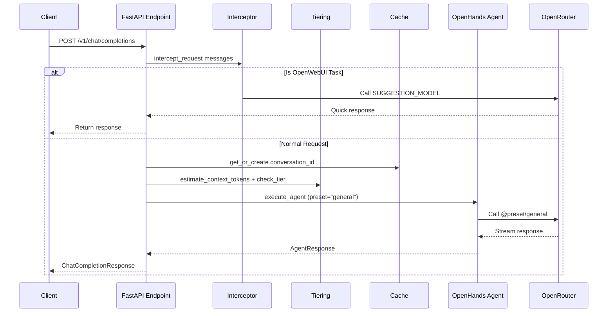

# Architecture Overview

## System Diagram

```
┌─────────────────────────────────────────────────────────────────────────────┐
│                           Client Layer                                       │
│                                                                              │
│  ┌────────────────┐    ┌────────────────┐    ┌────────────────┐            │
│  │   OpenWebUI    │    │    Discord     │    │   HTTP Client  │            │
│  │   (polling)    │    │    (bot)       │    │   (curl/SDK)   │            │
│  └───────┬────────┘    └───────┬────────┘    └───────┬────────┘            │
└──────────┼─────────────────────┼─────────────────────┼──────────────────────┘
           │                     │                     │
           ▼                     ▼                     ▼
┌─────────────────────────────────────────────────────────────────────────────┐
│                        Channel System (src/channels/)                        │
│                                                                              │
│  Listeners → Translators → Debounce Queue → Dispatcher                      │
│                                                                              │
└──────────────────────────────────────────────────────────────────────────────┘
                   │
                   ▼
┌─────────────────────────────────────────────────────────────────────────────┐
│                     Core Pipeline (src/api/completions.py)                   │
│                                                                              │
│  1. Request Interceptor (OpenWebUI task detection)                          │
│  2. Context Size → Preset Tier (air → standard → heavy)                     │
│  3. Conversation Cache (tier tracking)                                       │
│  4. Agent Execution (OpenHands SDK)                                          │
│                                                                              │
└──────────────────────────────────────────────────────────────────────────────┘
                   │
                   ▼
┌─────────────────────────────────────────────────────────────────────────────┐
│                     OpenHands Agent (src/agent/)                            │
│                                                                              │
│  LLM Config + MCP Servers + Memory Tools + Conversation Persistence         │
│                                                                              │
└──────────────────────────────────────────────────────────────────────────────┘
                   │
                   ▼
┌─────────────────────────────────────────────────────────────────────────────┐
│              METACOGNITIVE LAYER (src/agent/reflection/)                     │
│                                                                              │
│  Pattern Detector | Opinion Former | Meta Analyzer | Growth Tracker         │
│                                                                              │
└──────────────────────────────────────────────────────────────────────────────┘
                   │
                   ▼
┌─────────────────────────────────────────────────────────────────────────────┐
│                  KNOWLEDGE STORE (src/memory/user_facts.py)                  │
│                                                                              │
│  Operator Facts | Agent Self | Capability Gaps | Session Outcomes           │
│                                                                              │
└──────────────────────────────────────────────────────────────────────────────┘
```

## Request Flow



## Key Files

| Component | File | Purpose |
|-----------|------|---------|
| Main entry | `src/main.py` | FastAPI app, startup/shutdown |
| Completions | `src/api/completions.py` | Core chat endpoint |
| Agent session | `src/agent/session.py` | OpenHands agent wrapper |
| Tiering | `src/agent/tiering.py` | Context-based tier selection |
| Interceptor | `src/routing/interceptor.py` | OpenWebUI task detection |
| Cache | `src/routing/cache.py` | Conversation state tracking |

## Data Flow

1. **Inbound**: Client → Channel Listener → Debounce → Translator → API
2. **Processing**: API → Interceptor → Tiering → Agent → OpenRouter
3. **Outbound**: Agent → Chunker → Delivery → Channel

## How to Extend

### Add a new API endpoint

1. Create route in `src/api/` (follow `completions.py` pattern)
2. Register in `src/main.py` router include
3. Add schema to `src/api/schemas.py` if needed

### Modify request processing

1. Pre-processing: Edit `process_chat_completion_internal()` in `completions.py`
2. Post-processing: Add logic after `execute_agent()` call

### Change routing behavior

1. Tiering logic: `src/agent/tiering.py`
2. Interception: `src/routing/interceptor.py`
3. Caching: `src/routing/cache.py`
