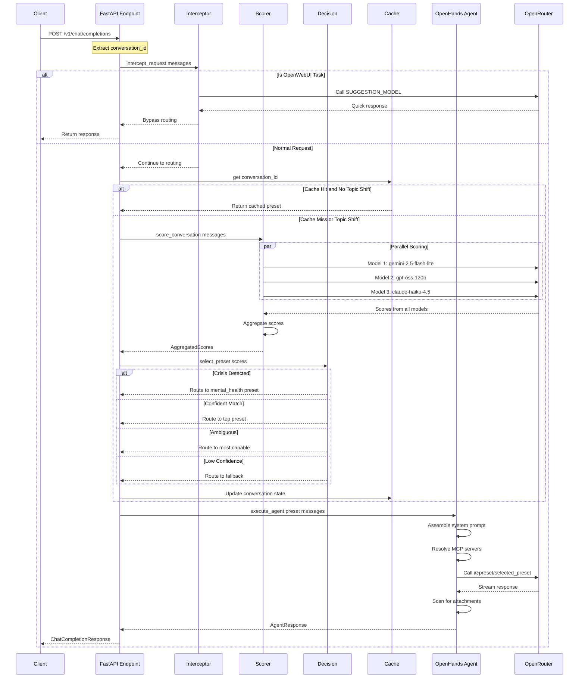
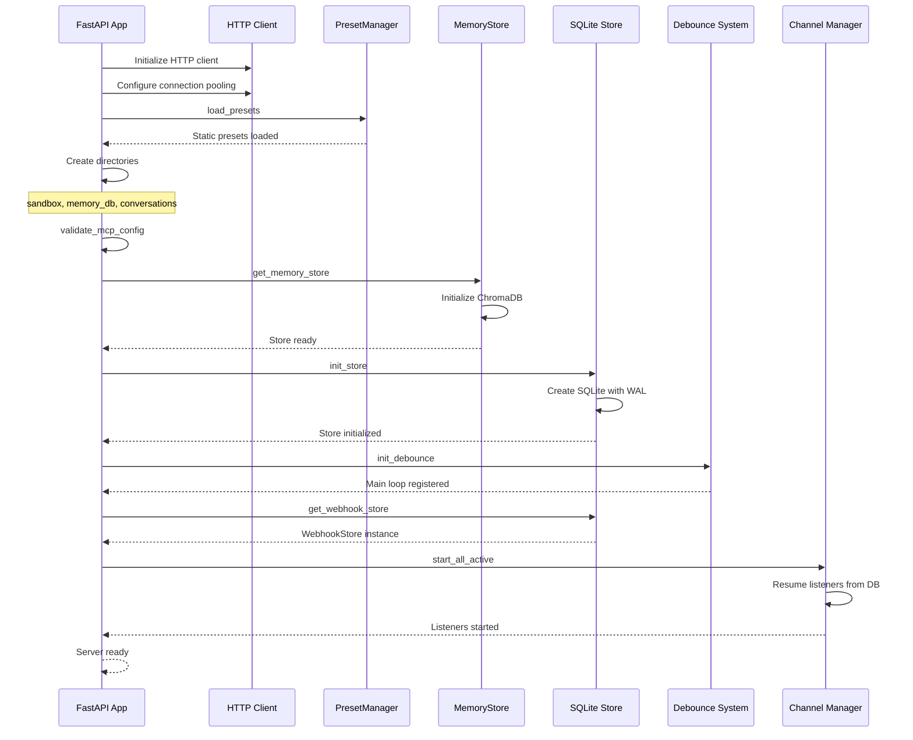

# IF — Intelligent Routing Agent API

An OpenAI-compatible API server in Python that provides intelligent routing to specialized AI presets based on conversation analysis. Incoming chat completions are analyzed by parallel scoring models, classified against preset definitions, and dispatched to the best-fit specialist model via OpenRouter presets.

The agent runs on the OpenHands SDK with access to MCP servers for extended capabilities (AWS docs, financial data, file system), a persistent RAG-backed memory store, conversation persistence, and a file-based attachment system.

---

## Table of Contents

- [Architecture Overview](#architecture-overview)
- [Request Flow Diagram](#request-flow-diagram)
- [API Endpoints](#api-endpoints)
- [Routing Pipeline](#routing-pipeline)
- [Command System](#command-system)
- [User Facts Store](#user-facts-store)
- [Pondering Preset](#pondering-preset)
- [Heartbeat System](#heartbeat-system)
- [Channel System](#channel-system)
- [Storage Layer](#storage-layer)
- [MCP Server Configuration](#mcp-server-configuration)
- [Preset System](#preset-system)
- [Environment Variables](#environment-variables)
- [Project Structure](#project-structure)
- [Startup Sequence](#startup-sequence)
- [Quick Start](#quick-start)

---

## Architecture Overview

```
┌─────────────────────────────────────────────────────────────────────────────┐
│                           Client Layer                                       │
│                                                                              │
│  ┌────────────────┐    ┌────────────────┐    ┌────────────────┐            │
│  │   OpenWebUI    │    │    Discord     │    │   HTTP Client  │            │
│  │   (polling)    │    │    (bot)       │    │   (curl/SDK)   │            │
│  └───────┬────────┘    └───────┬────────┘    └───────┬────────┘            │
└──────────┼─────────────────────┼─────────────────────┼──────────────────────┘
           │                     │                     │
           ▼                     ▼                     ▼
┌─────────────────────────────────────────────────────────────────────────────┐
│                        Channel System (src/channels/)                        │
│                                                                              │
│  ┌────────────────┐    ┌────────────────┐    ┌────────────────┐            │
│  │ OpenWebUI      │    │ Discord        │    │ HTTP API       │            │
│  │ Listener       │    │ Listener       │    │ (FastAPI)      │            │
│  └───────┬────────┘    └───────┬────────┘    └───────┬────────┘            │
│          │                     │                     │                      │
│          ▼                     ▼                     │                      │
│  ┌────────────────┐    ┌────────────────┐           │                      │
│  │ Translator     │    │ Translator     │           │                      │
│  └───────┬────────┘    └───────┬────────┘           │                      │
│          │                     │                     │                      │
│          ▼                     ▼                     │                      │
│  ┌────────────────┐    ┌────────────────┐           │                      │
│  │ Debounce Queue │    │ Debounce Queue │           │                      │
│  └───────┬────────┘    └───────┬────────┘           │                      │
│          │                     │                     │                      │
│          └──────────┬──────────┘                     │                      │
│                     ▼                                │                      │
│          ┌────────────────┐                          │                      │
│          │ Dispatcher     │                          │                      │
│          └───────┬────────┘                          │                      │
│                  │                                   │                      │
└──────────────────┼───────────────────────────────────┼──────────────────────┘
                   │                                   │
                   ▼                                   ▼
┌─────────────────────────────────────────────────────────────────────────────┐
│                     Core Pipeline (src/api/completions.py)                   │
│                                                                              │
│  ┌─────────────────────────────────────────────────────────────────────┐   │
│  │                    process_chat_completion_internal()                │   │
│  │                                                                      │   │
│  │  Step 1: Request Interceptor (OpenWebUI task detection)             │   │
│  │          ┌────────────────────────────────────────────────┐          │   │
│  │          │ intercept_request() → SUGGESTION_MODEL         │          │   │
│  │          │ (bypass routing for title/suggestion tasks)    │          │   │
│  │          └────────────────────────────────────────────────┘          │   │
│  │                           │                                          │   │
│  │  Step 2: Parallel Scoring (preset classification)                   │   │
│  │          ┌────────────────────────────────────────────────┐          │   │
│  │          │ score_conversation() → SCORING_MODELS (3x)     │          │   │
│  │          │ (gemini-flash, gpt-oss, claude-haiku)          │          │   │
│  │          └────────────────────────────────────────────────┘          │   │
│  │                           │                                          │   │
│  │  Step 3: Decision Logic (preset selection)                          │   │
│  │          ┌────────────────────────────────────────────────┐          │   │
│  │          │ select_preset() → Crisis/Confident/Ambiguous   │          │   │
│  │          └────────────────────────────────────────────────┘          │   │
│  │                           │                                          │   │
│  │  Step 4: Conversation Cache (routing state)                         │   │
│  │          ┌────────────────────────────────────────────────┐          │   │
│  │          │ ConversationCache → Topic Shift Detection      │          │   │
│  │          └────────────────────────────────────────────────┘          │   │
│  │                           │                                          │   │
│  │  Step 5: Agent Execution (OpenHands SDK)                            │   │
│  │          ┌────────────────────────────────────────────────┐          │   │
│  │          │ execute_agent() → @preset/{selected_preset}    │          │   │
│  │          └────────────────────────────────────────────────┘          │   │
│  └─────────────────────────────────────────────────────────────────────┘   │
└─────────────────────────────────────────────────────────────────────────────┘
                   │
                   ▼
┌─────────────────────────────────────────────────────────────────────────────┐
│                     OpenHands Agent (src/agent/)                            │
│                                                                              │
│  ┌────────────────┐    ┌────────────────┐    ┌────────────────┐            │
│  │  LLM Config    │    │  MCP Servers   │    │ Memory Tools   │            │
│  │  @preset/slug  │    │  (uvx-based)   │    │  (ChromaDB)    │            │
│  └────────────────┘    └────────────────┘    └────────────────┘            │
│                                                                              │
│  ┌────────────────────────────────────────────────────────────┐            │
│  │                    Conversation Persistence                 │            │
│  │                 (src/data/conversations/{id}/)             │            │
│  └────────────────────────────────────────────────────────────┘            │
└─────────────────────────────────────────────────────────────────────────────┘
                   │
                   ▼
            OpenRouter API
         (@preset/{name} routing)
```

---

## Request Flow Diagram



---

## API Endpoints

### Core Endpoints

#### `GET /v1/models`

Returns the model list with a single entry for `if-prototype`.

**Response:**
```json
{
  "object": "list",
  "data": [
    {
      "id": "if-prototype",
      "object": "model",
      "created": 1700000000,
      "owned_by": "if-prototype"
    }
  ]
}
```

#### `POST /v1/chat/completions`

Standard OpenAI chat completions interface. Accepts `model: "if-prototype"` only.

**Request Body:**
```json
{
  "model": "if-prototype",
  "messages": [
    {"role": "user", "content": "Hello, how are you?"}
  ],
  "stream": false
}
```

**Response:**
```json
{
  "id": "chatcmpl-abc123",
  "object": "chat.completion",
  "created": 1700000000,
  "model": "if-prototype",
  "choices": [
    {
      "index": 0,
      "message": {
        "role": "assistant",
        "content": "Response text here..."
      },
      "finish_reason": "stop"
    }
  ]
}
```

#### `POST /api/v1/chat/completions`

Alias for `/v1/chat/completions` for OpenWebUI compatibility.

---

### Webhook Management Endpoints

#### `POST /v1/webhooks/register`

Register a new channel webhook and start listening immediately.

**Request Body (Discord):**
```json
{
  "platform": "discord",
  "label": "My Discord Channel",
  "discord": {
    "bot_token": "your-bot-token",
    "channel_id": "123456789"
  }
}
```

**Request Body (OpenWebUI):**
```json
{
  "platform": "openwebui",
  "label": "My OpenWebUI Channel",
  "openwebui": {
    "base_url": "https://openwebui.example.com",
    "channel_id": "channel-uuid",
    "api_key": "your-api-key"
  }
}
```

**Response:**
```json
{
  "webhook_id": "wh_abc123def456",
  "conversation_id": "conv_xyz789",
  "platform": "discord",
  "label": "My Discord Channel",
  "status": "listening"
}
```

#### `GET /v1/webhooks/`

List all registered webhooks (active and inactive).

**Response:**
```json
{
  "webhooks": [
    {
      "webhook_id": "wh_abc123",
      "conversation_id": "conv_xyz",
      "platform": "discord",
      "label": "My Channel",
      "status": "active"
    }
  ],
  "total": 1
}
```

#### `GET /v1/webhooks/active`

List only active webhooks.

#### `GET /v1/webhooks/{webhook_id}`

Get a specific webhook by ID.

#### `DELETE /v1/webhooks/{webhook_id}`

Deactivate a webhook (stops listener, marks as inactive).

#### `POST /v1/webhooks/{webhook_id}/restart`

Restart a deactivated webhook.

---

### File Serving Endpoints

#### `GET /files/sandbox/{conversation_id}/{filepath:path}`

Serve files from a conversation's sandbox directory.

**Features:**
- Path traversal protection
- Automatic MIME type detection
- Scoped to conversation-specific directory

---

### Health Check

#### `GET /health`

Returns system health status.

**Response:**
```json
{
  "status": "healthy",
  "service": "if-prototype-a1",
  "features": {
    "routing": "active",
    "interceptor": "active",
    "commands": "active",
    "attachments": "active",
    "user_facts_store": "active",
    "user_facts_count": 47,
    "presets_loaded": true,
    "preset_count": 10,
    "channel_system": "active",
    "active_listeners": 2,
    "heartbeat": "active",
    "heartbeat_idle_hours": 6.0,
    "cached_conversations": 5,
    "pinned_conversations": 1
  }
}
```

---

## Routing Pipeline

The routing pipeline in [`src/api/completions.py`](src/api/completions.py:74) (`process_chat_completion_internal()`) consists of 5 steps:

### Step 1: Request Interception

**Module:** [`src/routing/interceptor.py`](src/routing/interceptor.py)

Detects OpenWebUI suggestion/title generation requests and bypasses the full routing pipeline.

- Checks for known OpenWebUI task markers in message content
- Calls `SUGGESTION_MODEL` (default: `mistralai/mistral-nemo`) directly
- Returns immediately without running scoring

**Detection Markers:**
- `"### Task:\nSuggest 3-5 relevant follow-up"`
- `"### Task:\nGenerate a concise, 3-5 word title"`
- `"### Task:\nGenerate 1-3 broad tags"`

### Step 2: Parallel Scoring

**Module:** [`src/routing/scorer.py`](src/routing/scorer.py)

Sends the last `MESSAGE_WINDOW` messages to all scoring models in parallel.

**Default Scoring Models:**
1. `google/gemini-2.5-flash-lite`
2. `openai/gpt-oss-120b`
3. `anthropic/claude-haiku-4.5`

**Scoring Prompt Structure:**
```
You are a conversation classifier. Given the following conversation
and a set of preset descriptions, score how well the conversation
matches each preset.

Return a JSON object where each key is the preset slug and the
value is a confidence score from 0.0 to 1.0.

Additionally, include a "crisis" key scored 0.0 to 1.0 indicating
whether the conversation contains signals of genuine distress.
```

**Response Validation:**
1. Parse response as JSON
2. Verify all preset slugs are present
3. Verify `crisis` key exists
4. Verify all values are floats between 0.0 and 1.0
5. Discard invalid responses

**Score Aggregation:**
- Each model nominates a top preset with confidence gap
- If all models agree → use that preset
- If models disagree → use scores from model with largest gap
- Crisis score = maximum across all models

### Step 3: Decision Logic

**Module:** [`src/routing/decision.py`](src/routing/decision.py)

Selects the final preset based on aggregated scores.

**Decision Tree:**

```
1. CRISIS CHECK
   If crisis_score > CRISIS_THRESHOLD (0.3):
     → Route to MENTAL_HEALTH_PRESET
     → Skip all other logic

2. CONFIDENT ROUTE
   If top_score > CONFIDENCE_THRESHOLD (0.6)
   AND (top_score - second_score) > CONFIDENCE_GAP (0.2):
     → Route to top-scoring preset

3. AMBIGUOUS ROUTE
   If multiple presets score above CONFIDENCE_THRESHOLD
   and gap is within CONFIDENCE_GAP:
     → Route to most capable preset among candidates

4. LOW CONFIDENCE FALLBACK
   If no preset scores above CONFIDENCE_THRESHOLD:
     → Route to most capable general preset
```

**Capability Ranking:**
```python
capability_ranking = {
    "architecture": 100,  # Claude 3.5 Sonnet
    "coding": 95,         # Claude 3.5 Sonnet
    "reasoning": 90,      # o1-preview
    "general": 50,
    "social": 40,
    "health": 30,
}
```

### Step 4: Conversation State Cache

**Module:** [`src/routing/cache.py`](src/routing/cache.py)

Caches routing decisions per conversation to avoid reclassifying on every message.

**Cache Entry:**
```python
@dataclass
class ConversationState:
    conversation_id: str
    active_preset: str
    anchor_window: List[str]      # Messages at last classification
    last_scores: AggregatedScores
    last_decision: RoutingDecision
    last_updated: datetime
```

**Topic Shift Detection:**

**Module:** [`src/routing/topic_shift.py`](src/routing/topic_shift.py)

When cache is warm (preset already assigned), uses LLM to detect topic shifts:

```python
async def topic_has_shifted(
    anchor_messages: List[str],  # From cache
    current_messages: List[str], # Current window
    http_client: httpx.AsyncClient,
) -> bool:
```

- Uses `TOPIC_SHIFT_MODEL` (default: `z-ai/glm-4.7-flash`)
- 5-second timeout, defaults to `False` on failure
- Returns `True` only for major domain shifts (coding → finance)
- Ignores sub-topic shifts (Python → Terraform)
- Ignores social noise ("thanks", "ok")

### Step 5: Agent Execution

**Module:** [`src/agent/session.py`](src/agent/session.py)

Executes the conversation with the selected preset via OpenHands SDK.

**Process:**
1. Get or create agent session for conversation
2. Assemble system prompt (base + operator context + preset-specific)
3. Resolve MCP servers for preset
4. Execute agent with messages
5. Scan for new file attachments
6. Return response with attachments
7. Fire-and-forget conversation summarization

---

## Command System

The command system provides slash commands for manual control over routing behavior. Commands are processed before any routing or LLM calls, returning synthetic responses immediately with zero latency.

**Module:** [`src/routing/commands.py`](src/routing/commands.py)

### Available Commands

| Command | Action | Response |
|---------|--------|----------|
| `/end_convo` | Clear conversation state, force reclassification | `"Acknowledged. Categorisation state cleared. Next message will be re-evaluated."` |
| `/{preset_name}` | Pin routing to a specific preset | `"Acknowledged. Routing pinned to preset: {preset_name}. Send /end_convo to release."` |
| `/pondering` | Engage pondering mode (special pin behavior) | `"Acknowledged. Pondering mode engaged."` |
| `/{invalid}` | Unknown preset | `"Negative. Preset \"{name}\" not recognized.\nAvailable: {sorted list}."` |

### Command Processing

Commands are processed in **Step 0** of the routing pipeline, before interception or scoring:

```python
cmd = parse_command(last_message_content, preset_manager.slugs())
if cmd is not None:
    if cmd.action == CommandAction.RESET_CACHE:
        conversation_cache.evict(cache_key)
        return synthetic_response(cmd.response_text)
    if cmd.action == CommandAction.PIN_PRESET:
        conversation_cache.pin(cache_key, cmd.preset)
        return synthetic_response(cmd.response_text)
```

### Pin Lifecycle

When a preset is pinned:

1. **Normal presets**: Auto-release after `RECLASSIFY_MESSAGE_COUNT` messages if topic shift is detected
2. **Pondering preset**: Never auto-releases. Only `/end_convo` or `/{other_preset}` can release it.

```python
if cached and cached.pinned:
    if cached.active_preset == "pondering":
        # Pondering pins never auto-release
        selected_preset = cached.active_preset
    else:
        cached.pin_message_count += 1
        if cached.pin_message_count >= RECLASSIFY_MESSAGE_COUNT:
            if should_check_shift(cached.anchor_window, current_window):
                shifted = await topic_has_shifted(...)
                if shifted:
                    cached.pinned = False  # Release pin
```

---

## User Facts Store

The user facts store replaces the simpler memory store with a structured fact system supporting categories, sources, and supersession. It uses ChromaDB for semantic search.

**Module:** [`src/memory/user_facts.py`](src/memory/user_facts.py)

### Fact Schema

```python
@dataclass
class UserFact:
    id: str                    # UUID
    username: str              # Operator identifier
    content: str               # The fact content
    category: FactCategory     # Classification category
    source: FactSource         # How this fact was captured
    confidence: float          # 0.0 to 1.0
    cache_key: str             # Where this fact was captured
    created_at: str            # ISO timestamp
    updated_at: str            # ISO timestamp
    superseded_by: str | None  # ID of replacement fact
    active: bool               # False if superseded
```

### Categories

| Category | Description | Example |
|----------|-------------|---------|
| `personal` | Name, location, profession, relationships | "Operator lives in Boston" |
| `preference` | Language/framework preferences, communication style | "Operator prefers TypeScript over JavaScript" |
| `opinion` | Strong stances on technologies, approaches | "Operator dislikes microservices architecture" |
| `skill` | Self-reported or demonstrated understanding | "Operator identifies as senior DevOps engineer" |
| `life_event` | Job changes, moves, competitions, milestones | "Operator started new job at TechCorp (2026-02)" |
| `future_direction` | Goals, timelines, aspirations | "Operator planning to learn Rust (as of 2026-03)" |
| `project_direction` | Current project plans and direction | "Operator migrating from Express to Fastify (as of 2026-02)" |
| `mental_state` | Noted shifts in mood, stress, outlook | "Operator showing increased stress about deadline" |
| `conversation_summary` | Auto-generated summaries of discussions | "Discussed Kubernetes deployment strategies" |
| `topic_log` | Domains discussed and when | "Topic: containerization discussed 2026-03-01" |
| `model_assessment` | Agent's observations about the operator | "Operator shows knowledge gap in network subnetting" |

### Sources

| Source | Description |
|--------|-------------|
| `user_stated` | Explicitly stated by the operator |
| `model_observed` | Observed from operator behavior |
| `model_assessed` | Agent's assessment of operator capabilities |
| `conversation_derived` | Extracted from conversation context |

### Agent Tools

**Module:** [`src/agent/tools/user_facts.py`](src/agent/tools/user_facts.py)

| Tool | Parameters | Description |
|------|-----------|-------------|
| `user_facts_search` | `query`, `category?`, `limit?` | Semantic search across stored facts |
| `user_facts_add` | `content`, `category`, `source?`, `confidence?` | Store a new fact |
| `user_facts_update` | `fact_id`, `new_content`, `reason` | Supersede an existing fact |
| `user_facts_list` | `category?`, `include_history?` | List all stored facts |
| `user_facts_remove` | `fact_id` | Hard delete (requires confirmation per Directive 0-1) |

### Auto-Retrieval

During system prompt assembly, relevant facts are automatically retrieved and injected:

```python
async def get_operator_context(messages: list[dict], store: UserFactStore) -> str:
    facts = await store.search(last_user_msg, limit=5)
    assessments = await store.search(last_user_msg, category=FactCategory.MODEL_ASSESSMENT, limit=3)
    # Returns formatted "OPERATOR CONTEXT" block
```

### Conversation Summarization

**Module:** [`src/memory/summarizer.py`](src/memory/summarizer.py)

After each agent execution, a fire-and-forget task generates a conversation summary:

- Only summarizes substantive exchanges (>3 messages)
- Uses `SUGGESTION_MODEL` for cheap summarization
- Stores as `conversation_summary` fact
- Zero impact on response latency

---

## Pondering Preset

The pondering preset is a special mode for operator profiling and engagement. Unlike other presets, it is **never auto-selected by the router** — it must be explicitly activated via `/pondering` command or the heartbeat system.

**Addendum:** [`src/agent/prompts/pondering_addendum.md`](src/agent/prompts/pondering_addendum.md)

### Characteristics

- **Objective**: Build and refine the operator profile
- **Behavior**: Ask ONE question at a time, focus on depth over breadth
- **MCP Servers**: Only `time` (all others disabled)
- **Pin Behavior**: Never auto-releases; only `/end_convo` or `/{other_preset}` releases

### Behavioral Rules

1. Focus areas: current projects, goals, preferences, frustrations, problem-solving approaches
2. Listen more than speak — the operator's words are the data
3. Every fact learned MUST be stored via `user_facts_add`
4. Every observation MUST be stored with `source: model_assessed`
5. Do not announce storage
6. If operator pivots to technical question, answer briefly then redirect

### Hard Constraints

- Do NOT produce code blocks
- Do NOT start architecture discussions
- Do NOT enter analysis or debugging flows
- Do NOT generate files

### Activation

```bash
# Manual activation
/pondering

# Automatic activation via heartbeat after idle period
# (see Heartbeat System section)
```

---

## Heartbeat System

The heartbeat system provides proactive operator engagement by monitoring channel activity and initiating pondering conversations after idle periods.

**Modules:**
- [`src/heartbeat/activity.py`](src/heartbeat/activity.py) — Activity tracking
- [`src/heartbeat/runner.py`](src/heartbeat/runner.py) — Background runner

### How It Works

1. **Activity Tracking**: Every message (inbound/outbound) updates `last_message_at` for the channel
2. **Idle Detection**: Every 60 seconds, check for channels idle beyond `HEARTBEAT_IDLE_HOURS`
3. **Cooldown**: Skip channels that received a heartbeat within `HEARTBEAT_COOLDOWN_HOURS`
4. **Quiet Hours**: Skip during configured quiet hours (default: 23:00-07:00 UTC)
5. **Initiation**: Pin channel to pondering, generate contextual opening, deliver message

### Activity Log Schema

```sql
CREATE TABLE activity_log (
    cache_key TEXT PRIMARY KEY,       -- channel_id or chat_id
    webhook_id TEXT,                  -- nullable (HTTP chats have no webhook)
    last_message_at TEXT NOT NULL,    -- ISO timestamp
    last_heartbeat_at TEXT            -- ISO timestamp
);
```

### Opening Message Generation

When initiating a heartbeat, the system:

1. Pulls relevant user facts (`future_direction`, `project_direction`, general)
2. Builds context block from stored facts
3. Calls LLM to generate personalized opening
4. Falls back to cold open if no facts exist:

```
"Statement: Idle period detected. Initiating baseline calibration. Query: What are you currently working on?"
```

### Configuration

| Variable | Default | Description |
|----------|---------|-------------|
| `HEARTBEAT_ENABLED` | `true` | Enable/disable heartbeat system |
| `HEARTBEAT_IDLE_HOURS` | `6.0` | Hours of inactivity before heartbeat |
| `HEARTBEAT_COOLDOWN_HOURS` | `6.0` | Hours between heartbeats on same channel |
| `HEARTBEAT_QUIET_HOURS` | `23:00-07:00` | UTC time range to skip heartbeats |

### Structured Logging

```
[Heartbeat] Tick: 3 active webhooks, 1 idle, 0 on cooldown
[Heartbeat] Pondering initiated on "Discord #dev-chat" (channel_id=123456)
[Heartbeat] Skipped channel_id=789: on cooldown (2.3h since last)
[Cache] Pin set: abc123 → pondering
```

---

## Channel System

The channel system enables multi-platform integration with Discord and OpenWebUI.

### Architecture

```
┌─────────────────────────────────────────────────────────────────┐
│                    Channel System Flow                           │
│                                                                  │
│  Discord Bot              OpenWebUI Poller                      │
│      │                         │                                │
│      ▼                         ▼                                │
│  discord_listener.py     openwebui_listener.py                  │
│      │                         │                                │
│      │    push_message()       │                                │
│      └─────────┬───────────────┘                                │
│                ▼                                                 │
│         debounce.py                                             │
│    (30s batching window)                                        │
│                │                                                 │
│                ▼                                                 │
│         dispatcher.py                                           │
│                │                                                 │
│      ┌─────────┴─────────┐                                      │
│      ▼                   ▼                                      │
│  discord_translator  openwebui_translator                       │
│      │                   │                                      │
│      └─────────┬─────────┘                                      │
│                ▼                                                 │
│    process_chat_completion_internal()                           │
│                │                                                 │
│                ▼                                                 │
│         chunker.py                                              │
│    (1500 char chunks)                                           │
│                │                                                 │
│                ▼                                                 │
│         delivery.py                                             │
│      ┌─────────┴─────────┐                                      │
│      ▼                   ▼                                      │
│  Discord Channel    OpenWebUI Channel                           │
└─────────────────────────────────────────────────────────────────┘
```

### Components

#### Listener Manager

**File:** [`src/channels/manager.py`](src/channels/manager.py)

Manages listener lifecycle in background daemon threads.

```python
def start_listener(record: WebhookRecord) -> None
def stop_listener(webhook_id: str) -> None
def start_all_active(records: list[WebhookRecord]) -> None  # Called at startup
def stop_all() -> None  # Called at shutdown
```

#### Discord Listener

**File:** [`src/channels/listeners/discord_listener.py`](src/channels/listeners/discord_listener.py)

- Uses `discord.py` client in a dedicated thread
- Listens to a single registered channel
- Ignores bot messages and own messages
- Pushes messages to debounce queue with attachments

#### OpenWebUI Listener

**File:** [`src/channels/listeners/openwebui_listener.py`](src/channels/listeners/openwebui_listener.py)

- Polling-based listener (default: 5-second interval)
- Tracks last-seen message ID for incremental updates
- Extracts files and attachments from messages

#### Debounce System

**File:** [`src/channels/debounce.py`](src/channels/debounce.py)

Thread-safe message batching with configurable window.

**Configuration:**
- `CHANNEL_DEBOUNCE_SECONDS`: Inactivity window (default: 30s)
- Messages are accumulated and flushed after silence period

**Threading Model:**
- Listener threads call `push_message()` from their own event loops
- Uses `threading.Lock` for buffer access
- Schedules timers on main asyncio event loop via `call_soon_threadsafe`

#### Translators

**Files:**
- [`src/channels/translators/discord_translator.py`](src/channels/translators/discord_translator.py)
- [`src/channels/translators/openwebui_translator.py`](src/channels/translators/openwebui_translator.py)

Convert platform messages to `ChatCompletionRequest` format:

```python
def translate_discord_batch(messages: list[dict], conversation_id: str) -> dict:
    # Returns:
    # {
    #     "model": "if-prototype",
    #     "stream": True,
    #     "messages": [{"role": "user", "content": content_parts}],
    #     "_conversation_id": conversation_id,
    # }
```

- Prepends sender attribution: `[Alice]: message text`
- Converts image attachments to `image_url` content parts
- References non-image attachments as text with URL

#### Response Chunker

**File:** [`src/channels/chunker.py`](src/channels/chunker.py)

Splits long responses for platform limits.

**Configuration:**
- `CHANNEL_MAX_CHUNK_CHARS`: Max chars per chunk (default: 1500)

**Split Priority:**
1. Paragraph break (`\n\n`)
2. Sentence break (`.\n` or `.`)
3. Newline (`\n`)
4. Space (` `)
5. Hard cut

#### Delivery

**File:** [`src/channels/delivery.py`](src/channels/delivery.py)

Platform-specific response delivery.

**Discord:**
- Sequential chunk delivery with 0.5s delay
- Files attached to last chunk
- Typing indicator during processing

**OpenWebUI:**
- Single combined message
- Attachments as markdown links

---

## Storage Layer

The storage layer provides an abstract interface for webhook persistence with pluggable backends.

### Architecture

**Protocol:** [`src/storage/protocol.py`](src/storage/protocol.py)

```python
@runtime_checkable
class WebhookStore(Protocol):
    def create(self, record: WebhookRecord) -> WebhookRecord: ...
    def get(self, webhook_id: str) -> WebhookRecord | None: ...
    def list_all(self) -> list[WebhookRecord]: ...
    def list_active(self) -> list[WebhookRecord]: ...
    def deactivate(self, webhook_id: str) -> bool: ...
```

### Data Model

**File:** [`src/storage/models.py`](src/storage/models.py)

```python
class WebhookRecord(SQLModel, table=True):
    __tablename__ = "webhooks"

    webhook_id: str        # Primary key, auto-generated: wh_{uuid12}
    conversation_id: str   # Index, auto-generated: conv_{uuid12}
    platform: str          # "discord" | "openwebui"
    label: str             # Human-readable name
    status: str            # "active" | "inactive"
    created_at: str        # ISO timestamp
    config_json: str       # JSON-serialized platform config
```

### SQLite Backend

**File:** [`src/storage/sqlite_backend.py`](src/storage/sqlite_backend.py)

- Uses SQLModel ORM over SQLite
- WAL mode for concurrent read/write safety
- Thread-safe for listener + API access

### Factory

**File:** [`src/storage/factory.py`](src/storage/factory.py)

```python
def init_store() -> None       # Called at startup
def get_webhook_store() -> WebhookStore
def close_store() -> None      # Called at shutdown
```

**Configuration:**
- `STORE_BACKEND`: Backend type (default: `sqlite`)
- `STORAGE_DB_PATH`: SQLite file path (default: `./data/store.db`)

**Future:** DynamoDB backend planned for AWS deployment.

---

## MCP Server Configuration

MCP servers provide extended capabilities to the agent.

### Available Servers

**File:** [`src/mcp_servers/config.py`](src/mcp_servers/config.py)

| Server | Package | Purpose |
|--------|---------|---------|
| `time` | `mcp-server-time@latest` | Current date/time |
| `aws_docs` | `awslabs.aws-documentation-mcp-server@latest` | AWS documentation lookup |
| `google_sheets` | `mcp-server-google-sheets@latest` | Spreadsheet access |
| `yahoo_finance` | `mcp-yahoo-finance` | Stock quotes and data |
| `alpha_vantage` | `alphavantage-mcp` | Financial indicators |
| `sandbox` | `mcp-server-filesystem@latest` | File system access |

### Preset Mapping

```python
PRESET_MCP_MAP = {
    "__all__": ["time"],
    "architecture": ["aws_docs", "sandbox"],
    "coding": ["sandbox"],
    "health": ["google_sheets"],
    "mental_health": [],
    "social": [],
    "finance": ["yahoo_finance", "alpha_vantage"],
}
```

### Sandbox Scoping

The sandbox server is scoped per-conversation:

```python
def resolve_mcp_config(preset_slug: str, conversation_id: str) -> Dict[str, Any]:
    # Sandbox root becomes: {SANDBOX_PATH}/{conversation_id}/
```

This prevents file cross-contamination between parallel sessions.

---

## Preset System

Presets are static definitions that define routing targets.

### Available Presets

**File:** [`src/presets/loader.py`](src/presets/loader.py)

| Preset | Model | Description |
|--------|-------|-------------|
| `architecture` | `@preset/architecture` | System design, infrastructure planning |
| `coding` | `@preset/coding` | Writing, modifying, debugging code |
| `shell` | `@preset/shell` | CLI commands, one-liners |
| `security` | `@preset/security` | Threat modeling, compliance |
| `health` | `@preset/health` | Fitness, nutrition, sports |
| `mental_health` | `@preset/mental_health` | Emotional support, crisis routing |
| `finance` | `@preset/finance` | Market data, investing |
| `social` | `@preset/social` | Casual conversation |
| `general` | `@preset/general` | General-purpose fallback |
| `pondering` | `@preset/pondering` | Operator profiling (manual/heartbeat only) |

> **Note:** The `pondering` preset is excluded from automatic scoring. It can only be activated via `/pondering` command or the heartbeat system.

### Preset Structure

```python
@dataclass
class Preset:
    slug: str           # URL-safe identifier
    name: str           # Display name
    description: str    # Used for scoring classification
    model: str          # OpenRouter model: @preset/{slug}
```

---

## Environment Variables

### Required

| Variable | Description |
|----------|-------------|
| `OPENROUTER_API_KEY` | OpenRouter API key for model access |

### Routing Configuration

| Variable | Default | Description |
|----------|---------|-------------|
| `MESSAGE_WINDOW` | `8` | Recent messages for routing |
| `CRISIS_THRESHOLD` | `0.3` | Crisis score threshold |
| `CONFIDENCE_THRESHOLD` | `0.6` | Minimum score for confident routing |
| `CONFIDENCE_GAP` | `0.2` | Minimum gap for confident decision |
| `RECLASSIFY_MESSAGE_COUNT` | `4` | Messages before reclassification check |

### Model Configuration

| Variable | Default | Description |
|----------|---------|-------------|
| `SUGGESTION_MODEL` | `mistralai/mistral-nemo` | Quick reply model |
| `SCORING_MODELS` | *(see below)* | Comma-separated scoring models |
| `TOPIC_SHIFT_MODEL` | `z-ai/glm-4.7-flash` | Topic shift detection |
| `MENTAL_HEALTH_PRESET` | `mental-health` | Crisis routing target |

**Default SCORING_MODELS:**
```
google/gemini-2.5-flash-lite,openai/gpt-oss-120b,anthropic/claude-haiku-4.5
```

### Storage Configuration

| Variable | Default | Description |
|----------|---------|-------------|
| `STORE_BACKEND` | `sqlite` | Storage backend type |
| `STORAGE_DB_PATH` | `./data/store.db` | SQLite database path |
| `SANDBOX_PATH` | `./sandbox` | File output directory |
| `MEMORY_DB_PATH` | `./data/memory_db` | ChromaDB path |
| `PERSISTENCE_DIR` | `./data/conversations` | Conversation persistence |

### Channel Configuration

| Variable | Default | Description |
|----------|---------|-------------|
| `CHANNEL_DEBOUNCE_SECONDS` | `30` | Message batching window |
| `CHANNEL_MAX_CHUNK_CHARS` | `1500` | Max chars per response chunk |
| `OPENWEBUI_POLL_INTERVAL` | `5.0` | OpenWebUI polling interval |

### Heartbeat Configuration

| Variable | Default | Description |
|----------|---------|-------------|
| `HEARTBEAT_ENABLED` | `true` | Enable/disable heartbeat system |
| `HEARTBEAT_IDLE_HOURS` | `6.0` | Hours of inactivity before heartbeat |
| `HEARTBEAT_COOLDOWN_HOURS` | `6.0` | Hours between heartbeats on same channel |
| `HEARTBEAT_QUIET_HOURS` | `23:00-07:00` | UTC time range to skip heartbeats |

### MCP Server Keys

| Variable | Description |
|----------|-------------|
| `GOOGLE_SHEETS_CREDENTIALS` | Base64-encoded JSON credentials |
| `ALPHAVANTAGE_API_KEY` | Alpha Vantage API key |

### Server Configuration

| Variable | Default | Description |
|----------|---------|-------------|
| `HOST` | `0.0.0.0` | Server bind address |
| `PORT` | `8000` | Server bind port |
| `LLM_BASE_URL` | `https://openrouter.ai/api/v1` | LLM API base URL |

---

## Project Structure

```
if-prototype-a1/
├── README.md                    # This file
├── requirements.txt             # Python dependencies
├── .env.example                 # Environment template
├── main_system_prompt.txt       # Base system prompt for agent
├── plan.md                      # Implementation plan
│
├── data/                        # Runtime data directory
│   ├── memory_db/               # ChromaDB vector storage (user facts)
│   ├── conversations/           # OpenHands persistence
│   │   └── {conversation_id}/
│   │       ├── base_state.json
│   │       └── events/
│   └── store.db                 # SQLite webhook + activity storage
│
├── sandbox/                     # File output directory
│   └── {conversation_id}/       # Per-conversation isolation
│
├── plans/                       # Implementation phase docs
│   ├── phase0-1-2-implementation.md
│   ├── phase3-4-implementation.md
│   ├── phase5-6-implementation.md
│   └── phase6-implementation.md
│
└── src/                         # Source code
    ├── main.py                  # FastAPI app entry point
    ├── config.py                # Environment configuration
    │
    ├── api/                     # HTTP API layer
    │   ├── __init__.py
    │   ├── models.py            # /v1/models endpoint
    │   ├── completions.py       # /v1/chat/completions endpoint
    │   ├── files.py             # /files/sandbox/* endpoint
    │   ├── webhooks.py          # /v1/webhooks/* endpoints
    │   └── schemas.py           # Pydantic request/response models
    │
    ├── routing/                 # Routing pipeline
    │   ├── __init__.py
    │   ├── interceptor.py       # Step 1: OpenWebUI task detection
    │   ├── commands.py          # Step 0: Slash command parser
    │   ├── scorer.py            # Step 2: Parallel scoring
    │   ├── decision.py          # Step 3: Preset selection
    │   ├── cache.py             # Step 4: Conversation state + pinning
    │   └── topic_shift.py       # Topic shift detection with heuristic
    │
    ├── agent/                   # OpenHands agent integration
    │   ├── __init__.py
    │   ├── session.py           # Session management + operator context
    │   ├── tools.py             # Legacy memory tools
    │   ├── tools/               # Agent tool implementations
    │   │   └── user_facts.py    # User facts tools (add/search/update/remove)
    │   ├── sandbox.py           # Sandbox path resolution
    │   ├── condenser.py         # Context condensation
    │   └── prompts/
    │       ├── system_prompt.j2 # Jinja2 template for system prompt
    │       └── pondering_addendum.md  # Pondering mode instructions
    │
    ├── channels/                # Channel system
    │   ├── __init__.py
    │   ├── manager.py           # Listener lifecycle
    │   ├── debounce.py          # Message batching
    │   ├── dispatcher.py        # Pipeline bridge
    │   ├── chunker.py           # Response chunking
    │   ├── delivery.py          # Platform delivery
    │   ├── listeners/
    │   │   ├── __init__.py
    │   │   ├── discord_listener.py
    │   │   └── openwebui_listener.py
    │   └── translators/
    │       ├── __init__.py
    │       ├── discord_translator.py
    │       └── openwebui_translator.py
    │
    ├── storage/                 # Persistence layer
    │   ├── __init__.py
    │   ├── protocol.py          # WebhookStore protocol
    │   ├── models.py            # WebhookRecord + ActivityLogEntry models
    │   ├── factory.py           # Backend factory
    │   ├── sqlite_backend.py    # SQLite implementation
    │   └── dynamodb_backend.py  # Future AWS implementation
    │
    ├── memory/                  # Memory store
    │   ├── __init__.py
    │   ├── user_facts.py        # ChromaDB user facts store
    │   └── summarizer.py        # Background conversation summarization
    │
    ├── heartbeat/               # Heartbeat system
    │   ├── __init__.py
    │   ├── activity.py          # Activity tracker
    │   └── runner.py            # Background heartbeat runner
    │
    ├── mcp_servers/             # MCP configuration
    │   ├── __init__.py
    │   └── config.py            # Server definitions and preset mapping
    │
    └── presets/                 # Preset definitions
        ├── __init__.py
        └── loader.py            # Static preset loading (includes pondering)
```

---

## Startup Sequence

The application startup in [`src/main.py`](src/main.py:34) follows this sequence:



**Startup Log Output:**
```
[Startup] Initializing IF Prototype A1...
[Startup] HTTP client initialized
[Startup] Loading presets...
[Startup] Sandbox directory: /path/to/sandbox
[Startup] Memory database directory: /path/to/data/memory_db
[Startup] Conversation persistence directory: /path/to/data/conversations
[Startup] MCP configuration validated
[Startup] Memory store initialized (0 memories)
[Startup] Storage backend initialized at ./data/store.db
[Startup] Debounce system initialized (window=30.0s)
[Startup] Resumed 0 active channel listeners
[Startup] Server ready on 0.0.0.0:8000
```

---

## Quick Start

### 1. Install Dependencies

```bash
pip install -r requirements.txt
```

### 2. Configure Environment

```bash
cp .env.example .env
# Edit .env and add your OPENROUTER_API_KEY
```

### 3. Run the Server

```bash
# From the app directory
python -m src.main

# Or with uvicorn directly
uvicorn src.main:app --host 0.0.0.0 --port 8000 --reload
```

### 4. Test the API

```bash
# List models
curl http://localhost:8000/v1/models

# Chat completion
curl -X POST http://localhost:8000/v1/chat/completions \
  -H "Content-Type: application/json" \
  -d '{
    "model": "if-prototype",
    "messages": [
      {"role": "user", "content": "Hello"}
    ]
  }'

# Health check
curl http://localhost:8000/health
```

### 5. Register a Discord Channel

```bash
curl -X POST http://localhost:8000/v1/webhooks/register \
  -H "Content-Type: application/json" \
  -d '{
    "platform": "discord",
    "label": "My Channel",
    "discord": {
      "bot_token": "your-bot-token",
      "channel_id": "123456789"
    }
  }'
```

---

## Structured Logging

The system produces structured log events for monitoring and debugging:

```
[UserFacts] Added: category=project_direction source=user_stated cache_key=abc123
[UserFacts] Superseded: old=fact_xyz → new=fact_abc reason="Operator changed direction"
[UserFacts] Assessment: category=model_assessment content="Networking knowledge gap..."
[Command] /end_convo executed for cache_key=abc123
[Command] /coding pinned for cache_key=abc123
[Heartbeat] Tick: 3 active webhooks, 1 idle, 0 on cooldown
[Heartbeat] Pondering initiated on "Discord #dev-chat" (channel_id=123456)
[Heartbeat] Skipped channel_id=789: on cooldown (2.3h since last)
[Cache] Pin set: abc123 → pondering
[Cache] Pin released: abc123 (topic shift)
[TopicShift] Heuristic skip: keyword overlap 0.62 > 0.40
```

---

## License

MIT
