# Multi-Agent Agentic Discord Bot

An autonomous multi-agent Discord bot that can execute complex multi-turn tasks, self-correct, escalate when stuck, and interact with users through reactions and clarifications.

**Key Features:**
- 🤖 Multi-turn agentic execution with **Reflexion** learning pattern
- 🧠 **Sequential Thinking** - Planning model thinks step-by-step before generating plans
- 🗂️ Per-channel S3 artifact storage with automatic file sync
- 🎯 Specialized agent roles (Python coder, DevOps engineer, Architect, etc.)
- 📈 Automatic tier escalation for complex tasks
- 🔄 **Self-reflection** and persistent learning from past attempts
- 🛑 Human-in-the-loop controls (stop, approve, reject via reactions)
- 👍👎 User feedback directly influences confidence scores
- 📊 Full observability (S3 execution logs, DynamoDB sessions, Discord progress)
- 🔒 Thread-safe execution with abort flags
- ⚡ Intelligent task classification and routing
- 🏗️ **Architecture Flow** - Design/planning mode without code generation
- ⚖️ **Dialectic Synthesis** - Thesis → Antithesis → Synthesis for philosophical questions
- 🔍 **Multi-Source Consensus** - Factual verification across multiple models
- 😇😈 **Angel/Devil Debate** - Balanced moral/ethical analysis

## Architecture

### Execution Flows

The bot supports 11 execution flows based on task classification:

```
User Message
    ↓
[Planning Model] Should respond? → YES/NO
    ↓
[Planning Model] Classify task → TaskType + AgentRole + Complexity
    ↓
    ├─→ SIMPLE (quick Q&A, no tools)
    │   └─→ Single turn, tier1/tier2, no tools
    │
    ├─→ SOCIAL (casual chat)
    │   └─→ Single turn, tier1 + social, no tools
    │
    ├─→ PROOFREADER (grammar check)
    │   └─→ Single turn, tier1, no tools
    │
    ├─→ SHELL (command suggestions)
    │   └─→ Single turn, tier2, no scripts
    │
    ├─→ ARCHITECTURE (design/planning WITHOUT code)
    │   └─→ Generates clear, succinct architectural plans
    │   └─→ NO code generation - theoretical/design only
    │   └─→ Confidence: completeness, conflicting info, holes identified
    │   └─→ Can transition to SEQUENTIAL-THINKING on "implement this"
    │
    ├─→ BRANCH (multi-solution brainstorming)
    │   └─→ 3 models explore different approaches in parallel
    │   └─→ Tier4 aggregator consolidates options
    │   └─→ Theoretical only, no code generation
    │
    ├─→ SEQUENTIAL-THINKING (complex multi-turn with code generation)
    │   └─→ Chain-of-Thought execution with self-reflection
    │   └─→ CODE GENERATION with MCP tools
    │   └─→ Per-channel artifact storage in S3
    │   └─→ Evaluator scores trajectory → Model reflects
    │
    ├─→ DIALECTIC (philosophical synthesis)
    │   └─→ Thesis → Antithesis → Synthesis
    │   └─→ For abstract "what is the meaning of..." questions
    │
    ├─→ CONSENSUS (multi-source factual verification)
    │   └─→ 3 models answer independently → Tier3 Judge synthesizes
    │   └─→ For "is it true that..." factual questions
    │
    ├─→ ANGEL_DEVIL (moral/ethical debate)
    │   └─→ Angel argues FOR → Devil argues AGAINST → Judge balances
    │   └─→ For "should I..." ethical dilemmas
    │
    └─→ BREAKGLASS (emergency override)
        └─→ Direct model access, bypasses all checks
```

### Flow Selection Guide

| Flow | Use Case | Code? | Tools? | Example Triggers |
|------|----------|-------|--------|------------------|
| **1. SIMPLE** | Quick Q&A, social | ❌ No | ❌ No | "What is...", "How do I..." |
| **2. SOCIAL** | Casual chat | ❌ No | ❌ No | "Hello", "What's up?" |
| **3. PROOFREADER** | Grammar check | ❌ No | ❌ No | "Proofread this..." |
| **4. SHELL** | Command help | ❌ No | ❌ No | "How to grep...", "kubectl command..." |
| **5. ARCHITECTURE** | Design, planning | ❌ No | ❌ No | "Design a system...", "What's the best approach..." |
| **6. BRANCH** | Explore alternatives | ❌ No | ❌ No | "Compare approaches...", "Pros and cons..." |
| **7. SEQUENTIAL** | Implementation | ✅ Yes | ✅ Yes | "Implement...", "Refactor...", "Create..." |
| **8. DIALECTIC** | Philosophical synthesis | ❌ No | ❌ No | "What is the meaning of...", "Philosophically speaking..." |
| **9. CONSENSUS** | Factual verification | ❌ No | ❌ No | "Is it true that...", "Fact check...", "Verify..." |
| **10. ANGEL_DEVIL** | Moral/ethical debate | ❌ No | ❌ No | "Should I...", "Is it ethical...", "Moral dilemma" |
| **11. BREAKGLASS** | Emergency | ✅ Yes | ✅ Yes | `!breakglass` prefix |

### Reflexion Learning Pattern

The sequential-thinking flow implements the **Reflexion** pattern for continuous improvement:

```
1. Load Session (reflections + key insights from DynamoDB)
   ↓
2. Planning Model generates plan (informed by previous trajectory + evaluation)
   ↓
3. Actor Executes (Chain-of-Thought prompting)
   ↓
4. Evaluator Scores Trajectory (task completion, code quality, efficiency)
   ↓
5. Model Self-Reflects (what worked, what failed, strategy change)
   ↓
6. Save to Memory (sliding window: last 5 reflections, top 20 insights)
   ↓
7. Next execution benefits from learnings
```

**Memory Components:**
- **Reflections**: Last 5 execution reflections (sliding window in DynamoDB)
- **Key Insights**: Top 20 persistent learnings across all executions
- **Trajectory Summary**: Compressed history of previous attempt
- **Evaluation Scores**: Task completion, code quality, efficiency metrics

### Agentic Execution Loop

```
1. Create execution lock (prevents concurrent runs)
2. Post "Starting work..." message (users can react 🛑 to abort)
3. FOR each turn (up to maxTurns):
   a. Check abort flag
   b. Execute turn with LLM + MCP tools
   c. Stream progress to Discord
   d. Update confidence score
   e. Check escalation triggers
   f. Checkpoint every 5 turns
   g. If complete → finalize
   h. If stuck → escalate or ask user
4. Release lock
5. Post commit message with 👍/👎 reactions
```

### Control Mechanisms

| Mechanism | Trigger | Action |
|-----------|---------|--------|
| 🛑 Reaction | On "Starting work..." message | Set abort flag, halt at next turn |
| 👍 Reaction | On commit message | Merge branch to main |
| 👎 Reaction | On commit message | Delete branch, reject changes |
| Low confidence | Confidence < 30% for 2 turns | Escalate model |
| Repeated errors | Same error 3 times | Escalate model |
| No progress | No file changes for 5 turns | Escalate model |
| Max escalation | Already at highest tier, still stuck | Ask user for clarification |

### Model Tiers (Tag-Based Routing)

Models are selected dynamically via LiteLLM tags instead of hardcoded lists. Each request uses `model: "auto"` with `metadata.tags`, and the router selects a random model that matches **all** tags.

#### Tier Overview

| Tier | Quality | Price Range | Trust Level |
|------|---------|-------------|-------------|
| **tier1** | Fast, casual responses | Free - $2.50 | Basic - quick Q&A, social |
| **tier2** | Standard quality | $0.08 - $1.10 | Moderate - general tasks |
| **tier3** | High quality | $0.45 - $3.00 | High - complex work |
| **tier4** | Premium quality | $2.00 - $5.00 | Maximum - critical decisions |

#### Available Models by Tier

**Classifier (Special)**
| Model | Context | Price |
|-------|---------|-------|
| gpt-oss-120b:exacto | 131K | Free |

**Tier 1 — Casual, Fast Responses**
| Model | Context | Price | Tags |
|-------|---------|-------|------|
| deepseek-r1t2-chimera-free | 128K | Free | tier1, general, thinking |
| deepseek-r1-0528-free | 128K | Free | tier1, general, thinking |
| mistral-nemo | 128K | $0.02/$0.04 | tier1, general, social, tools |
| mistral-tiny | 32K | $0.25/$0.25 | tier1, general, social, tools |
| gpt-oss-120b | 131K | $0.04/$0.19 | tier1, general, thinking, tools |
| gpt-5-nano | 131K | $0.05/$0.40 | tier1, general, thinking, tools |
| gemini-2.5-flash-lite | 65K | $0.10/$0.40 | tier1, general, thinking, tools |
| general (fallback) | 65K | $0.10/$0.40 | tier1, general, thinking, tools |
| mistral-small-creative | 32K | $0.10/$0.30 | tier1, creative, social, tools |
| claude-3-haiku | 64K | $0.25/$1.25 | tier1, general, social, tools |
| llama-3.1-70b-instruct | 131K | $0.40/$0.40 | tier1, general, social, tools |
| hermes-3-llama-405b | 131K | $1.00/$1.00 | tier1, general, creative |

**Tier 2 — Standard Quality**
| Model | Context | Price | Tags |
|-------|---------|-------|------|
| bytedance-seed-1.6-flash | 131K | $0.08/$0.30 | tier2, tools, thinking, general |
| xiaomi-mimo-v2-flash | 131K | $0.09/$0.29 | tier2, tools, thinking, general |
| hermes-4-70b | 131K | $0.11/$0.38 | tier2, tools, thinking, general |
| qwen3-235b-a22b-thinking | 131K | $0.11/$0.60 | tier2, tools, thinking, general |
| qwen3-coder | 131K | $0.22/$1.00 | tier2, tools, thinking, programming |
| deepseek-v3.2 | 131K | $0.25/$0.38 | tier2, tools, thinking, general |
| gpt-5-mini | 131K | $0.25/$2.00 | tier2, tools, thinking, general |
| minimax-m2.1 | 196K | $0.27/$0.95 | tier2, tools, thinking, general |
| gemini-2.5-flash | 65K | $0.30/$2.50 | tier2, tools, thinking, general |
| amazon-nova-2-lite | 131K | $0.30/$2.50 | tier2, tools, thinking, general |
| mistral-medium-3 | 131K | $0.40/$2.00 | tier2, tools, general |
| devstral-medium | 131K | $0.40/$2.00 | tier2, tools, programming |
| deepseek-r1-0528 | 128K | $0.40/$1.75 | tier2, tools, thinking, general |
| kimi-k2-thinking | 128K | $0.40/$1.75 | tier2, tools, thinking, general |
| claude-haiku-4.5 | 64K | $1.00/$5.00 | tier2, tools, thinking, general |
| o4-mini | 65K | $1.10/$4.40 | tier2, tools, thinking, general |

**Tier 3 — High Quality**
| Model | Context | Price | Tags |
|-------|---------|-------|------|
| kimi-k2.5 | 128K | $0.45/$2.25 | tier2, tier3, tier4, tools, thinking, programming |
| qwen3-coder-plus | 32K | $1.00/$5.00 | tier3, tools, thinking, programming |
| qwen3-max | 32K | $1.20/$6.00 | tier3, tools, general |
| gpt-5.1-codex-max | 128K | $1.25/$10.00 | tier3, tools, thinking, programming |
| gpt-5.2-codex | 128K | $1.75/$14.00 | tier3, tier4, tools, thinking, programming |
| mistral-large | 128K | $2.00/$6.00 | tier3, tools, general |
| gemini-3-pro | 65K | $2.00/$12.00 | tier3, tools, thinking, programming |

**Tier 4 — Premium Quality**
| Model | Context | Price | Tags |
|-------|---------|-------|------|
| o3 | 128K | $2.00/$8.00 | tier4, tools, thinking, general |
| claude-sonnet-4.5 | 64K | $3.00/$15.00 | tier4, tools, thinking, programming |
| claude-opus-4.6 | 64K | $5.00/$25.00 | tier4, tools, thinking, programming |
| claude-opus-4.5 | 16K | $5.00/$25.00 | tier4, tools, thinking, programming |

**Websearch Models (Cross-Tier)**
| Model | Tier | Price | Use Case |
|-------|------|-------|---------|
| gpt-4o-mini-search | tier2 | $0.15/$0.60 | Fast web search |
| sonar | tier2 | $1.00/$1.00 | Perplexity search |
| sonar-reasoning-pro | tier3 | $2.00/$8.00 | Deep reasoning search |
| sonar-deep-research | tier3 | $2.00/$8.00 | Comprehensive research |
| gpt-4o-search | tier3 | $2.50/$10.00 | GPT-4 web search |
| sonar-pro | tier3 | $3.00/$15.00 | Pro Perplexity search |
| sonar-pro-search | tier4 | $3.00/$15.00 | Premium research |

**Escalation Path:**
```
tier1 → tier2 → tier3 → tier4
```

### Agent Role Templates

The bot uses role-specific prompt templates for different task types:

| Role | Tags | Template | Use Case |
|------|------|----------|----------|
| Command Executor | tier2 + tools + general | command-executor | Fast commands |
| Python Coder | tier2 + tools + programming | python-coder | Python development |
| JS/TS Coder | tier2 + tools + programming | js-ts-coder | TypeScript/JavaScript |
| DevOps Engineer | tier3 + tools + general | devops-engineer | Infrastructure, K8s |
| Architect | tier4 + tools + thinking | architect | System design |
| Code Reviewer | tier3 + tools + programming | code-reviewer | Code quality |
| Documentation Writer | tier3 + tools + general | documentation-writer | Docs, README |
| DBA | tier3 + tools + general | dba | Database operations |
| Researcher | tier2 + tools + general | researcher | Code search |

## Advanced Features

### 1. Reflexion Learning Pattern

The bot implements the **Reflexion** pattern, enabling it to learn from past attempts:

**Components:**
- **Actor**: Execution model with Chain-of-Thought prompting
- **Evaluator**: Heuristic-based trajectory scoring (task completion, code quality, efficiency)
- **Self-Reflection**: Model analyzes what worked/failed and generates strategy changes
- **Memory**: DynamoDB stores reflections, key insights, and trajectory summaries

**How It Works:**
1. Before execution, the planning model reviews previous reflections and evaluation scores
2. During execution, the Actor implements with step-by-step reasoning
3. After execution, the Evaluator scores the trajectory (0-100)
4. Model generates a reflection: what worked, what failed, root cause, strategy change, key insight
5. Reflection is saved with sliding window (last 5) and key insights (top 20)
6. Next execution benefits from these learnings

### 2. Chain-of-Thought Prompting

All execution models are prompted to think step-by-step:

**Structure:**
```
1. Understand the Problem
2. Break Down into Steps
3. Consider Edge Cases
4. Explain Approach
5. Implement Step-by-Step
6. Verify Solution
```

This reduces errors and improves logic by forcing models to articulate their reasoning before acting.

### 3. Per-Thread S3 Artifact Storage

Each Discord channel gets its own isolated workspace:

**Architecture:**
- **Workspace**: `/workspace/<channel-id>/` in Kubernetes pod
- **S3 Sync**: `s3://discord-bot-artifacts/channels/<channel-id>/`
- **Discord Attachments**: Auto-synced to workspace before execution
- **Model Outputs**: Use `<<filename>>` markers to send files back to Discord

**Workflow:**
1. User uploads attachment → Auto-synced to workspace
2. Model reads/writes files in workspace
3. Model includes `<<src/index.ts>>` in response
4. System reads file from workspace → Sends as Discord attachment
5. After execution → Workspace synced to S3
6. Thread deleted → Workspace + S3 prefix cleaned up

### 4. User Feedback Integration

Users directly influence the bot's confidence through reactions:

- **👍 on bot message**: +15 confidence (encourages similar approach)
- **👎 on bot message**: -20 confidence (triggers reflection/escalation)
- Confidence clamped 10-100 and persisted across messages

This creates a feedback loop where user satisfaction directly impacts the bot's decision-making.

### 5. Simple Flow (Quick Q&A)

For basic questions that don't require tools or complex processing.

**Process:**
1. User message classified as SIMPLE task type
2. Single model response using tier-based tags
3. No tools, no planning, single turn only

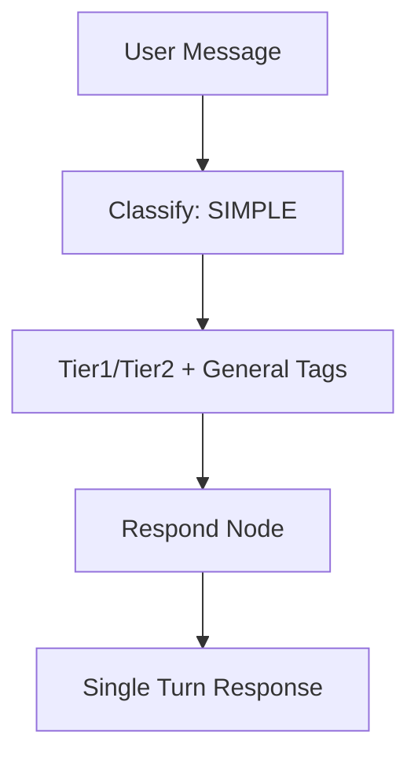

**Best for:** Quick Q&A, social chat, simple explanations

**Triggers:**
- "What is...", "How do I..."
- Greetings, casual conversation
- Simple factual questions

### 6. Architecture Flow (Design & Planning)

For theoretical/design tasks that require planning WITHOUT code generation.

**Process:**
1. Setup session and branch
2. Create architectural plan using Sequential Thinking
3. Evaluate plan for completeness and design quality
4. Return design recommendations (NO code generation)

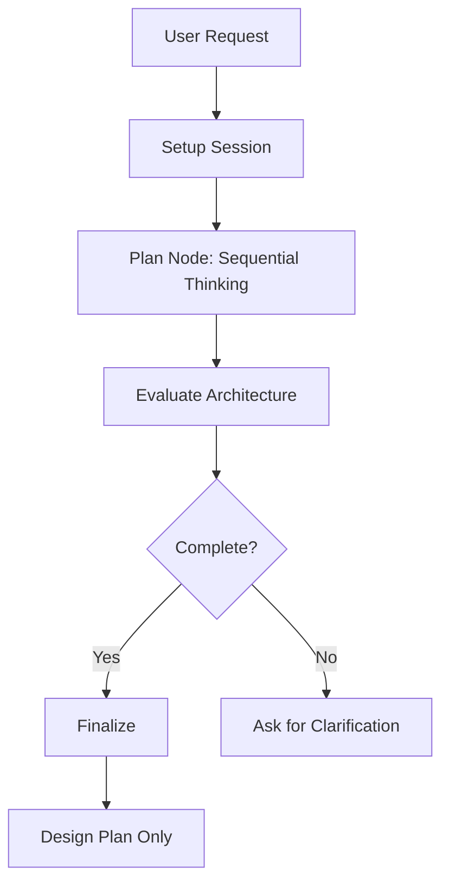

**Key Differences from Sequential-Thinking:**
| Aspect | Architecture Flow | Sequential-Thinking Flow |
|--------|-------------------|-------------------------|
| Output | Design/Plan only | Code + Implementation |
| Tools | None | MCP tools for file ops |
| Confidence | Completeness, clarity | Code quality, progress |
| Reflection | Design gaps, conflicts | Code issues, efficiency |

**Triggers:**
- "Design a system for..."
- "What's the best approach for..."
- "How should I architect..."
- "Plan out the implementation of..."

**Flow Transition:**
When user says "implement this" or "execute the plan", the bot switches to SEQUENTIAL-THINKING flow for actual code generation.

### 7. Branch Flow (Multi-Solution Brainstorming)

For exploring multiple architectural approaches in parallel.

**Process:**
1. Three models brainstorm in parallel (tier3 + thinking)
2. Each explores a different approach
3. Tier4 aggregator merges unique approaches
4. Presents 2-3 architectural options with pros/cons
5. **No code generation** - purely theoretical/architectural

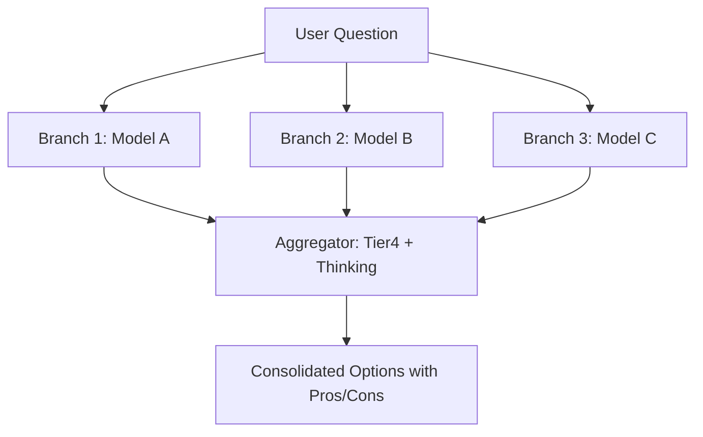

**Best for:** "Compare approaches...", "Pros and cons...", "Explore options"

**Triggers:**
- "multiple solutions", "brainstorm", "different ways"
- "compare approaches", "tradeoffs", "which approach"

### 8. Sequential-Thinking Flow (Code Implementation)

For complex multi-turn tasks requiring code generation and tool execution. This is the **primary agentic flow** with full Reflexion learning.

**Process:**
1. Setup: Acquire lock, create session/branch
2. Execute turns (up to maxTurns) with Chain-of-Thought prompting
3. Each turn: LLM + MCP tools execute tasks
4. Evaluate confidence and trajectory after each turn
5. Self-reflect on progress, generate key insights
6. On completion: checkpoint, commit, ask for user feedback

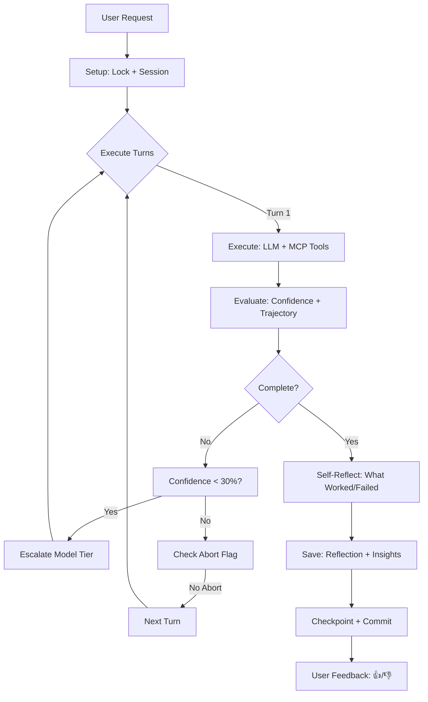

**Memory Components:**
- **Reflections**: Last 5 execution reflections (sliding window in DynamoDB)
- **Key Insights**: Top 20 persistent learnings across all executions
- **Trajectory Summary**: Compressed history of previous attempts
- **Evaluation Scores**: Task completion, code quality, efficiency metrics

**Control Mechanisms:**
| Mechanism | Trigger | Action |
|-----------|---------|--------|
| 🛑 Reaction | On "Starting work..." | Set abort flag, halt at next turn |
| 👍 Reaction | On commit message | Merge branch to main |
| 👎 Reaction | On commit message | Delete branch, reject changes |
| Low confidence | Confidence < 30% for 2 turns | Escalate model |
| Repeated errors | Same error 3 times | Escalate model |
| No progress | No file changes for 5 turns | Escalate model |
| Max escalation | Already at Opus, still stuck | Ask user for clarification |

### 9. Shell Flow (Command Suggestions)

For suggesting ready-to-run shell commands without code generation.

**Process:**
1. User asks how to run a command
2. Single model suggests one-liner command
3. NO scripts - only direct commands

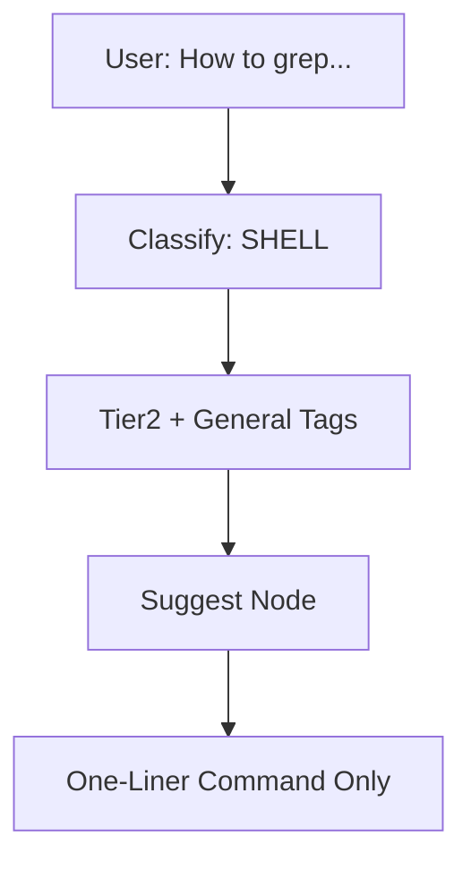

**Best for:** "How to grep...", "kubectl command...", "docker run..."

**Triggers:**
- "How to run...", "command for...", "kubectl..."
- "docker...", "bash...", "shell..."

### 10. Breakglass Flow (Emergency Override)

For direct model access bypassing all checks and routing. Triggered with `!breakglass` or `@modelname` prefix.

**Process:**
1. Parse breakglass model (opus, sonnet, gemini, etc.)
2. Call model directly with breakglass template
3. Bypasses: tool routing, confidence checks, escalation
4. Returns raw model response

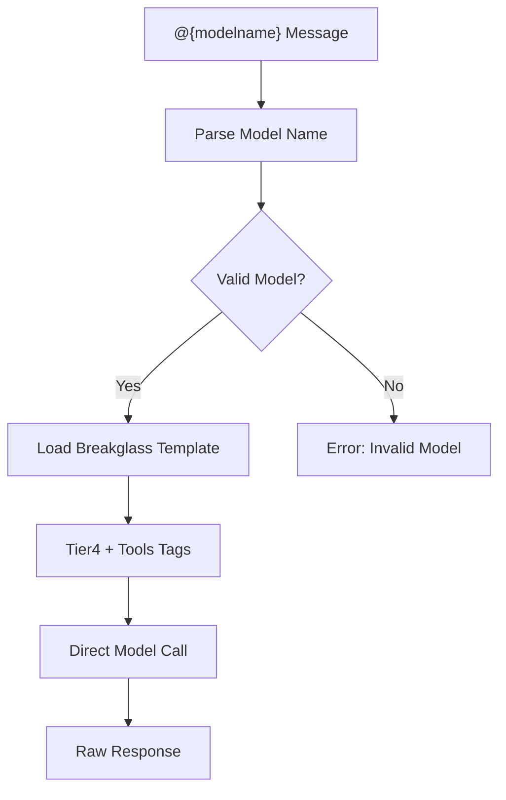

**Available Models:**
| Prefix | Model |
|--------|-------|
| @opus | claude-opus-4 |
| @sonnet | claude-sonnet-4 |
| @gemini | gemini-3-pro |
| @qwen | qwen3-max |
| @gpt | gpt-5.2-codex |
| @default | gemini-2.5-flash-lite |

**Use Cases:**
- When normal routing isn't working
- Need specific model capabilities
- Debugging or testing

### 11. Social Flow (Casual Chat)

For greetings and casual conversation using lightweight tier1 models.

**Process:**
1. User sends greeting or social message
2. Tier1 + social tags for fast, lightweight response
3. Single turn, no tools

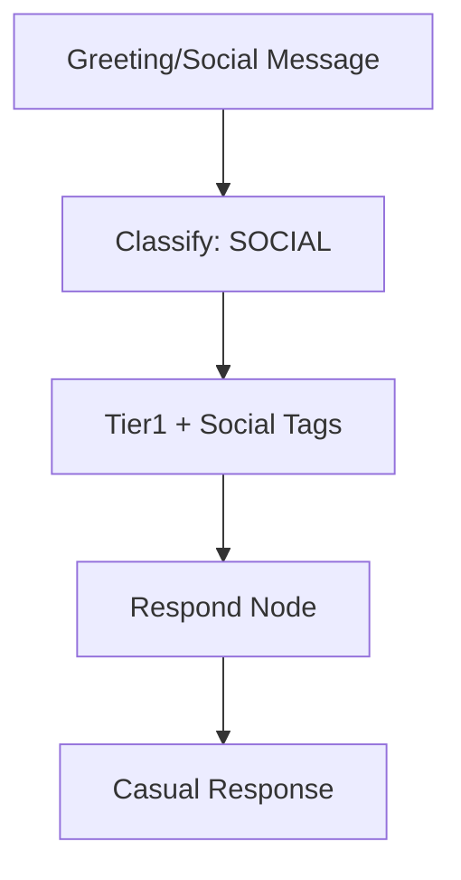

**Best for:** "Hello", "How are you?", "What's up?"

### 12. Proofreader Flow (Grammar & Spelling)

For grammar and spellcheck using lightweight tier1 models.

**Process:**
1. User sends text for proofreading
2. Tier1 + general tags for fast checking
3. Returns corrected text with annotations

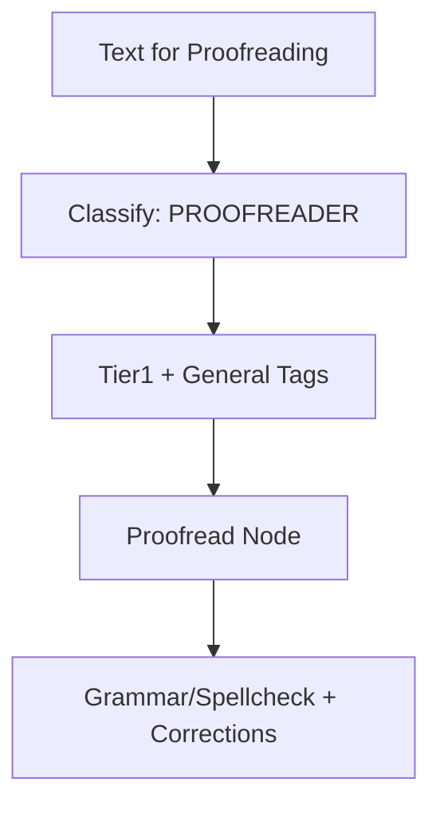

**Best for:** "Proofread this...", "Check my spelling...", "Grammar review..."

For abstract philosophical questions seeking understanding through dialectical exploration.

**Process:**
1. Model A generates a **Thesis** (strongest position)
2. Model B generates an **Antithesis** (counter-position, aware of thesis)
3. Tier3 Synthesizer creates a **Synthesis** (higher-order resolution)

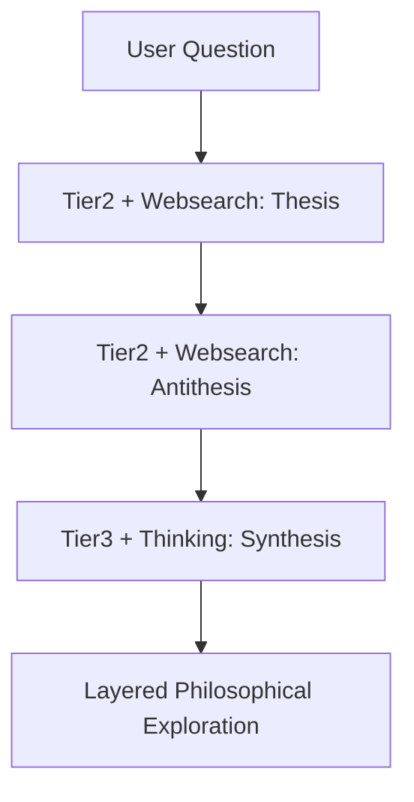

**Best for:** "What is the meaning of life?", "What is consciousness?", "What is justice?"

**Triggers:**
- "meaning of", "nature of", "philosophically", "existential"
- "what is the purpose", "what is reality", "what is truth"

### 13. Multi-Source Consensus Flow (Factual)

For factual questions requiring verification across multiple independent sources.

**Process:**
1. Three models answer the question **independently**
2. Tier3 Judge compares answers, identifies consensus/disagreement
3. Returns synthesis with confidence indicator

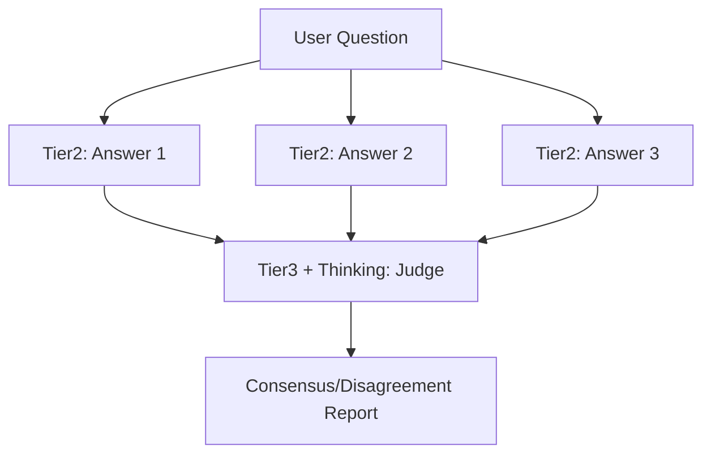

**Best for:** "Is it true that...", "How many...", "When did...", "Fact check..."

**Triggers:**
- "is it true that", "fact check", "verify", "actually true"
- "how many", "when did", "where is", "who was"

### 14. Angel/Devil Debate Flow (Moral/Ethical)

For moral dilemmas and ethical questions requiring balanced consideration of both sides.

**Process:**
1. Model A (Angel) argues **FOR** the position
2. Model B (Devil) argues **AGAINST** the position
3. Tier3 Judge synthesizes a **balanced, nuanced response**

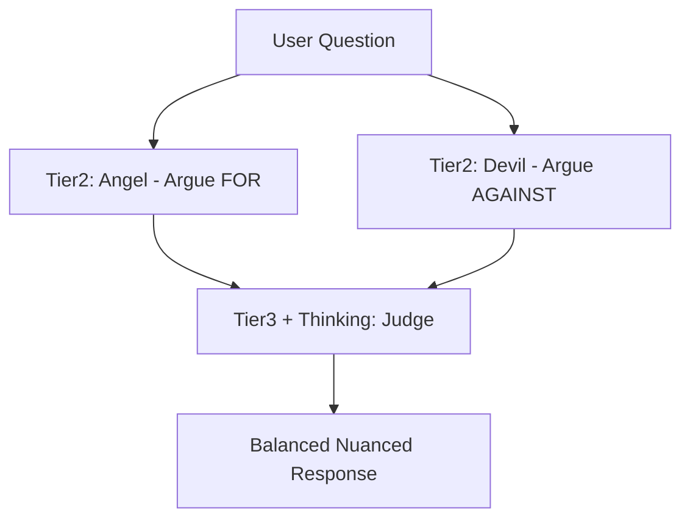

**Best for:** "Should I...", "Is it ethical...", "Moral dilemma", "Right or wrong"

**Triggers:**
- "should I", "is it right to", "ethical", "moral", "dilemma"
- "right or wrong", "good or bad"

## Project Structure

```
app/
├── src/
│   ├── modules/
│   │   ├── langgraph/         # LangGraph-based execution flows
│   │   │   ├── graphs/        # Flow implementations
│   │   │   │   ├── sequential-thinking.ts  # Agentic code generation
│   │   │   │   ├── architecture.ts         # Design/planning flow
│   │   │   │   ├── branch.ts               # Multi-solution brainstorming
│   │   │   │   ├── dialectic.ts            # Thesis → Antithesis → Synthesis
│   │   │   │   ├── consensus.ts            # Multi-source verification
│   │   │   │   ├── angel-devil.ts          # Moral debate
│   │   │   │   ├── simple.ts               # Quick responses
│   │   │   │   ├── shell.ts                # Command suggestions
│   │   │   │   ├── breakglass.ts          # Emergency override
│   │   │   │   ├── social.ts              # Casual chat
│   │   │   │   └── proofreader.ts         # Grammar check
│   │   │   ├── checkpointer.ts   # State persistence
│   │   │   ├── confidence.ts     # Confidence scoring
│   │   │   ├── escalation.ts     # Model tier escalation
│   │   │   ├── logger.ts         # Execution logging
│   │   │   ├── mermaid.ts        # Diagram generation
│   │   │   ├── model-tiers.ts    # Tag-based routing
│   │   │   ├── state.ts          # Graph state types
│   │   │   └── temperature.ts   # Temperature settings
│   │   ├── reflexion/        # Reflexion learning pattern
│   │   │   ├── evaluator.ts   # Trajectory evaluation
│   │   │   ├── memory.ts      # Reflection management
│   │   │   └── types.ts       # Reflexion interfaces
│   │   ├── workspace/        # Per-channel S3 artifact storage
│   │   │   ├── manager.ts    # Workspace operations
│   │   │   ├── s3-sync.ts    # S3 synchronization
│   │   │   └── file-sync.ts  # Discord attachment sync
│   │   ├── discord/          # Discord client with partials
│   │   ├── litellm/          # LLM integration
│   │   ├── dynamodb/         # Database operations
│   │   ├── redis/            # State & locks
│   │   └── agentic/         # Progress streaming
│   │       └── progress.ts   # Discord progress streaming
│   ├── handlers/
│   │   ├── reactions.ts      # Emoji reaction handler
│   │   ├── debounce.ts       # Message debouncing
│   │   └── README.md         # Handler documentation
│   ├── pipeline/             # Message processing pipeline
│   │   ├── session.ts        # Session setup
│   │   ├── planning.ts       # Sequential thinking planner
│   │   ├── classify.ts       # Task classification
│   │   ├── should-respond.ts  # Response gating
│   │   └── types.ts          # Pipeline types
│   ├── templates/            # Prompt templates
│   │   ├── registry.ts       # Template mapping
│   │   ├── loader.ts         # Template loading
│   │   └── prompts/
│   │       ├── coding.txt    # Code implementation
│   │       ├── devops.txt
│   │       ├── architect.txt
│   │       ├── dialectic-thesis.txt
│   │       ├── dialectic-antithesis.txt
│   │       ├── dialectic-synthesis.txt
│   │       └── ...
│   └── index.ts              # Application entry point
└── package.json

terraform/
├── dynamodb.tf               # Sessions + Executions tables
├── s3.tf                     # Artifact storage bucket
├── kubernetes.tf             # K8s deployments (Discord bot, Redis, Sandbox)
├── main.tf                   # Provider config
└── README.md                 # Infrastructure docs
```

## Configuration

### Tag-Based Model Routing

Models are selected via LiteLLM's tag-based routing. The registry only defines **tags**, and LiteLLM selects models that match all specified tags.

**Agent Role Tag Mapping:**
| Role | Tags | Use Case |
|------|------|----------|
| Command Executor | tier2 + tools + general | Fast commands |
| Python Coder | tier2 + tools + programming | Python development |
| JS/TS Coder | tier2 + tools + programming | TypeScript/JavaScript |
| DevOps Engineer | tier3 + tools + general | Infrastructure, K8s |
| Architect | tier4 + tools + thinking | System design |
| Code Reviewer | tier3 + tools + programming | Code quality |
| Documentation Writer | tier3 + tools + general | Docs, README |
| DBA | tier3 + tools + general | Database operations |
| Researcher | tier2 + tools + general | Code search |

### Max Turns

```typescript
// app/src/templates/registry.ts
export const MAX_TURNS_BY_COMPLEXITY = {
  [TaskComplexity.SIMPLE]: 10,
  [TaskComplexity.MEDIUM]: 20,
  [TaskComplexity.COMPLEX]: 35,
};
```


## Safety Features

1. **Max turn limits** - Prevents infinite loops (10-35 turns)
2. **Abort flags** - User can stop anytime with 🛑
3. **Confidence monitoring** - Detects when stuck (< 30%)
4. **Model escalation** - Automatically upgrades when struggling
5. **Checkpointing** - Saves progress every 5 turns
6. **Error tracking** - Detects repeated failures (3x same error)
7. **User clarification** - Asks for help when truly stuck
8. **Channel isolation** - Each channel has independent lock
9. **Event logging** - Full audit trail in S3
10. **Progress streaming** - Real-time visibility in Discord

## Module Documentation

- [Reflexion Module](app/src/modules/reflexion/README.md) - Learning from past attempts
- [Workspace Module](app/src/modules/workspace/README.md) - S3 artifact storage
- [Handlers Module](app/src/handlers/README.md) - Reaction & debounce handlers
- [Infrastructure](terraform/README.md) - Terraform configuration
## Q & A

- **Why?**
  - I was lonely
## Contributing

1. Fork the repository
2. Create a feature branch
3. Make changes with tests
4. Submit pull request

## License

MIT
