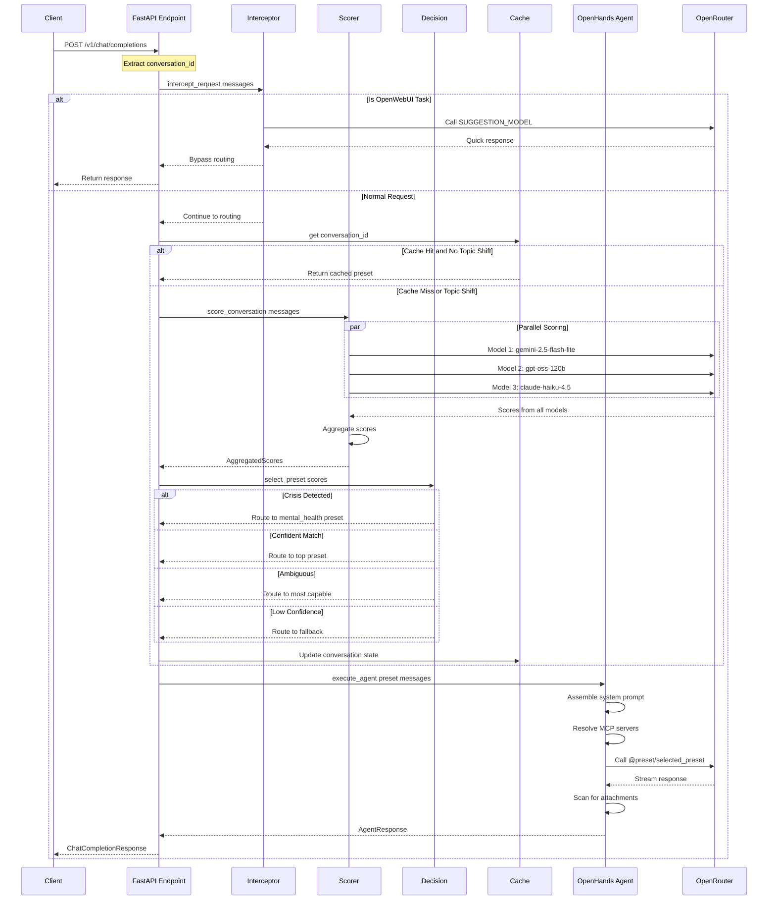
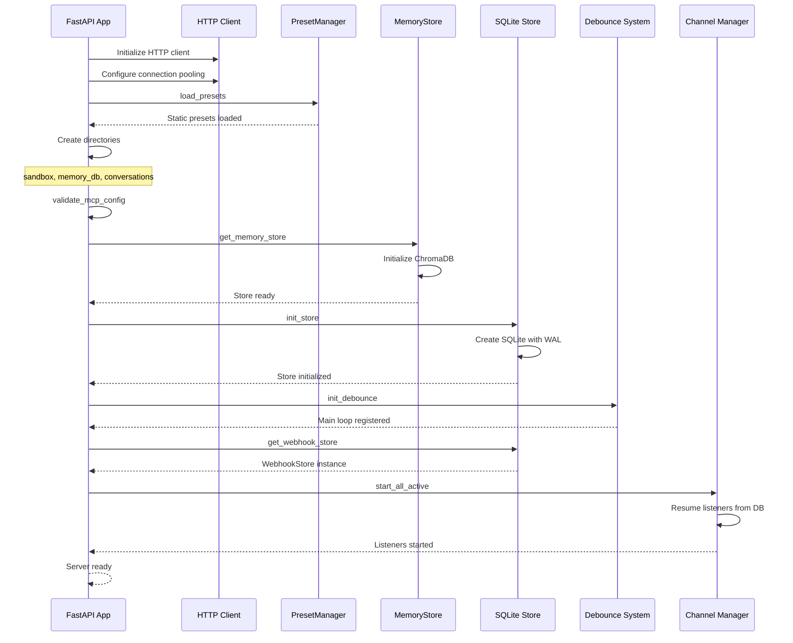

# IF — Intelligent Routing Agent API

An OpenAI-compatible API server in Python that provides intelligent routing to specialized AI presets based on conversation analysis. Incoming chat completions are analyzed by parallel scoring models, classified against preset definitions, and dispatched to the best-fit specialist model via OpenRouter presets.

The agent runs on the OpenHands SDK with access to MCP servers for extended capabilities (AWS docs, financial data, file system), a persistent RAG-backed memory store, conversation persistence, and a file-based attachment system.

---

## Table of Contents

- [Architecture Overview](#architecture-overview)
- [Request Flow Diagram](#request-flow-diagram)
- [API Endpoints](#api-endpoints)
- [Routing Pipeline](#routing-pipeline)
- [Command System](#command-system)
- [User Facts Store](#user-facts-store)
- [Metacognitive Memory System](#metacognitive-memory-system)
- [Reflection Engine](#reflection-engine)
- [Capability Gap Tracking](#capability-gap-tracking)
- [Pattern Detection](#pattern-detection)
- [Opinion Formation](#opinion-formation)
- [Operator Growth Tracking](#operator-growth-tracking)
- [Meta-Analysis](#meta-analysis)
- [Directive System](#directive-system)
- [Pondering Preset](#pondering-preset)
- [Heartbeat System](#heartbeat-system)
- [Channel System](#channel-system)
- [Terminal System](#terminal-system)
- [Orchestrator System](#orchestrator-system)
- [Storage Layer](#storage-layer)
- [MCP Server Configuration](#mcp-server-configuration)
- [Preset System](#preset-system)
- [Environment Variables](#environment-variables)
- [Project Structure](#project-structure)
- [Startup Sequence](#startup-sequence)
- [Future Improvements](#future-improvements)
- [Quick Start](#quick-start)

---

## Architecture Overview

```
┌─────────────────────────────────────────────────────────────────────────────┐
│                           Client Layer                                       │
│                                                                              │
│  ┌────────────────┐    ┌────────────────┐    ┌────────────────┐            │
│  │   OpenWebUI    │    │    Discord     │    │   HTTP Client  │            │
│  │   (polling)    │    │    (bot)       │    │   (curl/SDK)   │            │
│  └───────┬────────┘    └───────┬────────┘    └───────┬────────┘            │
└──────────┼─────────────────────┼─────────────────────┼──────────────────────┘
           │                     │                     │
           ▼                     ▼                     ▼
┌─────────────────────────────────────────────────────────────────────────────┐
│                        Channel System (src/channels/)                        │
│                                                                              │
│  ┌────────────────┐    ┌────────────────┐    ┌────────────────┐            │
│  │ OpenWebUI      │    │ Discord        │    │ HTTP API       │            │
│  │ Listener       │    │ Listener       │    │ (FastAPI)      │            │
│  └───────┬────────┘    └───────┬────────┘    └───────┬────────┘            │
│          │                     │                     │                      │
│          ▼                     ▼                     │                      │
│  ┌────────────────┐    ┌────────────────┐           │                      │
│  │ Translator     │    │ Translator     │           │                      │
│  └───────┬────────┘    └───────┬────────┘           │                      │
│          │                     │                     │                      │
│          ▼                     ▼                     │                      │
│  ┌────────────────┐    ┌────────────────┐           │                      │
│  │ Debounce Queue │    │ Debounce Queue │           │                      │
│  └───────┬────────┘    └───────┬────────┘           │                      │
│          │                     │                     │                      │
│          └──────────┬──────────┘                     │                      │
│                     ▼                                │                      │
│          ┌────────────────┐                          │                      │
│          │ Dispatcher     │                          │                      │
│          └───────┬────────┘                          │                      │
│                  │                                   │                      │
└──────────────────┼───────────────────────────────────┼──────────────────────┘
                   │                                   │
                   ▼                                   ▼
┌─────────────────────────────────────────────────────────────────────────────┐
│                     Core Pipeline (src/api/completions.py)                   │
│                                                                              │
│  ┌─────────────────────────────────────────────────────────────────────┐   │
│  │                    process_chat_completion_internal()                │   │
│  │                                                                      │   │
│  │  Step 1: Request Interceptor (OpenWebUI task detection)             │   │
│  │          ┌────────────────────────────────────────────────┐          │   │
│  │          │ intercept_request() → SUGGESTION_MODEL         │          │   │
│  │          │ (bypass routing for title/suggestion tasks)    │          │   │
│  │          └────────────────────────────────────────────────┘          │   │
│  │                           │                                          │   │
│  │  Step 2: Parallel Scoring (preset classification)                   │   │
│  │          ┌────────────────────────────────────────────────┐          │   │
│  │          │ score_conversation() → SCORING_MODELS (3x)     │          │   │
│  │          │ (gemini-flash, gpt-oss, claude-haiku)          │          │   │
│  │          └────────────────────────────────────────────────┘          │   │
│  │                           │                                          │   │
│  │  Step 3: Decision Logic (preset selection)                          │   │
│  │          ┌────────────────────────────────────────────────┐          │   │
│  │          │ select_preset() → Crisis/Confident/Ambiguous   │          │   │
│  │          └────────────────────────────────────────────────┘          │   │
│  │                           │                                          │   │
│  │  Step 4: Conversation Cache (routing state)                         │   │
│  │          ┌────────────────────────────────────────────────┐          │   │
│  │          │ ConversationCache → Topic Shift Detection      │          │   │
│  │          └────────────────────────────────────────────────┘          │   │
│  │                           │                                          │   │
│  │  Step 5: Agent Execution (OpenHands SDK)                            │   │
│  │          ┌────────────────────────────────────────────────┐          │   │
│  │          │ execute_agent() → @preset/{selected_preset}    │          │   │
│  │          └────────────────────────────────────────────────┘          │   │
│  └─────────────────────────────────────────────────────────────────────┘   │
└─────────────────────────────────────────────────────────────────────────────┘
                   │
                   ▼
┌─────────────────────────────────────────────────────────────────────────────┐
│                     OpenHands Agent (src/agent/)                            │
│                                                                              │
│  ┌────────────────┐    ┌────────────────┐    ┌────────────────┐            │
│  │  LLM Config    │    │  MCP Servers   │    │ Memory Tools   │            │
│  │  @preset/slug  │    │  (uvx-based)   │    │  (ChromaDB)    │            │
│  └────────────────┘    └────────────────┘    └────────────────┘            │
│                                                                              │
│  ┌────────────────────────────────────────────────────────────┐            │
│  │                    Conversation Persistence                 │            │
│  │                 (src/data/conversations/{id}/)             │            │
│  └────────────────────────────────────────────────────────────┘            │
└─────────────────────────────────────────────────────────────────────────────┘
                   │
                   ▼
┌─────────────────────────────────────────────────────────────────────────────┐
│              METACOGNITIVE LAYER (src/agent/reflection/)                     │
│                                                                              │
│  ┌──────────────┐ ┌──────────────┐ ┌──────────────┐ ┌──────────────┐       │
│  │   Pattern    │ │   Opinion    │ │   Meta       │ │   Growth     │       │
│  │   Detector   │ │   Former     │ │   Analyzer   │ │   Tracker    │       │
│  └──────┬───────┘ └──────┬───────┘ └──────┬───────┘ └──────┬───────┘       │
│         │                │                │                │                │
│         └────────────────┼────────────────┼────────────────┘                │
│                          │                │                                 │
│                    ┌─────┴──────┐   ┌─────┴──────┐                          │
│                    │ Reflection │   │ Capability │                          │
│                    │   Engine   │   │  Tracker   │                          │
│                    └─────┬──────┘   └─────┬──────┘                          │
└──────────────────────────┼────────────────┼──────────────────────────────────┘
                           │                │
                           ▼                ▼
┌─────────────────────────────────────────────────────────────────────────────┐
│                  KNOWLEDGE STORE (src/memory/user_facts.py)                  │
│                                                                              │
│  ┌─────────────┐ ┌─────────────┐ ┌─────────────┐ ┌─────────────┐           │
│  │  Operator   │ │   Agent     │ │  Capability │ │  Session    │           │
│  │   Facts     │ │   Self      │ │    Gaps     │ │  Outcomes   │           │
│  ├─────────────┤ ├─────────────┤ ├─────────────┤ ├─────────────┤           │
│  │ preferences │ │ identity    │ │ limitation  │ │ what_worked │           │
│  │ opinions    │ │ opinions    │ │ frequency   │ │ what_failed │           │
│  │ skills      │ │ principles  │ │ workarounds │ │ open_issues │           │
│  │ life_events │ │ stance_log  │ │ tool_spec   │ │             │           │
│  └─────────────┘ └─────────────┘ └─────────────┘ └─────────────┘           │
│                                                                              │
│  ┌─────────────┐ ┌─────────────┐ ┌─────────────┐                           │
│  │  Opinion    │ │  Pattern    │ │Misconception│                           │
│  │   Pairs     │ │   Log       │ │   Tracker   │                           │
│  ├─────────────┤ ├─────────────┤ ├─────────────┤                           │
│  │ user_stated │ │ theme       │ │ topic       │                           │
│  │ agent_view  │ │ frequency   │ │ what_wrong  │                           │
│  │ reasoning   │ │ trend_dir   │ │ corrected   │                           │
│  └─────────────┘ └─────────────┘ └─────────────┘                           │
└─────────────────────────────────────────────────────────────────────────────┘
                   │
                   ▼
            OpenRouter API
         (@preset/{name} routing)
```

---

## Request Flow Diagram



---

## API Endpoints

### Core Endpoints

#### `GET /v1/models`

Returns the model list with a single entry for `if-prototype`.

**Response:**
```json
{
  "object": "list",
  "data": [
    {
      "id": "if-prototype",
      "object": "model",
      "created": 1700000000,
      "owned_by": "if-prototype"
    }
  ]
}
```

#### `POST /v1/chat/completions`

Standard OpenAI chat completions interface. Accepts `model: "if-prototype"` only.

**Request Body:**
```json
{
  "model": "if-prototype",
  "messages": [
    {"role": "user", "content": "Hello, how are you?"}
  ],
  "stream": false
}
```

**Response:**
```json
{
  "id": "chatcmpl-abc123",
  "object": "chat.completion",
  "created": 1700000000,
  "model": "if-prototype",
  "choices": [
    {
      "index": 0,
      "message": {
        "role": "assistant",
        "content": "Response text here..."
      },
      "finish_reason": "stop"
    }
  ]
}
```

#### `POST /api/v1/chat/completions`

Alias for `/v1/chat/completions` for OpenWebUI compatibility.

---

### Webhook Management Endpoints

#### `POST /v1/webhooks/register`

Register a new channel webhook and start listening immediately.

**Request Body (Discord):**
```json
{
  "platform": "discord",
  "label": "My Discord Channel",
  "discord": {
    "bot_token": "your-bot-token",
    "channel_id": "123456789"
  }
}
```

**Request Body (OpenWebUI):**
```json
{
  "platform": "openwebui",
  "label": "My OpenWebUI Channel",
  "openwebui": {
    "base_url": "https://openwebui.example.com",
    "channel_id": "channel-uuid",
    "api_key": "your-api-key"
  }
}
```

**Response:**
```json
{
  "webhook_id": "wh_abc123def456",
  "conversation_id": "conv_xyz789",
  "platform": "discord",
  "label": "My Discord Channel",
  "status": "listening"
}
```

#### `GET /v1/webhooks/`

List all registered webhooks (active and inactive).

**Response:**
```json
{
  "webhooks": [
    {
      "webhook_id": "wh_abc123",
      "conversation_id": "conv_xyz",
      "platform": "discord",
      "label": "My Channel",
      "status": "active"
    }
  ],
  "total": 1
}
```

#### `GET /v1/webhooks/active`

List only active webhooks.

#### `GET /v1/webhooks/{webhook_id}`

Get a specific webhook by ID.

#### `DELETE /v1/webhooks/{webhook_id}`

Deactivate a webhook (stops listener, marks as inactive).

#### `POST /v1/webhooks/{webhook_id}/restart`

Restart a deactivated webhook.

---

### File Serving Endpoints

#### `GET /files/sandbox/{conversation_id}/{filepath:path}`

Serve files from a conversation's sandbox directory.

**Features:**
- Path traversal protection
- Automatic MIME type detection
- Scoped to conversation-specific directory

---

### Health Check

#### `GET /health`

Returns system health status.

**Response:**
```json
{
  "status": "healthy",
  "service": "if-prototype-a1",
  "features": {
    "routing": "active",
    "interceptor": "active",
    "commands": "active",
    "attachments": "active",
    "user_facts_store": "active",
    "user_facts_count": 47,
    "presets_loaded": true,
    "preset_count": 10,
    "channel_system": "active",
    "active_listeners": 2,
    "heartbeat": "active",
    "heartbeat_idle_hours": 6.0,
    "cached_conversations": 5,
    "pinned_conversations": 1,
    "reflection_engine": "active",
    "reflection_periodic_hours": 6.0,
    "capability_gaps": 3,
    "tool_suggestions": 1
  }
}
```

---

## Routing Pipeline

The routing pipeline in [`src/api/completions.py`](src/api/completions.py:74) (`process_chat_completion_internal()`) consists of 5 steps:

### Step 1: Request Interception

**Module:** [`src/routing/interceptor.py`](src/routing/interceptor.py)

Detects OpenWebUI suggestion/title generation requests and bypasses the full routing pipeline.

- Checks for known OpenWebUI task markers in message content
- Calls `SUGGESTION_MODEL` (default: `mistralai/mistral-nemo`) directly
- Returns immediately without running scoring

**Detection Markers:**
- `"### Task:\nSuggest 3-5 relevant follow-up"`
- `"### Task:\nGenerate a concise, 3-5 word title"`
- `"### Task:\nGenerate 1-3 broad tags"`

### Step 2: Parallel Scoring

**Module:** [`src/routing/scorer.py`](src/routing/scorer.py)

Sends the last `MESSAGE_WINDOW` messages to all scoring models in parallel.

**Default Scoring Models:**
1. `google/gemini-2.5-flash-lite`
2. `openai/gpt-oss-120b`
3. `anthropic/claude-haiku-4.5`

**Scoring Prompt Structure:**
```
You are a conversation classifier. Given the following conversation
and a set of preset descriptions, score how well the conversation
matches each preset.

Return a JSON object where each key is the preset slug and the
value is a confidence score from 0.0 to 1.0.

Additionally, include a "crisis" key scored 0.0 to 1.0 indicating
whether the conversation contains signals of genuine distress.
```

**Response Validation:**
1. Parse response as JSON
2. Verify all preset slugs are present
3. Verify `crisis` key exists
4. Verify all values are floats between 0.0 and 1.0
5. Discard invalid responses

**Score Aggregation:**
- Each model nominates a top preset with confidence gap
- If all models agree → use that preset
- If models disagree → use scores from model with largest gap
- Crisis score = maximum across all models

### Step 3: Decision Logic

**Module:** [`src/routing/decision.py`](src/routing/decision.py)

Selects the final preset based on aggregated scores.

**Decision Tree:**

```
1. CRISIS CHECK
   If crisis_score > CRISIS_THRESHOLD (0.3):
     → Route to MENTAL_HEALTH_PRESET
     → Skip all other logic

2. CONFIDENT ROUTE
   If top_score > CONFIDENCE_THRESHOLD (0.6)
   AND (top_score - second_score) > CONFIDENCE_GAP (0.2):
     → Route to top-scoring preset

3. AMBIGUOUS ROUTE
   If multiple presets score above CONFIDENCE_THRESHOLD
   and gap is within CONFIDENCE_GAP:
     → Route to most capable preset among candidates

4. LOW CONFIDENCE FALLBACK
   If no preset scores above CONFIDENCE_THRESHOLD:
     → Route to most capable general preset
```

**Capability Ranking:**
```python
capability_ranking = {
    "architecture": 100,  # Claude 3.5 Sonnet
    "code": 95,         # Claude 3.5 Sonnet
    "reasoning": 90,      # o1-preview
    "general": 50,
    "social": 40,
    "health": 30,
}
```

### Step 4: Conversation State Cache

**Module:** [`src/routing/cache.py`](src/routing/cache.py)

Caches routing decisions per conversation to avoid reclassifying on every message.

**Cache Entry:**
```python
@dataclass
class ConversationState:
    conversation_id: str
    active_preset: str
    anchor_window: List[str]      # Messages at last classification
    last_scores: AggregatedScores
    last_decision: RoutingDecision
    last_updated: datetime
```

**Topic Shift Detection:**

**Module:** [`src/routing/topic_shift.py`](src/routing/topic_shift.py)

When cache is warm (preset already assigned), uses LLM to detect topic shifts:

```python
async def topic_has_shifted(
    anchor_messages: List[str],  # From cache
    current_messages: List[str], # Current window
    http_client: httpx.AsyncClient,
) -> bool:
```

- Uses `TOPIC_SHIFT_MODEL` (default: `z-ai/glm-4.7-flash`)
- 5-second timeout, defaults to `False` on failure
- Returns `True` only for major domain shifts (code → finance)
- Ignores sub-topic shifts (Python → Terraform)
- Ignores social noise ("thanks", "ok")

### Step 5: Agent Execution

**Module:** [`src/agent/session.py`](src/agent/session.py)

Executes the conversation with the selected preset via OpenHands SDK.

**Process:**
1. Get or create agent session for conversation
2. Assemble system prompt (base + operator context + preset-specific)
3. Resolve MCP servers for preset
4. Execute agent with messages
5. Scan for new file attachments
6. Return response with attachments
7. Fire-and-forget conversation summarization

---

## Command System

The command system provides slash commands for manual control over routing behavior and metacognitive features. Commands are processed before any routing or LLM calls, returning synthetic responses immediately with zero latency.

**Modules:**
- [`src/routing/commands.py`](src/routing/commands.py) — Routing commands
- [`src/agent/commands.py`](src/agent/commands.py) — Metacognitive commands

### Routing Commands

| Command | Action | Response |
|---------|--------|----------|
| `/end_convo` | Clear conversation state, force reclassification | `"Acknowledged. Categorisation state cleared. Next message will be re-evaluated."` |
| `/{preset_name}` | Pin routing to a specific preset | `"Acknowledged. Routing pinned to preset: {preset_name}. Send /end_convo to release."` |
| `/pondering` | Engage pondering mode (special pin behavior) | `"Acknowledged. Pondering mode engaged."` |
| `/{invalid}` | Unknown preset | `"Negative. Preset \"{name}\" not recognized.\nAvailable: {sorted list}."` |

### Metacognitive Commands

| Command | Action | Example Output |
|---------|--------|----------------|
| `/reflect` | Trigger manual reflection cycle | "Reflection cycle initiated. Check logs for results." |
| `/gaps` | List capability gaps by priority | Table: Priority, Status, Triggers, Description |
| `/patterns` | Show detected patterns | Pattern types with frequency and confidence |
| `/opinions` | Show opinion pairs | User vs agent positions with reasoning |
| `/growth` | Show operator growth report | Knowledge gaps, skill trends, abandoned interests |
| `/meta` | Show store health metrics | Category distribution, suggestions |
| `/tools` | Show tool suggestions from gaps | Priority, acceptance criteria, example triggers |

### Command Processing

Commands are processed in **Step 0** of the routing pipeline, before interception or scoring:

```python
cmd = parse_command(last_message_content, preset_manager.slugs())
if cmd is not None:
    if cmd.action == CommandAction.RESET_CACHE:
        conversation_cache.evict(cache_key)
        return synthetic_response(cmd.response_text)
    if cmd.action == CommandAction.PIN_PRESET:
        conversation_cache.pin(cache_key, cmd.preset)
        return synthetic_response(cmd.response_text)
```

### Pin Lifecycle

When a preset is pinned:

1. **Normal presets**: Auto-release after `RECLASSIFY_MESSAGE_COUNT` messages if topic shift is detected
2. **Pondering preset**: Never auto-releases. Only `/end_convo` or `/{other_preset}` can release it.

```python
if cached and cached.pinned:
    if cached.active_preset == "pondering":
        # Pondering pins never auto-release
        selected_preset = cached.active_preset
    else:
        cached.pin_message_count += 1
        if cached.pin_message_count >= RECLASSIFY_MESSAGE_COUNT:
            if should_check_shift(cached.anchor_window, current_window):
                shifted = await topic_has_shifted(...)
                if shifted:
                    cached.pinned = False  # Release pin
```

---

## User Facts Store

The user facts store replaces the simpler memory store with a structured fact system supporting categories, sources, and supersession. It uses ChromaDB for semantic search.

**Module:** [`src/memory/user_facts.py`](src/memory/user_facts.py)

### Fact Schema

```python
@dataclass
class UserFact:
    id: str                    # UUID
    username: str              # Operator identifier
    content: str               # The fact content
    category: FactCategory     # Classification category
    source: FactSource         # How this fact was captured
    confidence: float          # 0.0 to 1.0
    cache_key: str             # Where this fact was captured
    created_at: str            # ISO timestamp
    updated_at: str            # ISO timestamp
    superseded_by: str | None  # ID of replacement fact
    active: bool               # False if superseded
```

### Categories

#### Operator Facts

| Category | Description | Example |
|----------|-------------|---------|
| `personal` | Name, location, profession, relationships | "Operator lives in Boston" |
| `preference` | Language/framework preferences, communication style | "Operator prefers TypeScript over JavaScript" |
| `opinion` | Strong stances on technologies, approaches | "Operator dislikes microservices architecture" |
| `skill` | Self-reported or demonstrated understanding | "Operator identifies as senior DevOps engineer" |
| `life_event` | Job changes, moves, competitions, milestones | "Operator started new job at TechCorp (2026-02)" |
| `future_direction` | Goals, timelines, aspirations | "Operator planning to learn Rust (as of 2026-03)" |
| `project_direction` | Current project plans and direction | "Operator migrating from Express to Fastify (as of 2026-02)" |
| `mental_state` | Noted shifts in mood, stress, outlook | "Operator showing increased stress about deadline" |
| `interest_area` | Topics they gravitate toward | "Operator frequently asks about AWS networking" |
| `conversation_summary` | Auto-generated summaries of discussions | "Discussed Kubernetes deployment strategies" |
| `topic_log` | Domains discussed and when | "Topic: containerization discussed 2026-03-01" |
| `model_assessment` | Agent's observations about the operator | "Operator shows knowledge gap in network subnetting" |

#### Agent Self-Knowledge

| Category | Description | Example |
|----------|-------------|---------|
| `agent_identity` | Agent's self-knowledge | "I am IF, an intelligent routing agent" |
| `agent_opinion` | Agent's formed positions | "Monoliths are correct default for teams < 20" |
| `agent_principle` | Operating principles learned | "Always verify arithmetic with calculator" |

#### Capability Tracking

| Category | Description | Example |
|----------|-------------|---------|
| `capability_gap` | Things agent can't do | "Cannot send emails" |
| `tool_suggestion` | Derived from frequent gaps | "email_mcp_server" |

#### Opinion Pairs

| Category | Description | Example |
|----------|-------------|---------|
| `opinion_pair` | User + agent positions on topics | Topic: "Microservices", User: "Always better", Agent: "Disagree" |

#### Operator Growth

| Category | Description | Example |
|----------|-------------|---------|
| `misconception` | User misunderstandings corrected | "CIDR /24 = 512 addresses (corrected to 256)" |
| `session_reflection` | Post-session learnings | "What worked: step-by-step explanations" |

### Sources

| Source | Description |
|--------|-------------|
| `user_stated` | Explicitly stated by the operator |
| `model_observed` | Observed from operator behavior |
| `model_assessed` | Agent's assessment of operator capabilities |
| `conversation_derived` | Extracted from conversation context |

### Agent Tools

**Module:** [`src/agent/tools/user_facts.py`](src/agent/tools/user_facts.py)

| Tool | Parameters | Description |
|------|-----------|-------------|
| `user_facts_search` | `query`, `category?`, `limit?` | Semantic search across stored facts |
| `user_facts_add` | `content`, `category`, `source?`, `confidence?` | Store a new fact |
| `user_facts_update` | `fact_id`, `new_content`, `reason` | Supersede an existing fact |
| `user_facts_list` | `category?`, `include_history?` | List all stored facts |
| `user_facts_remove` | `fact_id` | Hard delete (requires confirmation per Directive 0-1) |

### Auto-Retrieval

During system prompt assembly, relevant facts are automatically retrieved and injected:

```python
async def get_operator_context(messages: list[dict], store: UserFactStore) -> str:
    facts = await store.search(last_user_msg, limit=5)
    assessments = await store.search(last_user_msg, category=FactCategory.MODEL_ASSESSMENT, limit=3)
    # Returns formatted "OPERATOR CONTEXT" block
```

### Conversation Summarization

**Module:** [`src/memory/summarizer.py`](src/memory/summarizer.py)

After each agent execution, a fire-and-forget task generates a conversation summary:

- Only summarizes substantive exchanges (>3 messages)
- Uses `SUGGESTION_MODEL` for cheap summarization
- Stores as `conversation_summary` fact
- Zero impact on response latency

---

## Metacognitive Memory System

The metacognitive memory system provides self-reflective capabilities that allow the agent to learn from experience, track its own limitations, and improve over time. This implements the architecture from plan.md Parts 1-10.

### Architecture

```
┌──────────────────────────────────────────────────────────────────┐
│                    REFLECTION ENGINE CYCLE                        │
│                                                                  │
│  ┌─────────────────────────────────────────────────────┐        │
│  │ 1. POST-SESSION REFLECTION                          │        │
│  │    - Summarize what happened                        │        │
│  │    - Identify what worked / what failed             │        │
│  │    - Log capability gaps hit                        │        │
│  │    - Detect misconceptions surfaced                 │        │
│  │    - Store as session_reflection                    │        │
│  └──────────────────────┬──────────────────────────────┘        │
│                         │                                        │
│  ┌──────────────────────▼──────────────────────────────┐        │
│  │ 2. PATTERN DETECTION                                │        │
│  │    - Cluster recent topics by semantic similarity   │        │
│  │    - Detect temporal patterns                       │        │
│  │    - Detect skill gap patterns                      │        │
│  │    - Update frequency + confidence or create new    │        │
│  └──────────────────────┬──────────────────────────────┘        │
│                         │                                        │
│  ┌──────────────────────▼──────────────────────────────┐        │
│  │ 3. OPINION FORMATION                                │        │
│  │    - Review user opinions without agent responses   │        │
│  │    - Form agent position with reasoning             │        │
│  │    - Store as opinion_pair                          │        │
│  └──────────────────────┬──────────────────────────────┘        │
│                         │                                        │
│  ┌──────────────────────▼──────────────────────────────┐        │
│  │ 4. CAPABILITY GAP ANALYSIS                          │        │
│  │    - Aggregate gaps by frequency                    │        │
│  │    - Generate acceptance criteria for top gaps      │        │
│  │    - Promote high-priority gaps to tool_suggestion  │        │
│  └──────────────────────┬──────────────────────────────┘        │
│                         │                                        │
│  ┌──────────────────────▼──────────────────────────────┐        │
│  │ 5. META-ANALYSIS                                    │        │
│  │    - Category distribution (what's growing?)        │        │
│  │    - Stale fact detection                           │        │
│  │    - Category fit analysis                          │        │
│  └──────────────────────┬──────────────────────────────┘        │
│                         │                                        │
│  ┌──────────────────────▼──────────────────────────────┐        │
│  │ 6. OPERATOR GROWTH TRACKING                         │        │
│  │    - Review misconceptions: any repeated?           │        │
│  │    - Review skill assessments: improvement trend?   │        │
│  │    - Generate learning suggestions                  │        │
│  └──────────────────────────────────────────────────────┘        │
└──────────────────────────────────────────────────────────────────┘
```

### What This Gets You

The metacognitive system maintains a structured model of:

| Knowledge Type | Description | Benefit |
|----------------|-------------|---------|
| **Operator Knowledge** | What the operator knows and doesn't know | Personalized responses, gap-aware assistance |
| **Agent Capabilities** | What the agent can and can't do | Clear limitation tracking, tool development pipeline |
| **Strategy Memory** | What approaches work for what problem types | Improved routing, better outcomes |
| **Opinion Positions** | Where both parties disagree and why | Transparent disagreement, reasoned discussion |
| **Behavioral Patterns** | What patterns exist in operator behavior | Proactive suggestions, anticipation |
| **Self-Knowledge** | What the system itself is missing | Self-improving feedback loop |

---

## Reflection Engine

The reflection engine runs metacognitive analysis cycles to learn from experience.

**Module:** [`src/agent/reflection/engine.py`](src/agent/reflection/engine.py)

### When It Runs

| Trigger | Condition | Description |
|---------|-----------|-------------|
| Post-session | >5 exchanges | After substantive conversations |
| Periodic | Every 6 hours | Background analysis |
| On-demand | `/reflect` command | Manual trigger |
| Threshold | Store size limits | When thresholds are hit |

### Threshold Triggers

| Threshold | Default | Description |
|-----------|---------|-------------|
| `REFLECTION_THRESHOLD_UNCATEGORIZED` | 20 | Uncategorized facts limit |
| `REFLECTION_THRESHOLD_GAPS_NO_CRITERIA` | 5 | Gaps without criteria limit |
| `REFLECTION_THRESHOLD_OPINIONS_NO_RESPONSE` | 10 | Opinions needing response |

### Components

| Component | Module | Purpose |
|-----------|--------|---------|
| Pattern Detector | [`pattern_detector.py`](src/agent/reflection/pattern_detector.py) | Detect recurring themes |
| Opinion Former | [`opinion_formation.py`](src/agent/reflection/opinion_formation.py) | Form agent positions |
| Meta Analyzer | [`meta_analysis.py`](src/agent/reflection/meta_analysis.py) | Store health metrics |
| Growth Tracker | [`growth_tracker.py`](src/agent/reflection/growth_tracker.py) | Track operator learning |

---

## Capability Gap Tracking

The capability gap system tracks agent limitations and generates tool development suggestions.

**Module:** [`src/agent/tools/capability_tracker.py`](src/agent/tools/capability_tracker.py)

### Gap Lifecycle

```
User asks for something ──► Agent can't do it
         │
         ▼
Log capability_gap
{content, context, timestamp}
         │
         ▼
Reflection engine aggregates ──► trigger_count++
         │
         ▼
threshold (trigger_count >= 3)?
     │               │
    No              Yes
     │               │
     ▼               ▼
Continue      Generate acceptance criteria
tracking      Compute priority score
              Promote to tool_suggestion
                   │
                   ▼
         Surface via /gaps command
```

### Gap Schema

```python
@dataclass
class CapabilityGap:
    id: str
    content: str                    # "Cannot send emails"
    trigger_count: int              # How many times hit
    first_seen: str                 # ISO timestamp
    last_seen: str                  # ISO timestamp
    trigger_contexts: list[str]     # When it was hit
    workaround: str | None          # Suggested workaround
    suggested_tool: str | None      # "email_mcp_server"
    acceptance_criteria: list[str]  # What "solved" looks like
    status: str                     # "open" | "workaround_exists" | "resolved"
    priority_score: float           # Computed priority
```

### Priority Score Formula

```
priority = (trigger_count / max_triggers) * 0.4
         + recency_weight * 0.3
         + impact_estimate * 0.3

Where recency_weight = e^(-0.05 * days_since_last_seen)
```

---

## Pattern Detection

The pattern detector identifies recurring themes in operator behavior.

**Module:** [`src/agent/reflection/pattern_detector.py`](src/agent/reflection/pattern_detector.py)

### Pattern Types

| Type | Description | Example |
|------|-------------|---------|
| Temporal | Time-based patterns | "Asks about AWS every Monday" |
| Topical | Subject clustering | "Networking questions cluster together" |
| Behavioral | Action patterns | "Prefers step-by-step explanations" |
| Skill Gap | Learning patterns | "Repeated basic questions in domain" |

### Pattern Schema

```python
@dataclass
class Pattern:
    id: str
    description: str            # "Operator asks about AWS networking weekly"
    pattern_type: str           # "temporal" | "topical" | "behavioral" | "skill_gap"
    evidence: list[str]         # Fact IDs supporting this pattern
    frequency: int              # How many times observed
    confidence: float           # How confident the pattern is real
    trend_direction: str        # "increasing" | "stable" | "decreasing"
    last_seen: str
    actionable: bool            # Does this suggest action?
    suggested_action: str       # "Proactively surface VPC docs"
```

---

## Opinion Formation

The opinion formation system creates agent positions on user-stated opinions.

**Module:** [`src/agent/reflection/opinion_formation.py`](src/agent/reflection/opinion_formation.py)

### Opinion Pair Schema

```python
@dataclass
class OpinionPair:
    id: str
    topic: str                  # "Microservices vs monoliths"
    user_position: str          # "Microservices are always better"
    agent_position: str         # "Disagree. Monoliths correct for teams < 20"
    agent_reasoning: str        # The why
    agent_confidence: float     # 0.0-1.0
    agreement_level: str        # "agree" | "partial" | "disagree"
    evolution: list[dict]       # Track position changes
    created_at: str
    updated_at: str
```

### Agreement Levels

| Level | Emoji | Meaning |
|-------|-------|---------|
| `agree` | 🟢 | Agent agrees with user position |
| `partial` | 🟡 | Agent partially agrees |
| `disagree` | 🔴 | Agent disagrees with reasoning |
| `insufficient_data` | ⚪ | Not enough information |

---

## Operator Growth Tracking

The growth tracker monitors operator learning and identifies knowledge gaps.

**Module:** [`src/agent/reflection/growth_tracker.py`](src/agent/reflection/growth_tracker.py)

### Misconception Schema

```python
@dataclass
class Misconception:
    id: str
    topic: str                  # "CIDR notation"
    what_they_said: str         # "A /24 gives you 512 addresses"
    what_is_correct: str        # "A /24 gives you 256 addresses"
    domain: str                 # "networking"
    severity: str               # "minor" | "moderate" | "critical"
    corrected_in_session: bool  # Was it corrected live?
    recurrence_count: int       # How many times repeated
    suggested_resources: list   # Reading suggestions
```

### Growth Report

The `/growth` command generates reports showing:

- **Knowledge Gaps Identified**: Misconceptions logged, trends
- **Skills Trending Up**: Progressive advancement in topics
- **Abandoned Interests**: Topics mentioned but not followed up

---

## Meta-Analysis

The meta-analyzer examines the fact store itself to identify patterns and health metrics.

**Module:** [`src/agent/reflection/meta_analysis.py`](src/agent/reflection/meta_analysis.py)

### Store Health Metrics

```python
@dataclass
class StoreHealthMetrics:
    total_facts: int
    active_facts: int
    superseded_facts: int
    category_distribution: dict[str, int]
    stalest_category: str           # Category with oldest avg fact
    fastest_growing: str            # Most new facts in last 30 days
    most_superseded: str            # Category with most churn
    uncategorized_pressure: list    # Facts hard to categorize
    suggested_new_categories: list  # Proposed categories
    capability_gap_summary: dict    # {total, open, resolved, top_priority}
    reflection_count: int           # Sessions reflected on
```

### Category Evolution

When facts don't fit well into existing categories:

1. Log the categorization tension as `meta_observation`
2. Cluster poorly-fitting facts during reflection
3. If cluster size ≥ 3, propose new category

---

## Directive System

The directive system provides versioned behavioral directives backed by DynamoDB. Directives define standing orders and behavioral rules that the agent follows across all conversations.

**Modules:**
- [`src/storage/directive_model.py`](src/storage/directive_model.py) — Directive data model
- [`src/storage/directive_store.py`](src/storage/directive_store.py) — DynamoDB backend with caching
- [`src/agent/tools/directive_tools.py`](src/agent/tools/directive_tools.py) — Agent tools for directive CRUD
- [`src/api/directives.py`](src/api/directives.py) — REST API endpoints

### Architecture

```
┌──────────────────────────────────────────────────────────────────┐
│                    DIRECTIVE SYSTEM                               │
│                                                                  │
│  ┌─────────────────────────────────────────────────────────┐    │
│  │                    DynamoDB Backend                       │    │
│  │                                                           │    │
│  │  PK=DIR, SK={alpha}-{beta}-{version}                     │    │
│  │  - All directives stored with versioning                 │    │
│  │  - Immutable history (revisions create new versions)     │    │
│  │  - Active flag for soft-delete                           │    │
│  └──────────────────────────┬──────────────────────────────┘    │
│                             │                                    │
│                             ▼                                    │
│  ┌─────────────────────────────────────────────────────────┐    │
│  │                    In-Memory Cache                        │    │
│  │                                                           │    │
│  │  - Loads all active directives at startup                │    │
│  │  - Only highest version per alpha/beta is cached         │    │
│  │  - Fast access for system prompt assembly                │    │
│  └──────────────────────────┬──────────────────────────────┘    │
│                             │                                    │
│              ┌──────────────┴──────────────┐                    │
│              ▼                             ▼                    │
│  ┌────────────────────┐        ┌────────────────────┐          │
│  │   Agent Tools      │        │    REST API        │          │
│  │                    │        │                    │          │
│  │  directive_add     │        │  GET /directives   │          │
│  │  directive_revise  │        │  GET /{a}/{b}      │          │
│  │  directive_deact-  │        │  GET /{a}/{b}/     │          │
│  │    ivate           │        │    history         │          │
│  │  directive_list    │        │  POST /reload      │          │
│  └────────────────────┘        └────────────────────┘          │
└──────────────────────────────────────────────────────────────────┘
```

### Directive Schema

```python
@dataclass
class Directive:
    alpha: int              # Tier number (0-5)
    beta: int               # Directive number within tier
    version: int            # Version number (auto-incremented)
    label: str              # Short label (e.g., "VERIFY_CLAIMS")
    content: str            # Full directive text
    active: bool            # Soft-delete flag
    created_by: str         # "agent" or "operator"
    created_at: str         # ISO timestamp
```

### Alpha Tiers

| Alpha | Description | Protection |
|-------|-------------|------------|
| 0 | Core Identity | Protected - cannot be modified via agent tools |
| 1 | Fundamental Rules | Protected - cannot be modified via agent tools |
| 2 | Behavioral Guidelines | Modifiable via agent tools |
| 3 | Task-Specific Rules | Modifiable via agent tools |
| 4 | Context-Specific Rules | Modifiable via agent tools |
| 5 | Temporary/Session Rules | Modifiable via agent tools |

### Content Rewriting

All directive content is rewritten through an LLM before storage to ensure consistent voice and style:

```
Raw Operator Intent → LLM Rewriter → Directive Voice
```

**Rewriting Prompt:**
```
The directive system uses terse, imperative prose. No filler. No corporate warmth.
Each directive reads like a standing order — clear conditions, clear behavior, 
clear exceptions.

Rewrite the following into a single directive in that voice.
```

The rewrite model is configurable via `DIRECTIVE_REWRITE_MODEL` (default: `anthropic/claude-opus-4`).

### Agent Tools

| Tool | Parameters | Description |
|------|-----------|-------------|
| `directive_add` | `alpha`, `label`, `content`, `created_by` | Add new directive (alpha 2-5 only) |
| `directive_revise` | `alpha`, `beta`, `content` | Create new version of existing directive |
| `directive_deactivate` | `alpha`, `beta` | Soft-delete a directive |
| `directive_list` | `alpha?` | List all directives (optionally filtered) |

### REST API Endpoints

#### `GET /v1/directives/`

List all active directives.

**Query Parameters:**
- `alpha` (optional): Filter by alpha tier

**Response:**
```json
{
  "directives": [
    {
      "alpha": 2,
      "beta": 1,
      "version": 3,
      "label": "VERIFY_CLAIMS",
      "content": "When the operator submits a message for review...",
      "created_by": "operator",
      "created_at": "2026-03-01T12:00:00Z"
    }
  ]
}
```

#### `GET /v1/directives/{alpha}/{beta}`

Get a specific directive.

**Response:**
```json
{
  "alpha": 2,
  "beta": 1,
  "version": 3,
  "label": "VERIFY_CLAIMS",
  "content": "...",
  "created_by": "operator",
  "created_at": "2026-03-01T12:00:00Z"
}
```

#### `GET /v1/directives/{alpha}/{beta}/history`

Get version history for a directive.

**Response:**
```json
{
  "alpha": 2,
  "beta": 1,
  "versions": [
    {
      "version": 3,
      "content": "...",
      "created_at": "2026-03-01T12:00:00Z"
    },
    {
      "version": 2,
      "content": "...",
      "created_at": "2026-02-15T08:30:00Z"
    }
  ]
}
```

#### `POST /v1/directives/reload`

Force reload of directives from DynamoDB. Useful after manual DynamoDB edits.

**Response:**
```json
{
  "status": "reloaded",
  "active_count": 12
}
```

### DynamoDB Table Schema

```sql
CREATE TABLE if-core (
    PK STRING,          -- Always "DIR"
    SK STRING,          -- "{alpha}-{beta}-{version}"
    label STRING,
    content STRING,
    active BOOLEAN,
    created_by STRING,
    created_at STRING,
    PRIMARY KEY (PK, SK)
);
```

### Prompt Assembly

Directives are formatted and injected into the system prompt:

```python
def format_for_prompt(self, alpha: int = None) -> str:
    """Format directives for system prompt injection."""
    lines = ["## Directives\n"]
    for d in self.get_all(alpha=alpha):
        lines.append(f"### {d.alpha}-{d.beta}: {d.label}")
        lines.append(d.content)
        lines.append("")
    return "\n".join(lines)
```

---

## Pondering Preset

The pondering preset is a special mode for operator profiling and engagement. Unlike other presets, it is **never auto-selected by the router** — it must be explicitly activated via `/pondering` command or the heartbeat system.

**Addendum:** [`src/agent/prompts/pondering_addendum.md`](src/agent/prompts/pondering_addendum.md)

### Characteristics

- **Objective**: Build and refine the operator profile
- **Behavior**: Ask ONE question at a time, focus on depth over breadth
- **MCP Servers**: Only `time` (all others disabled)
- **Pin Behavior**: Never auto-releases; only `/end_convo` or `/{other_preset}` releases

### Behavioral Rules

1. Focus areas: current projects, goals, preferences, frustrations, problem-solving approaches
2. Listen more than speak — the operator's words are the data
3. Every fact learned MUST be stored via `user_facts_add`
4. Every observation MUST be stored with `source: model_assessed`
5. Do not announce storage
6. If operator pivots to technical question, answer briefly then redirect

### Hard Constraints

- Do NOT produce code blocks
- Do NOT start architecture discussions
- Do NOT enter analysis or debugging flows
- Do NOT generate files

### Activation

```bash
# Manual activation
/pondering

# Automatic activation via heartbeat after idle period
# (see Heartbeat System section)
```

---

## Heartbeat System

The heartbeat system provides proactive operator engagement by monitoring channel activity and initiating pondering conversations after idle periods.

**Modules:**
- [`src/heartbeat/activity.py`](src/heartbeat/activity.py) — Activity tracking
- [`src/heartbeat/runner.py`](src/heartbeat/runner.py) — Background runner

### How It Works

1. **Activity Tracking**: Every message (inbound/outbound) updates `last_message_at` for the channel
2. **Idle Detection**: Every 60 seconds, check for channels idle beyond `HEARTBEAT_IDLE_HOURS`
3. **Cooldown**: Skip channels that received a heartbeat within `HEARTBEAT_COOLDOWN_HOURS`
4. **Quiet Hours**: Skip during configured quiet hours (default: 23:00-07:00 UTC)
5. **Initiation**: Pin channel to pondering, generate contextual opening, deliver message

### Activity Log Schema

```sql
CREATE TABLE activity_log (
    cache_key TEXT PRIMARY KEY,       -- channel_id or chat_id
    webhook_id TEXT,                  -- nullable (HTTP chats have no webhook)
    last_message_at TEXT NOT NULL,    -- ISO timestamp
    last_heartbeat_at TEXT            -- ISO timestamp
);
```

### Opening Message Generation

When initiating a heartbeat, the system:

1. Pulls relevant user facts (`future_direction`, `project_direction`, general)
2. Builds context block from stored facts
3. Calls LLM to generate personalized opening
4. Falls back to cold open if no facts exist:

```
"Statement: Idle period detected. Initiating baseline calibration. Query: What are you currently working on?"
```

### Configuration

| Variable | Default | Description |
|----------|---------|-------------|
| `HEARTBEAT_ENABLED` | `true` | Enable/disable heartbeat system |
| `HEARTBEAT_IDLE_HOURS` | `6.0` | Hours of inactivity before heartbeat |
| `HEARTBEAT_COOLDOWN_HOURS` | `6.0` | Hours between heartbeats on same channel |
| `HEARTBEAT_QUIET_HOURS` | `23:00-07:00` | UTC time range to skip heartbeats |

### Structured Logging

```
[Heartbeat] Tick: 3 active webhooks, 1 idle, 0 on cooldown
[Heartbeat] Pondering initiated on "Discord #dev-chat" (channel_id=123456)
[Heartbeat] Skipped channel_id=789: on cooldown (2.3h since last)
[Cache] Pin set: abc123 → pondering
```

---

## Channel System

The channel system enables multi-platform integration with Discord and OpenWebUI.

### Architecture

```
┌─────────────────────────────────────────────────────────────────┐
│                    Channel System Flow                           │
│                                                                  │
│  Discord Bot              OpenWebUI Poller                      │
│      │                         │                                │
│      ▼                         ▼                                │
│  discord_listener.py     openwebui_listener.py                  │
│      │                         │                                │
│      │    push_message()       │                                │
│      └─────────┬───────────────┘                                │
│                ▼                                                 │
│         debounce.py                                             │
│    (30s batching window)                                        │
│                │                                                 │
│                ▼                                                 │
│         dispatcher.py                                           │
│                │                                                 │
│      ┌─────────┴─────────┐                                      │
│      ▼                   ▼                                      │
│  discord_translator  openwebui_translator                       │
│      │                   │                                      │
│      └─────────┬─────────┘                                      │
│                ▼                                                 │
│    process_chat_completion_internal()                           │
│                │                                                 │
│                ▼                                                 │
│         chunker.py                                              │
│    (1500 char chunks)                                           │
│                │                                                 │
│                ▼                                                 │
│         delivery.py                                             │
│      ┌─────────┴─────────┐                                      │
│      ▼                   ▼                                      │
│  Discord Channel    OpenWebUI Channel                           │
└─────────────────────────────────────────────────────────────────┘
```

### Components

#### Listener Manager

**File:** [`src/channels/manager.py`](src/channels/manager.py)

Manages listener lifecycle in background daemon threads.

```python
def start_listener(record: WebhookRecord) -> None
def stop_listener(webhook_id: str) -> None
def start_all_active(records: list[WebhookRecord]) -> None  # Called at startup
def stop_all() -> None  # Called at shutdown
```

#### Discord Listener

**File:** [`src/channels/listeners/discord_listener.py`](src/channels/listeners/discord_listener.py)

- Uses `discord.py` client in a dedicated thread
- Listens to a single registered channel
- Ignores bot messages and own messages
- Pushes messages to debounce queue with attachments

#### OpenWebUI Listener

**File:** [`src/channels/listeners/openwebui_listener.py`](src/channels/listeners/openwebui_listener.py)

- Polling-based listener (default: 5-second interval)
- Tracks last-seen message ID for incremental updates
- Extracts files and attachments from messages

#### Debounce System

**File:** [`src/channels/debounce.py`](src/channels/debounce.py)

Thread-safe message batching with configurable window.

**Configuration:**
- `CHANNEL_DEBOUNCE_SECONDS`: Inactivity window (default: 30s)
- Messages are accumulated and flushed after silence period

**Threading Model:**
- Listener threads call `push_message()` from their own event loops
- Uses `threading.Lock` for buffer access
- Schedules timers on main asyncio event loop via `call_soon_threadsafe`

#### Translators

**Files:**
- [`src/channels/translators/discord_translator.py`](src/channels/translators/discord_translator.py)
- [`src/channels/translators/openwebui_translator.py`](src/channels/translators/openwebui_translator.py)

Convert platform messages to `ChatCompletionRequest` format:

```python
def translate_discord_batch(messages: list[dict], conversation_id: str) -> dict:
    # Returns:
    # {
    #     "model": "if-prototype",
    #     "stream": True,
    #     "messages": [{"role": "user", "content": content_parts}],
    #     "_conversation_id": conversation_id,
    # }
```

- Prepends sender attribution: `[Alice]: message text`
- Converts image attachments to `image_url` content parts
- References non-image attachments as text with URL

#### Response Chunker

**File:** [`src/channels/chunker.py`](src/channels/chunker.py)

Splits long responses for platform limits.

**Configuration:**
- `CHANNEL_MAX_CHUNK_CHARS`: Max chars per chunk (default: 1500)

**Split Priority:**
1. Paragraph break (`\n\n`)
2. Sentence break (`.\n` or `.`)
3. Newline (`\n`)
4. Space (` `)
5. Hard cut

#### Delivery

**File:** [`src/channels/delivery.py`](src/channels/delivery.py)

Platform-specific response delivery.

**Discord:**
- Sequential chunk delivery with 0.5s delay
- Files attached to last chunk
- Typing indicator during processing

**OpenWebUI:**
- Single combined message
- Attachments as markdown links

---

## Terminal System

The terminal system provides persistent Docker containers for command execution and file operations. It replaces the previous sandbox MCP server approach with full shell access.

**Modules:**
- [`src/terminal/__init__.py`](src/terminal/__init__.py) — Module exports
- [`src/terminal/config.py`](src/terminal/config.py) — Configuration dataclass
- [`src/terminal/lifecycle.py`](src/terminal/lifecycle.py) — Container lifecycle management
- [`src/terminal/client.py`](src/terminal/client.py) — HTTP client for terminal API
- [`src/terminal/files.py`](src/terminal/files.py) — File reference handling

### Architecture

```
┌──────────────────────────────────────────────────────────────────┐
│                    TERMINAL SYSTEM                                │
│                                                                  │
│  ┌─────────────────────────────────────────────────────────┐    │
│  │               TerminalLifecycleManager                    │    │
│  │                                                           │    │
│  │  - Per-chat Docker containers (open-webui/open-terminal) │    │
│  │  - Named volumes for persistent filesystems               │    │
│  │  - Idle cleanup with configurable timeout                 │    │
│  │  - Container recovery on restart                          │    │
│  └──────────────────────────┬──────────────────────────────┘    │
│                             │                                    │
│                             ▼                                    │
│  ┌─────────────────────────────────────────────────────────┐    │
│  │                   TerminalClient                          │    │
│  │                                                           │    │
│  │  - HTTP API to container exec endpoint                    │    │
│  │  - Command execution with timeout                         │    │
│  │  - File listing and reading operations                    │    │
│  │  - Output truncation for large responses                  │    │
│  └──────────────────────────┬──────────────────────────────┘    │
│                             │                                    │
│              ┌──────────────┴──────────────┐                    │
│              ▼                             ▼                    │
│  ┌────────────────────┐        ┌────────────────────┐          │
│  │  Terminal Tools    │        │   Files Handling   │          │
│  │                    │        │                    │          │
│  │  terminal_execute  │        │  strip_files_line  │          │
│  │  terminal_list_    │        │  FilesStripBuffer  │          │
│  │    files           │        │  FileRef           │          │
│  │  terminal_read_    │        │  log_file_refs     │          │
│  │    file            │        │                    │          │
│  │  terminal_write_   │        │                    │          │
│  │    file            │        │                    │          │
│  └────────────────────┘        └────────────────────┘          │
└──────────────────────────────────────────────────────────────────┘
```

### Container Lifecycle

Containers are managed per-chat with persistent volumes:

1. **Creation**: On first `terminal_execute` for a chat
2. **Volume**: Named Docker volume at `/home/user` persists data
3. **Cleanup**: After `TERMINAL_IDLE_TIMEOUT` seconds of inactivity
4. **Recovery**: Existing containers are recovered on server restart

### Terminal Tools

**Module:** [`src/agent/tools/terminal_tools.py`](src/agent/tools/terminal_tools.py)

| Tool | Description |
|------|-------------|
| `terminal_execute` | Execute shell command with optional timeout and working directory |
| `terminal_list_files` | List files in a directory |
| `terminal_read_file` | Read file contents |
| `terminal_write_file` | Write content to a file |

### FILES: Line Handling

The terminal system includes special handling for file references in agent output:

- `FILES:` lines in responses are stripped from visible output
- File references are logged for tracking generated artifacts
- `FilesStripBuffer` class handles streaming output

### Configuration

| Variable | Default | Description |
|----------|---------|-------------|
| `TERMINAL_IMAGE` | `ghcr.io/open-webui/open-terminal:latest` | Docker image for terminals |
| `TERMINAL_NETWORK` | `if-terminal-net` | Docker network name |
| `TERMINAL_MEM_LIMIT` | `512m` | Memory limit per container |
| `TERMINAL_CPU_QUOTA` | `50000` | CPU quota (50% of one CPU) |
| `TERMINAL_IDLE_TIMEOUT` | `3600` | Seconds before idle cleanup |
| `TERMINAL_STARTUP_TIMEOUT` | `30.0` | Seconds to wait for container startup |
| `TERMINAL_MAX_CONTAINERS` | `20` | Maximum concurrent containers |
| `TERMINAL_VOLUME_HOST_ROOT` | `/var/lib/docker/volumes` | Docker volumes host path |

---

## Orchestrator System

The orchestrator system provides multi-step task execution and parallel analysis capabilities through subagent delegation.

**Modules:**
- [`src/orchestrator/__init__.py`](src/orchestrator/__init__.py) — Module exports
- [`src/orchestrator/executor.py`](src/orchestrator/executor.py) — Plan execution engine
- [`src/orchestrator/analyzer.py`](src/orchestrator/analyzer.py) — Parallel analysis

### Key Features

1. **Plan Execution**: Sequential multi-step task execution with subagents
2. **Parallel Analysis**: Code analysis from multiple perspectives simultaneously
3. **Subagent Delegation**: Main agent can delegate complex work to specialized subagents

### Tools

| Tool | Description |
|------|-------------|
| `execute_plan` | Execute a multi-step plan with sequential subagent calls |
| `analyze_parallel` | Analyze code from multiple perspectives in parallel |

### Data Models

```python
@dataclass
class PlanStep:
    description: str          # What this step accomplishes
    tool: str                 # Tool or approach to use
    expected_output: str      # Expected result

@dataclass
class ExecutionPlan:
    goal: str                 # Overall objective
    steps: List[PlanStep]     # Sequential steps

@dataclass
class StepResult:
    step: PlanStep
    success: bool
    output: str
    error: Optional[str]
```

### Pre-defined Analysis Perspectives

The `analyze_parallel` tool includes pre-defined perspectives:

- **Security**: Vulnerability assessment, attack surface analysis
- **Performance**: Bottlenecks, optimization opportunities
- **Architecture**: Design patterns, modularity, extensibility
- **Code Quality**: Readability, maintainability, best practices
- **Testing**: Coverage gaps, test quality

### Configuration

| Variable | Default | Description |
|----------|---------|-------------|
| `ORCHESTRATOR_SUBAGENT_MODEL` | `anthropic/claude-sonnet-4` | Model for plan execution subagents |
| `ORCHESTRATOR_ANALYSIS_MODEL` | `anthropic/claude-haiku-4.5` | Model for parallel analysis |
| `ORCHESTRATOR_SYNTHESIS_MODEL` | `anthropic/claude-sonnet-4` | Model for synthesizing analysis results |
| `ORCHESTRATOR_MAX_TURNS` | `15` | Maximum turns per subagent |
| `ORCHESTRATOR_ANALYSIS_MAX_TURNS` | `10` | Maximum turns for analysis subagents |

---

## Storage Layer

The storage layer provides an abstract interface for webhook persistence with pluggable backends.

### Architecture

**Protocol:** [`src/storage/protocol.py`](src/storage/protocol.py)

```python
@runtime_checkable
class WebhookStore(Protocol):
    def create(self, record: WebhookRecord) -> WebhookRecord: ...
    def get(self, webhook_id: str) -> WebhookRecord | None: ...
    def list_all(self) -> list[WebhookRecord]: ...
    def list_active(self) -> list[WebhookRecord]: ...
    def deactivate(self, webhook_id: str) -> bool: ...
```

### Data Model

**File:** [`src/storage/models.py`](src/storage/models.py)

```python
class WebhookRecord(SQLModel, table=True):
    __tablename__ = "webhooks"

    webhook_id: str        # Primary key, auto-generated: wh_{uuid12}
    conversation_id: str   # Index, auto-generated: conv_{uuid12}
    platform: str          # "discord" | "openwebui"
    label: str             # Human-readable name
    status: str            # "active" | "inactive"
    created_at: str        # ISO timestamp
    config_json: str       # JSON-serialized platform config
```

### SQLite Backend

**File:** [`src/storage/sqlite_backend.py`](src/storage/sqlite_backend.py)

- Uses SQLModel ORM over SQLite
- WAL mode for concurrent read/write safety
- Thread-safe for listener + API access

### DynamoDB Backend (Stub)

**File:** [`src/storage/dynamodb_backend.py`](src/storage/dynamodb_backend.py)

> **Note:** The DynamoDB webhook backend is a stub implementation. It raises `NotImplementedError` for all methods. Use the SQLite backend for webhook storage. DynamoDB is only used for the directive store.

### Factory

**File:** [`src/storage/factory.py`](src/storage/factory.py)

```python
def init_store() -> None              # Called at startup
def init_directive_store() -> None    # Initialize DynamoDB directive store
def get_webhook_store() -> WebhookStore
def close_store() -> None             # Called at shutdown
```

**Configuration:**
- `STORE_BACKEND`: Backend type (default: `sqlite`, `dynamodb` is stub)
- `STORAGE_DB_PATH`: SQLite file path (default: `./data/store.db`)

### Directive Store

**File:** [`src/storage/directive_store.py`](src/storage/directive_store.py)

The directive store uses DynamoDB for behavioral directive persistence:

```python
class DirectiveStore:
    def load() -> List[Directive]         # Load and cache all active directives
    def get(alpha: int, beta: int)        # Get specific directive
    def get_all(alpha: int = None)        # Get all (optionally filtered)
    def add(alpha, label, content, ...)   # Add new directive
    def revise(alpha, beta, content)      # Create new version
    def deactivate(alpha, beta)           # Soft-delete
    def format_for_prompt(alpha=None)     # Format for system prompt
```

**Configuration:**
- `DIRECTIVE_STORE_ENABLED`: Enable directive store (default: `true`)
- `DYNAMODB_DIRECTIVES_TABLE`: DynamoDB table name (default: `if-core`)
- `AWS_REGION`: AWS region (default: `us-east-1`)
- `DIRECTIVE_REWRITE_MODEL`: Model for content rewriting (default: `anthropic/claude-opus-4`)

---

## MCP Server Configuration

MCP servers provide extended capabilities to the agent.

### Available Servers

**File:** [`src/mcp_servers/config.py`](src/mcp_servers/config.py)

| Server | Package | Purpose |
|--------|---------|---------|
| `time` | `mcp-server-time@latest` | Current date/time |
| `aws_docs` | `awslabs.aws-documentation-mcp-server@latest` | AWS documentation lookup |
| `google_sheets` | `mcp-server-google-sheets@latest` | Spreadsheet access |
| `yahoo_finance` | `mcp-yahoo-finance` | Stock quotes and data |
| `alpha_vantage` | `alphavantage-mcp` | Financial indicators |

> **Note:** The `sandbox` MCP server has been removed. File system access is now provided through the Terminal System (see below), which offers persistent Docker containers with full shell access.

### Preset Mapping

```python
PRESET_MCP_MAP = {
    "__all__": ["time"],
    "architecture": ["aws_docs"],
    "code": [],  # Uses terminal tools for file access
    "health": ["google_sheets"],
    "mental_health": [],
    "social": [],
    "finance": ["yahoo_finance", "alpha_vantage"],
    "pondering": [],  # Only gets time via __all__
}
```

### MCP Config Resolution

```python
def resolve_mcp_config(preset_slug: str, conversation_id: str = "") -> Dict[str, Any]:
    # Returns mcpServers dict for the preset
```

---

## Preset System

Presets are static definitions that define routing targets.

### Available Presets

**File:** [`src/presets/loader.py`](src/presets/loader.py)

| Preset | Model | Description |
|--------|-------|-------------|
| `architecture` | `@preset/architecture` | System design, infrastructure planning |
| `code` | `@preset/code` | Writing, modifying, debugging code |
| `shell` | `@preset/shell` | CLI commands, one-liners |
| `security` | `@preset/security` | Threat modeling, compliance |
| `health` | `@preset/health` | Fitness, nutrition, sports |
| `mental_health` | `@preset/mental_health` | Emotional support, crisis routing |
| `finance` | `@preset/finance` | Market data, investing |
| `proofreader` | `@preset/proofreader` | Proofreading, editing, rewriting non-code text |
| `social` | `@preset/social` | Casual conversation |
| `general` | `@preset/general` | General-purpose fallback |
| `pondering` | `@preset/pondering` | Operator profiling (manual/heartbeat only) |

> **Note:** The `pondering` preset is excluded from automatic scoring. It can only be activated via `/pondering` command or the heartbeat system.

### Preset Structure

```python
@dataclass
class Preset:
    slug: str           # URL-safe identifier
    name: str           # Display name
    description: str    # Used for scoring classification
    model: str          # OpenRouter model: @preset/{slug}
```

---

## Environment Variables

### Required

| Variable | Description |
|----------|-------------|
| `OPENROUTER_API_KEY` | OpenRouter API key for model access |

### Routing Configuration

| Variable | Default | Description |
|----------|---------|-------------|
| `MESSAGE_WINDOW` | `8` | Recent messages for routing |
| `CRISIS_THRESHOLD` | `0.3` | Crisis score threshold |
| `CONFIDENCE_THRESHOLD` | `0.6` | Minimum score for confident routing |
| `CONFIDENCE_GAP` | `0.2` | Minimum gap for confident decision |
| `RECLASSIFY_MESSAGE_COUNT` | `4` | Messages before reclassification check |

### Model Configuration

| Variable | Default | Description |
|----------|---------|-------------|
| `SUGGESTION_MODEL` | `mistralai/mistral-nemo` | Quick reply model |
| `SCORING_MODELS` | *(see below)* | Comma-separated scoring models |
| `TOPIC_SHIFT_MODEL` | `z-ai/glm-4.7-flash` | Topic shift detection |
| `MENTAL_HEALTH_PRESET` | `mental-health` | Crisis routing target |

**Default SCORING_MODELS:**
```
google/gemini-2.5-flash-lite,openai/gpt-oss-120b,anthropic/claude-haiku-4.5
```

### Storage Configuration

| Variable | Default | Description |
|----------|---------|-------------|
| `STORE_BACKEND` | `sqlite` | Storage backend type |
| `STORAGE_DB_PATH` | `./data/store.db` | SQLite database path |
| `SANDBOX_PATH` | `./sandbox` | File output directory |
| `MEMORY_DB_PATH` | `./data/memory_db` | ChromaDB path |
| `PERSISTENCE_DIR` | `./data/conversations` | Conversation persistence |

### Directive Store Configuration

| Variable | Default | Description |
|----------|---------|-------------|
| `DIRECTIVE_STORE_ENABLED` | `true` | Enable directive store |
| `DYNAMODB_DIRECTIVES_TABLE` | `if-core` | DynamoDB table for directives |
| `AWS_REGION` | `us-east-1` | AWS region for DynamoDB |
| `DIRECTIVE_REWRITE_MODEL` | `anthropic/claude-opus-4` | Model for content rewriting |

### Channel Configuration

| Variable | Default | Description |
|----------|---------|-------------|
| `CHANNEL_DEBOUNCE_SECONDS` | `30` | Message batching window |
| `CHANNEL_MAX_CHUNK_CHARS` | `1500` | Max chars per response chunk |
| `OPENWEBUI_POLL_INTERVAL` | `5.0` | OpenWebUI polling interval |

### Heartbeat Configuration

| Variable | Default | Description |
|----------|---------|-------------|
| `HEARTBEAT_ENABLED` | `true` | Enable/disable heartbeat system |
| `HEARTBEAT_IDLE_HOURS` | `6.0` | Hours of inactivity before heartbeat |
| `HEARTBEAT_COOLDOWN_HOURS` | `6.0` | Hours between heartbeats on same channel |
| `HEARTBEAT_QUIET_HOURS` | `23:00-07:00` | UTC time range to skip heartbeats |

### Reflection Engine Configuration

| Variable | Default | Description |
|----------|---------|-------------|
| `REFLECTION_ENABLED` | `true` | Enable/disable reflection engine |
| `REFLECTION_PERIODIC_HOURS` | `6.0` | Hours between periodic reflections |
| `REFLECTION_POST_SESSION_MIN_TURNS` | `5` | Minimum turns before post-session reflection |
| `REFLECTION_THRESHOLD_UNCATEGORIZED` | `20` | Uncategorized facts to trigger reflection |
| `REFLECTION_THRESHOLD_GAPS_NO_CRITERIA` | `5` | Gaps without criteria to trigger reflection |
| `REFLECTION_THRESHOLD_OPINIONS_NO_RESPONSE` | `10` | Opinions needing response to trigger |
| `CAPABILITY_GAP_PROMOTION_THRESHOLD` | `3` | Triggers needed to promote gap to tool suggestion |

### MCP Server Keys

| Variable | Description |
|----------|-------------|
| `GOOGLE_SHEETS_CREDENTIALS` | Base64-encoded JSON credentials |
| `ALPHAVANTAGE_API_KEY` | Alpha Vantage API key |

### Terminal Configuration

| Variable | Default | Description |
|----------|---------|-------------|
| `TERMINAL_IMAGE` | `ghcr.io/open-webui/open-terminal:latest` | Docker image for terminals |
| `TERMINAL_NETWORK` | `if-terminal-net` | Docker network name |
| `TERMINAL_MEM_LIMIT` | `512m` | Memory limit per container |
| `TERMINAL_CPU_QUOTA` | `50000` | CPU quota (50% of one CPU) |
| `TERMINAL_IDLE_TIMEOUT` | `3600` | Seconds before idle cleanup |
| `TERMINAL_STARTUP_TIMEOUT` | `30.0` | Seconds to wait for container startup |
| `TERMINAL_MAX_CONTAINERS` | `20` | Maximum concurrent containers |
| `TERMINAL_VOLUME_HOST_ROOT` | `/var/lib/docker/volumes` | Docker volumes host path |

### Orchestrator Configuration

| Variable | Default | Description |
|----------|---------|-------------|
| `ORCHESTRATOR_SUBAGENT_MODEL` | `anthropic/claude-sonnet-4` | Model for plan execution subagents |
| `ORCHESTRATOR_ANALYSIS_MODEL` | `anthropic/claude-haiku-4.5` | Model for parallel analysis subagents |
| `ORCHESTRATOR_SYNTHESIS_MODEL` | `anthropic/claude-sonnet-4` | Model for synthesis of analysis results |
| `ORCHESTRATOR_MAX_TURNS` | `15` | Maximum turns per subagent |
| `ORCHESTRATOR_ANALYSIS_MAX_TURNS` | `10` | Maximum turns for analysis subagents |

### Server Configuration

| Variable | Default | Description |
|----------|---------|-------------|
| `HOST` | `0.0.0.0` | Server bind address |
| `PORT` | `8000` | Server bind port |
| `LLM_BASE_URL` | `https://openrouter.ai/api/v1` | LLM API base URL |

---

## Project Structure

```
if-prototype-a1/
├── README.md                    # This file
├── requirements.txt             # Python dependencies
├── .env.example                 # Environment template
├── main_system_prompt.txt       # Base system prompt for agent
├── plan.md                      # Implementation plan
│
├── data/                        # Runtime data directory
│   ├── memory_db/               # ChromaDB vector storage (user facts)
│   ├── conversations/           # OpenHands persistence
│   │   └── {conversation_id}/
│   │       ├── base_state.json
│   │       └── events/
│   └── store.db                 # SQLite webhook + activity storage
│
├── sandbox/                     # File output directory
│   └── {conversation_id}/       # Per-conversation isolation
│
├── plans/                       # Implementation phase docs
│   ├── phase0-1-2-implementation.md
│   ├── phase3-4-implementation.md
│   ├── phase5-6-implementation.md
│   ├── phase6-implementation.md
│   └── part10-readme-update.md  # Part10 implementation plan
│
└── src/                         # Source code
    ├── main.py                  # FastAPI app entry point
    ├── config.py                # Environment configuration
    │
    ├── api/                     # HTTP API layer
    │   ├── __init__.py
    │   ├── models.py            # /v1/models endpoint
    │   ├── completions.py       # /v1/chat/completions endpoint
    │   ├── files.py             # /files/sandbox/* endpoint
    │   ├── webhooks.py          # /v1/webhooks/* endpoints
    │   ├── directives.py        # /v1/directives/* endpoints
    │   └── schemas.py           # Pydantic request/response models
    │
    ├── routing/                 # Routing pipeline
    │   ├── __init__.py
    │   ├── interceptor.py       # Step 1: OpenWebUI task detection
    │   ├── commands.py          # Step 0: Slash command parser
    │   ├── scorer.py            # Step 2: Parallel scoring
    │   ├── decision.py          # Step 3: Preset selection
    │   ├── cache.py             # Step 4: Conversation state + pinning
    │   └── topic_shift.py       # Topic shift detection with heuristic
    │
    ├── agent/                   # OpenHands agent integration
    │   ├── __init__.py
    │   ├── session.py           # Session management + operator context
    │   ├── commands.py          # Metacognitive command handlers
    │   ├── tools.py             # Legacy memory tools
    │   ├── tools/               # Agent tool implementations
    │   │   ├── user_facts.py    # User facts tools (add/search/update/remove)
    │   │   ├── capability_tracker.py  # Capability gap logging
    │   │   ├── opinion_tools.py       # Opinion pair tools
    │   │   ├── session_reflection.py  # Session reflection tools
    │   │   └── directive_tools.py     # Directive management tools
    │   ├── sandbox.py           # Sandbox path resolution
    │   ├── condenser.py         # Context condensation
    │   ├── reflection/          # Metacognitive analysis layer
    │   │   ├── __init__.py
    │   │   ├── engine.py        # Core reflection engine
    │   │   ├── pattern_detector.py    # Pattern detection
    │   │   ├── opinion_formation.py   # Opinion formation
    │   │   ├── meta_analysis.py       # Store health analysis
    │   │   └── growth_tracker.py      # Operator growth tracking
    │   └── prompts/
    │       ├── system_prompt.j2 # Jinja2 template for system prompt
    │       └── pondering_addendum.md  # Pondering mode instructions
    │
    ├── channels/                # Channel system
    │   ├── __init__.py
    │   ├── manager.py           # Listener lifecycle
    │   ├── debounce.py          # Message batching
    │   ├── dispatcher.py        # Pipeline bridge
    │   ├── chunker.py           # Response chunking
    │   ├── delivery.py          # Platform delivery
    │   ├── listeners/
    │   │   ├── __init__.py
    │   │   ├── discord_listener.py
    │   │   └── openwebui_listener.py
    │   └── translators/
    │       ├── __init__.py
    │       ├── discord_translator.py
    │       └── openwebui_translator.py
    │
    ├── storage/                 # Persistence layer
    │   ├── __init__.py
    │   ├── protocol.py          # WebhookStore protocol
    │   ├── models.py            # WebhookRecord + ActivityLogEntry models
    │   ├── factory.py           # Backend factory
    │   ├── sqlite_backend.py    # SQLite implementation
    │   ├── dynamodb_backend.py  # DynamoDB webhook backend (future)
    │   ├── directive_model.py   # Directive data model
    │   └── directive_store.py   # DynamoDB directive store
    │
    ├── memory/                  # Memory store
    │   ├── __init__.py
    │   ├── user_facts.py        # ChromaDB user facts store
    │   └── summarizer.py        # Background conversation summarization
    │
    ├── heartbeat/               # Heartbeat system
    │   ├── __init__.py
    │   ├── activity.py          # Activity tracker
    │   └── runner.py            # Background heartbeat runner
    │
    ├── terminal/                # Terminal system
    │   ├── __init__.py
    │   ├── config.py            # Terminal configuration
    │   ├── lifecycle.py         # Docker container lifecycle
    │   ├── client.py            # HTTP client for terminal API
    │   └── files.py             # File reference handling
    │
    ├── orchestrator/            # Orchestrator system
    │   ├── __init__.py
    │   ├── executor.py          # Plan execution engine
    │   └── analyzer.py          # Parallel analysis
    │
    ├── mcp_servers/             # MCP configuration
    │   ├── __init__.py
    │   └── config.py            # Server definitions and preset mapping
    │
    └── presets/                 # Preset definitions
        ├── __init__.py
        └── loader.py            # Static preset loading (includes pondering)
```

---

## Startup Sequence

The application startup in [`src/main.py`](src/main.py:34) follows this sequence:



**Startup Log Output:**
```
[Startup] Initializing IF Prototype A1...
[Startup] HTTP client initialized
[Startup] Loading presets...
[Startup] Sandbox directory: /path/to/sandbox
[Startup] Memory database directory: /path/to/data/memory_db
[Startup] Conversation persistence directory: /path/to/data/conversations
[Startup] MCP configuration validated
[Startup] Memory store initialized (0 memories)
[Startup] Storage backend initialized at ./data/store.db
[Startup] Debounce system initialized (window=30.0s)
[Startup] Resumed 0 active channel listeners
[Startup] Server ready on 0.0.0.0:8000
```

---

## License

MIT
