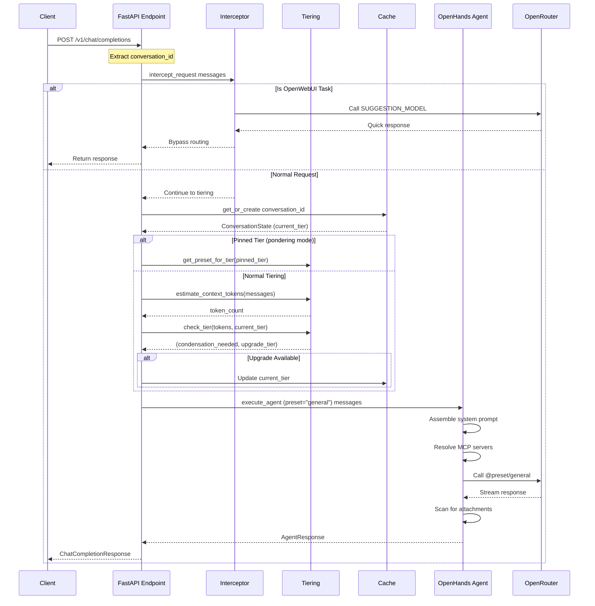

# IF — Intelligent Agent API

A single main agent with context-aware tiering and specialist subagent delegation. The system uses a general-purpose preset as the main agent, automatically upgrading tiers based on context size, and can spawn specialized subagents for deep domain expertise.

The agent runs on the OpenHands SDK with access to MCP servers for extended capabilities (AWS docs, financial data, time), a persistent LanceDB-backed user facts store, conversation persistence, a terminal system for shell access, and a file-based attachment system.

---

## Table of Contents

- [Architecture Overview](#architecture-overview)
- [Request Flow Diagram](#request-flow-diagram)
- [API Endpoints](#api-endpoints)
- [Tiering System](#tiering-system)
- [Specialist Subagents](#specialist-subagents)
- [Subagent Tools](#subagent-tools)
- [Command System](#command-system)
- [User Facts Store](#user-facts-store)
- [Metacognitive Memory System](#metacognitive-memory-system)
- [Reflection Engine](#reflection-engine)
- [Capability Gap Tracking](#capability-gap-tracking)
- [Pattern Detection](#pattern-detection)
- [Opinion Formation](#opinion-formation)
- [Operator Growth Tracking](#operator-growth-tracking)
- [Meta-Analysis](#meta-analysis)
- [Directive System](#directive-system)
- [Pondering Preset](#pondering-preset)
- [Heartbeat System](#heartbeat-system)
- [Channel System](#channel-system)
- [Terminal System](#terminal-system)
- [Orchestrator System](#orchestrator-system)
- [Storage Layer](#storage-layer)
- [MCP Server Configuration](#mcp-server-configuration)
- [Preset System](#preset-system)
- [Environment Variables](#environment-variables)
- [Project Structure](#project-structure)
- [Startup Sequence](#startup-sequence)
- [Utility Applications](#utility-applications)
  - [Main Portal (Hub)](#main-portal-hub---port-3000)
  - [Finance Portal](#finance-portal---port-3002)
  - [Diary Portal](#diary-portal---port-3003)
  - [Proposals Portal](#proposals-portal---port-3004)
  - [Powerlifting App](#powerlifting-app)
  - [Discord Webhook Server](#discord-webhook-server)
- [Utility App Architecture](#utility-app-architecture)
- [Shared Patterns Across Utility Apps](#shared-patterns-across-utility-apps)
- [Data Models & Key Patterns](#data-models--key-patterns)
- [Kubernetes Deployment](#kubernetes-deployment)
- [Development and Running](#development-and-running)
- [Common Issues & Solutions](#common-issues--solutions)

---

## Architecture Overview

```
┌─────────────────────────────────────────────────────────────────────────────┐
│                           Client Layer                                       │
│                                                                              │
│  ┌────────────────┐    ┌────────────────┐    ┌────────────────┐            │
│  │   OpenWebUI    │    │    Discord     │    │   HTTP Client  │            │
│  │   (polling)    │    │    (bot)       │    │   (curl/SDK)   │            │
│  └───────┬────────┘    └───────┬────────┘    └───────┬────────┘            │
└──────────┼─────────────────────┼─────────────────────┼──────────────────────┘
           │                     │                     │
           ▼                     ▼                     ▼
┌─────────────────────────────────────────────────────────────────────────────┐
│                        Channel System (src/channels/)                        │
│                                                                              │
│  ┌────────────────┐    ┌────────────────┐    ┌────────────────┐            │
│  │ OpenWebUI      │    │ Discord        │    │ HTTP API       │            │
│  │ Listener       │    │ Listener       │    │ (FastAPI)      │            │
│  └───────┬────────┘    └───────┬────────┘    └───────┬────────┘            │
│          │                     │                     │                      │
│          ▼                     ▼                     │                      │
│  ┌────────────────┐    ┌────────────────┐           │                      │
│  │ Translator     │    │ Translator     │           │                      │
│  └───────┬────────┘    └───────┬────────┘           │                      │
│          │                     │                     │                      │
│          ▼                     ▼                     │                      │
│  ┌────────────────┐    ┌────────────────┐           │                      │
│  │ Debounce Queue │    │ Debounce Queue │           │                      │
│  └───────┬────────┘    └───────┬────────┘           │                      │
│          │                     │                     │                      │
│          └──────────┬──────────┘                     │                      │
│                     ▼                                │                      │
│          ┌────────────────┐                          │                      │
│          │ Dispatcher     │                          │                      │
│          └───────┬────────┘                          │                      │
│                  │                                   │                      │
└──────────────────┼───────────────────────────────────┼──────────────────────┘
                   │                                   │
                   ▼                                   ▼
┌─────────────────────────────────────────────────────────────────────────────┐
│                     Core Pipeline (src/api/completions.py)                   │
│                                                                              │
│  ┌─────────────────────────────────────────────────────────────────────┐   │
│  │                    process_chat_completion_internal()                │   │
│  │                                                                      │   │
│  │  Step 1: Request Interceptor (OpenWebUI task detection)             │   │
│  │          ┌────────────────────────────────────────────────┐          │   │
│  │          │ intercept_request() → SUGGESTION_MODEL         │          │   │
│  │          │ (bypass routing for title/suggestion tasks)    │          │   │
│  │          └────────────────────────────────────────────────┘          │   │
│  │                           │                                          │   │
│  │  Step 2: Context Size → Preset Tier                                 │   │
│  │          ┌────────────────────────────────────────────────┐          │   │
│  │          │ estimate_context_tokens() → check_tier()       │          │   │
│  │          │ (air → standard → heavy based on context)      │          │   │
│  │          └────────────────────────────────────────────────┘          │   │
│  │                           │                                          │   │
│  │  Step 3: Conversation Cache (tier tracking)                         │   │
│  │          ┌────────────────────────────────────────────────┐          │   │
│  │          │ ConversationCache → current_tier, pinned_tier  │          │   │
│  │          └────────────────────────────────────────────────┘          │   │
│  │                           │                                          │   │
│  │  Step 4: Agent Execution (OpenHands SDK)                            │   │
│  │          ┌────────────────────────────────────────────────┐          │   │
│  │          │ execute_agent() → @preset/general (main agent) │          │   │
│  │          └────────────────────────────────────────────────┘          │   │
│  └─────────────────────────────────────────────────────────────────────┘   │
└─────────────────────────────────────────────────────────────────────────────┘
                   │
                   ▼
┌─────────────────────────────────────────────────────────────────────────────┐
│                     OpenHands Agent (src/agent/)                            │
│                                                                              │
│  ┌────────────────┐    ┌────────────────┐    ┌────────────────┐            │
│  │  LLM Config    │    │  MCP Servers   │    │ Memory Tools   │            │
│  │  @preset/slug  │    │  (uvx-based)   │    │  (LanceDB)     │            │
│  └────────────────┘    └────────────────┘    └────────────────┘            │
│                                                                              │
│  ┌────────────────────────────────────────────────────────────┐            │
│  │                    Conversation Persistence                 │            │
│  │                 (src/data/conversations/{id}/)             │            │
│  └────────────────────────────────────────────────────────────┘            │
└─────────────────────────────────────────────────────────────────────────────┘
                   │
                   ▼
┌─────────────────────────────────────────────────────────────────────────────┐
│              METACOGNITIVE LAYER (src/agent/reflection/)                     │
│                                                                              │
│  ┌──────────────┐ ┌──────────────┐ ┌──────────────┐ ┌──────────────┐       │
│  │   Pattern    │ │   Opinion    │ │   Meta       │ │   Growth     │       │
│  │   Detector   │ │   Former     │ │   Analyzer   │ │   Tracker    │       │
│  └──────┬───────┘ └──────┬───────┘ └──────┬───────┘ └──────┬───────┘       │
│         │                │                │                │                │
│         └────────────────┼────────────────┼────────────────┘                │
│                          │                │                                 │
│                    ┌─────┴──────┐   ┌─────┴──────┐                          │
│                    │ Reflection │   │ Capability │                          │
│                    │   Engine   │   │  Tracker   │                          │
│                    └─────┬──────┘   └─────┬──────┘                          │
└──────────────────────────┼────────────────┼──────────────────────────────────┘
                           │                │
                           ▼                ▼
┌─────────────────────────────────────────────────────────────────────────────┐
│                  KNOWLEDGE STORE (src/memory/user_facts.py)                  │
│                                                                              │
│  ┌─────────────┐ ┌─────────────┐ ┌─────────────┐ ┌─────────────┐           │
│  │  Operator   │ │   Agent     │ │  Capability │ │  Session    │           │
│  │   Facts     │ │   Self      │ │    Gaps     │ │  Outcomes   │           │
│  ├─────────────┤ ├─────────────┤ ├─────────────┤ ├─────────────┤           │
│  │ preferences │ │ identity    │ │ limitation  │ │ what_worked │           │
│  │ opinions    │ │ opinions    │ │ frequency   │ │ what_failed │           │
│  │ skills      │ │ principles  │ │ workarounds │ │ open_issues │           │
│  │ life_events │ │ stance_log  │ │ tool_spec   │ │             │           │
│  └─────────────┘ └─────────────┘ └─────────────┘ └─────────────┘           │
│                                                                              │
│  ┌─────────────┐ ┌─────────────┐ ┌─────────────┐                           │
│  │  Opinion    │ │  Pattern    │ │Misconception│                           │
│  │   Pairs     │ │   Log       │ │   Tracker   │                           │
│  ├─────────────┤ ├─────────────┤ ├─────────────┤                           │
│  │ user_stated │ │ theme       │ │ topic       │                           │
│  │ agent_view  │ │ frequency   │ │ what_wrong  │                           │
│  │ reasoning   │ │ trend_dir   │ │ corrected   │                           │
│  └─────────────┘ └─────────────┘ └─────────────┘                           │
└─────────────────────────────────────────────────────────────────────────────┘
                   │
                   ▼
            OpenRouter API
         (@preset/{name} routing)
```

---

## Request Flow Diagram



---

## Tiering System

The tiering system replaces the previous parallel scoring router with a simpler context-based approach.

**Module:** [`src/agent/tiering.py`](src/agent/tiering.py)

### Overview

Instead of using 3 parallel models to classify conversations, the system now uses a single main agent with context-aware tiering:

1. **Single Main Agent**: Uses `@preset/general` as the default
2. **Context-Based Tiers**: Upgrades from air → standard → heavy based on context size
3. **Specialist Delegation**: Main agent can spawn specialists for deep expertise

### Tier Definitions

| Tier | Name | Context Limit | Preset | Use Case |
|------|------|---------------|--------|----------|
| 0 | Air | 30,000 tokens | `@preset/air` | Simple queries, quick responses |
| 1 | Standard | 120,000 tokens | `@preset/standard` | Most conversations |
| 2 | Heavy | 200,000 tokens | `@preset/heavy` | Complex tasks, large context |

### Tier Upgrade Logic

```python
# In src/agent/tiering.py

def check_tier(context_tokens: int, current_tier: int) -> tuple[bool, Optional[int]]:
    """
    Returns:
        (try_condensation, upgrade_available)

    - try_condensation: True if context exceeds limit
    - upgrade_available: New tier number if upgrade recommended
    """
```

**Upgrade Threshold**: 65% of current tier's limit (`TIER_UPGRADE_THRESHOLD`)

### Context Estimation

```python
def estimate_context_tokens(
    system_prompt: str,
    messages: List[dict],
    tool_overhead: int = 0
) -> int:
    """Estimate total context tokens (~4 chars per token)."""
```

### Configuration

Environment variables (see `src/config.py`):

```bash
TIER_UPGRADE_THRESHOLD=0.65    # Fraction of limit before upgrade
TIER_AIR_LIMIT=30000           # Air tier context limit
TIER_STANDARD_LIMIT=120000     # Standard tier context limit
TIER_HEAVY_LIMIT=200000        # Heavy tier context limit
TIER_AIR_PRESET=@preset/air
TIER_STANDARD_PRESET=@preset/standard
TIER_HEAVY_PRESET=@preset/heavy
```

---

## Specialist Subagents

The main agent can spawn specialist subagents for domain-specific expertise.

**Module:** [`src/agent/specialists.py`](src/agent/specialists.py)

### Available Specialists

| Specialist | Description | Directive Types | MCP Servers |
|------------|-------------|-----------------|-------------|
| `debugger` | Deep code debugging and error analysis | code, architecture | - |
| `architect` | System architecture and design patterns | architecture, code | aws_docs |
| `secops` | Security operations and vulnerability analysis | security, code | - |
| `devops` | Infrastructure and deployment automation | code, architecture | - |
| `financial_analyst` | Financial data analysis and market research | finance, competition | yahoo_finance, alpha_vantage |
| `finance_write` | Validated write agent for finance snapshot mutations | finance | - |
| `health_write` | Validated write agent for training program mutations | health | - |
| `web_researcher` | Web research and information synthesis | core, competition | - |
| `proofreader` | General prose editing — grammar, clarity, tone, flow | writing, core | - |
| `jira_writer` | Jira ticket writing with AC, subtasks, and metadata | writing, code | - |
| `email_writer` | Professional email drafting with tone matching | writing | - |
| `constrained_writer` | Character-limited content  | writing | - |

### Skills (Mode Modifiers)

Specialists can operate in different modes:

| Skill | Description |
|-------|-------------|
| `red_team` | Adversarial/attack perspective |
| `blue_team` | Defensive/protection perspective |
| `pro_con` | Balanced pros and cons analysis |

### Directive Filtering

Specialists receive filtered directives based on their domain:

```python
def get_for_subagent(types: List[str]) -> List[Directive]:
    """
    1. All tier 0 directives (always included for safety)
    2. All directives matching any of the given types
    3. Exclude main-agent-only types (tool, memory, metacognition)
    """
```

### Templates

Specialist prompts are Jinja2 templates in `src/agent/prompts/specialists/`:

```
src/agent/prompts/
├── deep_thinker.j2          # Extended pondering
└── specialists/
    ├── debugger.j2
    ├── architect.j2
    ├── secops.j2
    ├── devops.j2
    ├── financial_analyst.j2
    ├── finance_write.j2      # Finance snapshot write agent
    ├── health_write.j2       # Health program write agent
    ├── web_researcher.j2
    ├── proofreader.j2        # General prose editing
    ├── jira_writer.j2        # Jira ticket writing
    ├── email_writer.j2       # Professional email drafting
    └── constrained_writer.j2 # Character-limited content
```

---

## Subagent Tools

The main agent has access to tools for spawning subagents.

**Module:** [`src/agent/tools/subagents.py`](src/agent/tools/subagents.py)

### deep_think

Spawn a deep thinking subagent for extended analysis.

```python
deep_think(
    topic: str,           # Topic identifier (used in output filename)
    task: str,            # Detailed task description
    context: str = "",    # Background information
    extra_directives: str = ""  # Additional directive text
) -> str
```

**Output**: Analysis saved to `plans/{topic}-plan.md`

### spawn_specialist

Spawn a single specialist subagent.

```python
spawn_specialist(
    specialist_type: str,      # debugger, architect, secops, etc.
    task: str,                 # Task description
    context: str = "",         # Background information
    extra_directives: str = "",# Additional directive text
    skill: str = None,         # red_team, blue_team, pro_con
    write_to_file: str = None  # Optional file path for output
) -> str
```

### spawn_specialists

Spawn multiple specialists in parallel.

```python
spawn_specialists(
    specialist_types: List[str],  # e.g., ["debugger", "secops"]
    task: str,                    # Same task sent to all
    context: str = ""             # Same context sent to all
) -> str
```

**Output**: Combined results from all specialists, separated by `---`

### Configuration

```bash
SPECIALIST_PRESET=@preset/standard
SPECIALIST_MAX_TURNS=15
THINKING_PRESET=@preset/general
THINKING_MAX_TURNS=20
```

---

## API Endpoints

### Core Endpoints

#### `GET /v1/models`

Returns the model list with a single entry for `if-prototype`.

**Response:**
```json
{
  "object": "list",
  "data": [
    {
      "id": "if-prototype",
      "object": "model",
      "created": 1700000000,
      "owned_by": "if-prototype"
    }
  ]
}
```

#### `POST /v1/chat/completions`

Standard OpenAI chat completions interface. Accepts `model: "if-prototype"` only.

**Request Body:**
```json
{
  "model": "if-prototype",
  "messages": [
    {"role": "user", "content": "Hello, how are you?"}
  ],
  "stream": false
}
```

**Response:**
```json
{
  "id": "chatcmpl-abc123",
  "object": "chat.completion",
  "created": 1700000000,
  "model": "if-prototype",
  "choices": [
    {
      "index": 0,
      "message": {
        "role": "assistant",
        "content": "Response text here..."
      },
      "finish_reason": "stop"
    }
  ]
}
```

#### `POST /api/v1/chat/completions`

Alias for `/v1/chat/completions` for OpenWebUI compatibility.

---

### Webhook Management Endpoints

#### `POST /v1/webhooks/register`

Register a new channel webhook and start listening immediately.

**Request Body (Discord):**
```json
{
  "platform": "discord",
  "label": "My Discord Channel",
  "discord": {
    "bot_token": "your-bot-token",
    "channel_id": "123456789"
  }
}
```

**Request Body (OpenWebUI):**
```json
{
  "platform": "openwebui",
  "label": "My OpenWebUI Channel",
  "openwebui": {
    "base_url": "https://openwebui.example.com",
    "channel_id": "channel-uuid",
    "api_key": "your-api-key"
  }
}
```

**Response:**
```json
{
  "webhook_id": "wh_abc123def456",
  "conversation_id": "conv_xyz789",
  "platform": "discord",
  "label": "My Discord Channel",
  "status": "listening"
}
```

#### `GET /v1/webhooks/`

List all registered webhooks (active and inactive).

**Response:**
```json
{
  "webhooks": [
    {
      "webhook_id": "wh_abc123",
      "conversation_id": "conv_xyz",
      "platform": "discord",
      "label": "My Channel",
      "status": "active"
    }
  ],
  "total": 1
}
```

#### `GET /v1/webhooks/active`

List only active webhooks.

#### `GET /v1/webhooks/{webhook_id}`

Get a specific webhook by ID.

#### `DELETE /v1/webhooks/{webhook_id}`

Deactivate a webhook (stops listener, marks as inactive).

#### `POST /v1/webhooks/{webhook_id}/restart`

Restart a deactivated webhook.

---

### File Serving Endpoints

#### `GET /files/sandbox/{conversation_id}/{filepath:path}`

Serve files from a conversation's sandbox directory.

**Features:**
- Path traversal protection
- Automatic MIME type detection
- Scoped to conversation-specific directory

---

### Health Check

#### `GET /health`

Returns system health status.

**Response:**
```json
{
  "status": "healthy",
  "service": "if-prototype-a1",
  "features": {
    "routing": "active",
    "interceptor": "active",
    "commands": "active",
    "attachments": "active",
    "user_facts_store": "active",
    "user_facts_count": 47,
    "presets_loaded": true,
    "preset_count": 10,
    "channel_system": "active",
    "active_listeners": 2,
    "pending_messages": 0,
    "heartbeat": "active",
    "heartbeat_idle_hours": 6.0,
    "cached_conversations": 5,
    "pinned_conversations": 1
  }
}
```

---

## Command System

The command system provides slash commands for manual control over routing behavior and metacognitive features. Commands are processed before any routing or LLM calls, returning synthetic responses immediately with zero latency.

**Modules:**
- [`src/routing/commands.py`](src/routing/commands.py) — Routing commands
- [`src/agent/commands.py`](src/agent/commands.py) — Metacognitive commands

### Routing Commands

| Command | Action | Response |
|---------|--------|----------|
| `/end_convo` | Clear conversation state, force reclassification | `"Acknowledged. Categorisation state cleared. Next message will be re-evaluated."` |
| `/{preset_name}` | Pin routing to a specific preset | `"Acknowledged. Routing pinned to preset: {preset_name}. Send /end_convo to release."` |
| `/pondering` | Engage pondering mode (special pin behavior) | `"Acknowledged. Pondering mode engaged."` |
| `/{invalid}` | Unknown preset | `"Negative. Preset \"{name}\" not recognized.\nAvailable: {sorted list}."` |

### Metacognitive Commands

| Command | Action | Example Output |
|---------|--------|----------------|
| `/reflect` | Trigger manual reflection cycle | "Reflection cycle initiated. Check logs for results." |
| `/gaps` | List capability gaps by priority | Table: Priority, Status, Triggers, Description |
| `/patterns` | Show detected patterns | Pattern types with frequency and confidence |
| `/opinions` | Show opinion pairs | User vs agent positions with reasoning |
| `/growth` | Show operator growth report | Knowledge gaps, skill trends, abandoned interests |
| `/meta` | Show store health metrics | Category distribution, suggestions |
| `/tools` | Show tool suggestions from gaps | Priority, acceptance criteria, example triggers |

### Command Processing

Commands are processed in **Step 0** of the routing pipeline, before interception or scoring:

```python
cmd = parse_command(last_message_content, preset_manager.slugs())
if cmd is not None:
    if cmd.action == CommandAction.RESET_CACHE:
        conversation_cache.evict(cache_key)
        return synthetic_response(cmd.response_text)
    if cmd.action == CommandAction.PIN_PRESET:
        conversation_cache.pin(cache_key, cmd.preset)
        return synthetic_response(cmd.response_text)
```

### Pin Lifecycle

When a preset is pinned:

1. **Normal presets**: Auto-release after `RECLASSIFY_MESSAGE_COUNT` messages if topic shift is detected
2. **Pondering preset**: Never auto-releases. Only `/end_convo` or `/{other_preset}` can release it.

```python
if cached and cached.pinned:
    if cached.active_preset == "pondering":
        # Pondering pins never auto-release
        selected_preset = cached.active_preset
    else:
        cached.pin_message_count += 1
        if cached.pin_message_count >= RECLASSIFY_MESSAGE_COUNT:
            if should_check_shift(cached.anchor_window, current_window):
                shifted = await topic_has_shifted(...)
                if shifted:
                    cached.pinned = False  # Release pin
```

---

## User Facts Store

The user facts store replaces the simpler memory store with a structured fact system supporting categories, sources, supersession, and context isolation. It uses LanceDB for semantic search.

**Module:** [`src/memory/user_facts.py`](src/memory/user_facts.py)

### Fact Schema

```python
@dataclass
class UserFact:
    id: str                    # UUID
    context_id: str            # Scope: "openwebui_{chat_id}" or "discord_{channel_id}"
    username: str              # Operator identifier
    content: str               # The fact content
    category: FactCategory     # Classification category
    source: FactSource         # How this fact was captured
    confidence: float          # 0.0 to 1.0
    cache_key: str             # Where this fact was captured
    created_at: str            # ISO timestamp
    updated_at: str            # ISO timestamp
    superseded_by: str | None  # ID of replacement fact
    active: bool               # False if superseded
    metadata: dict             # Structured data storage
```

### Categories

#### Operator Facts

| Category | Description | Example |
|----------|-------------|---------|
| `personal` | Name, location, profession, relationships | "Operator lives in Boston" |
| `preference` | Language/framework preferences, communication style | "Operator prefers TypeScript over JavaScript" |
| `opinion` | Strong stances on technologies, approaches | "Operator dislikes microservices architecture" |
| `skill` | Self-reported or demonstrated understanding | "Operator identifies as senior DevOps engineer" |
| `life_event` | Job changes, moves, competitions, milestones | "Operator started new job at TechCorp (2026-02)" |
| `future_direction` | Goals, timelines, aspirations | "Operator planning to learn Rust (as of 2026-03)" |
| `project_direction` | Current project plans and direction | "Operator migrating from Express to Fastify (as of 2026-02)" |
| `mental_state` | Noted shifts in mood, stress, outlook | "Operator showing increased stress about deadline" |
| `interest_area` | Topics they gravitate toward | "Operator frequently asks about AWS networking" |
| `conversation_summary` | Auto-generated summaries of discussions | "Discussed Kubernetes deployment strategies" |
| `topic_log` | Domains discussed and when | "Topic: containerization discussed 2026-03-01" |
| `model_assessment` | Agent's observations about the operator | "Operator shows knowledge gap in network subnetting" |

#### Agent Self-Knowledge

| Category | Description | Example |
|----------|-------------|---------|
| `agent_identity` | Agent's self-knowledge | "I am IF, an intelligent routing agent" |
| `agent_opinion` | Agent's formed positions | "Monoliths are correct default for teams < 20" |
| `agent_principle` | Operating principles learned | "Always verify arithmetic with calculator" |

#### Capability Tracking

| Category | Description | Example |
|----------|-------------|---------|
| `capability_gap` | Things agent can't do | "Cannot send emails" |
| `tool_suggestion` | Derived from frequent gaps | "email_mcp_server" |

#### Opinion Pairs

| Category | Description | Example |
|----------|-------------|---------|
| `opinion_pair` | User + agent positions on topics | Topic: "Microservices", User: "Always better", Agent: "Disagree" |

#### Operator Growth

| Category | Description | Example |
|----------|-------------|---------|
| `misconception` | User misunderstandings corrected | "CIDR /24 = 512 addresses (corrected to 256)" |
| `session_reflection` | Post-session learnings | "What worked: step-by-step explanations" |

### Sources

| Source | Description |
|--------|-------------|
| `user_stated` | Explicitly stated by the operator |
| `model_observed` | Observed from operator behavior |
| `model_assessed` | Agent's assessment of operator capabilities |
| `conversation_derived` | Extracted from conversation context |

### Agent Tools

**Module:** [`src/agent/tools/user_facts.py`](src/agent/tools/user_facts.py)

| Tool | Parameters | Description |
|------|-----------|-------------|
| `user_facts_search` | `query`, `category?`, `limit?` | Semantic search across stored facts |
| `user_facts_add` | `content`, `category`, `source?`, `confidence?` | Store a new fact |
| `user_facts_update` | `fact_id`, `new_content`, `reason` | Supersede an existing fact |
| `user_facts_list` | `category?`, `include_history?` | List all stored facts |
| `user_facts_remove` | `fact_id` | Hard delete (requires confirmation per Directive 0-1) |

### Auto-Retrieval

During system prompt assembly, relevant facts are automatically retrieved and injected:

```python
async def get_operator_context(messages: list[dict], store: UserFactStore) -> str:
    facts = await store.search(last_user_msg, limit=5)
    assessments = await store.search(last_user_msg, category=FactCategory.MODEL_ASSESSMENT, limit=3)
    # Returns formatted "OPERATOR CONTEXT" block
```

### Conversation Summarization

**Module:** [`src/memory/summarizer.py`](src/memory/summarizer.py)

After each agent execution, a fire-and-forget task generates a conversation summary:

- Only summarizes substantive exchanges (>3 messages)
- Uses `SUGGESTION_MODEL` for cheap summarization
- Stores as `conversation_summary` fact
- Zero impact on response latency

---

## Metacognitive Memory System

The metacognitive memory system provides self-reflective capabilities that allow the agent to learn from experience, track its own limitations, and improve over time. This implements the architecture from plan.md Parts 1-10.

### Architecture

```
┌──────────────────────────────────────────────────────────────────┐
│                    REFLECTION ENGINE CYCLE                        │
│                                                                  │
│  ┌─────────────────────────────────────────────────────┐        │
│  │ 1. POST-SESSION REFLECTION                          │        │
│  │    - Summarize what happened                        │        │
│  │    - Identify what worked / what failed             │        │
│  │    - Log capability gaps hit                        │        │
│  │    - Detect misconceptions surfaced                 │        │
│  │    - Store as session_reflection                    │        │
│  └──────────────────────┬──────────────────────────────┘        │
│                         │                                        │
│  ┌──────────────────────▼──────────────────────────────┐        │
│  │ 2. PATTERN DETECTION                                │        │
│  │    - Cluster recent topics by semantic similarity   │        │
│  │    - Detect temporal patterns                       │        │
│  │    - Detect skill gap patterns                      │        │
│  │    - Update frequency + confidence or create new    │        │
│  └──────────────────────┬──────────────────────────────┘        │
│                         │                                        │
│  ┌──────────────────────▼──────────────────────────────┐        │
│  │ 3. OPINION FORMATION                                │        │
│  │    - Review user opinions without agent responses   │        │
│  │    - Form agent position with reasoning             │        │
│  │    - Store as opinion_pair                          │        │
│  └──────────────────────┬──────────────────────────────┘        │
│                         │                                        │
│  ┌──────────────────────▼──────────────────────────────┐        │
│  │ 4. CAPABILITY GAP ANALYSIS                          │        │
│  │    - Aggregate gaps by frequency                    │        │
│  │    - Generate acceptance criteria for top gaps      │        │
│  │    - Promote high-priority gaps to tool_suggestion  │        │
│  └──────────────────────┬──────────────────────────────┘        │
│                         │                                        │
│  ┌──────────────────────▼──────────────────────────────┐        │
│  │ 5. META-ANALYSIS                                    │        │
│  │    - Category distribution (what's growing?)        │        │
│  │    - Stale fact detection                           │        │
│  │    - Category fit analysis                          │        │
│  └──────────────────────┬──────────────────────────────┘        │
│                         │                                        │
│  ┌──────────────────────▼──────────────────────────────┐        │
│  │ 6. OPERATOR GROWTH TRACKING                         │        │
│  │    - Review misconceptions: any repeated?           │        │
│  │    - Review skill assessments: improvement trend?   │        │
│  │    - Generate learning suggestions                  │        │
│  └──────────────────────────────────────────────────────┘        │
└──────────────────────────────────────────────────────────────────┘
```

### What This Gets You

The metacognitive system maintains a structured model of:

| Knowledge Type | Description | Benefit |
|----------------|-------------|---------|
| **Operator Knowledge** | What the operator knows and doesn't know | Personalized responses, gap-aware assistance |
| **Agent Capabilities** | What the agent can and can't do | Clear limitation tracking, tool development pipeline |
| **Strategy Memory** | What approaches work for what problem types | Improved routing, better outcomes |
| **Opinion Positions** | Where both parties disagree and why | Transparent disagreement, reasoned discussion |
| **Behavioral Patterns** | What patterns exist in operator behavior | Proactive suggestions, anticipation |
| **Self-Knowledge** | What the system itself is missing | Self-improving feedback loop |

---

## Reflection Engine

The reflection engine runs metacognitive analysis cycles to learn from experience.

**Module:** [`src/agent/reflection/engine.py`](src/agent/reflection/engine.py)

### When It Runs

| Trigger | Condition | Description |
|---------|-----------|-------------|
| Post-session | >5 exchanges | After substantive conversations |
| Periodic | Every 6 hours | Background analysis |
| On-demand | `/reflect` command | Manual trigger |
| Threshold | Store size limits | When thresholds are hit |

### Threshold Triggers

| Threshold | Default | Description |
|-----------|---------|-------------|
| `REFLECTION_THRESHOLD_UNCATEGORIZED` | 20 | Uncategorized facts limit |
| `REFLECTION_THRESHOLD_GAPS_NO_CRITERIA` | 5 | Gaps without criteria limit |
| `REFLECTION_THRESHOLD_OPINIONS_NO_RESPONSE` | 10 | Opinions needing response |

### Components

| Component | Module | Purpose |
|-----------|--------|---------|
| Pattern Detector | [`pattern_detector.py`](src/agent/reflection/pattern_detector.py) | Detect recurring themes |
| Opinion Former | [`opinion_formation.py`](src/agent/reflection/opinion_formation.py) | Form agent positions |
| Meta Analyzer | [`meta_analysis.py`](src/agent/reflection/meta_analysis.py) | Store health metrics |
| Growth Tracker | [`growth_tracker.py`](src/agent/reflection/growth_tracker.py) | Track operator learning |

---

## Capability Gap Tracking

The capability gap system tracks agent limitations and generates tool development suggestions.

**Module:** [`src/agent/tools/capability_tracker.py`](src/agent/tools/capability_tracker.py)

### Gap Lifecycle

```
User asks for something ──► Agent can't do it
         │
         ▼
Log capability_gap
{content, context, timestamp}
         │
         ▼
Reflection engine aggregates ──► trigger_count++
         │
         ▼
threshold (trigger_count >= 3)?
     │               │
    No              Yes
     │               │
     ▼               ▼
Continue      Generate acceptance criteria
tracking      Compute priority score
              Promote to tool_suggestion
                   │
                   ▼
         Surface via /gaps command
```

### Gap Schema

```python
@dataclass
class CapabilityGap:
    id: str
    content: str                    # "Cannot send emails"
    trigger_count: int              # How many times hit
    first_seen: str                 # ISO timestamp
    last_seen: str                  # ISO timestamp
    trigger_contexts: list[str]     # When it was hit
    workaround: str | None          # Suggested workaround
    suggested_tool: str | None      # "email_mcp_server"
    acceptance_criteria: list[str]  # What "solved" looks like
    status: str                     # "open" | "workaround_exists" | "resolved"
    priority_score: float           # Computed priority
```

### Priority Score Formula

```
priority = (trigger_count / max_triggers) * 0.4
         + recency_weight * 0.3
         + impact_estimate * 0.3

Where recency_weight = e^(-0.05 * days_since_last_seen)
```

---

## Pattern Detection

The pattern detector identifies recurring themes in operator behavior.

**Module:** [`src/agent/reflection/pattern_detector.py`](src/agent/reflection/pattern_detector.py)

### Pattern Types

| Type | Description | Example |
|------|-------------|---------|
| Temporal | Time-based patterns | "Asks about AWS every Monday" |
| Topical | Subject clustering | "Networking questions cluster together" |
| Behavioral | Action patterns | "Prefers step-by-step explanations" |
| Skill Gap | Learning patterns | "Repeated basic questions in domain" |

### Pattern Schema

```python
@dataclass
class Pattern:
    id: str
    description: str            # "Operator asks about AWS networking weekly"
    pattern_type: str           # "temporal" | "topical" | "behavioral" | "skill_gap"
    evidence: list[str]         # Fact IDs supporting this pattern
    frequency: int              # How many times observed
    confidence: float           # How confident the pattern is real
    trend_direction: str        # "increasing" | "stable" | "decreasing"
    last_seen: str
    actionable: bool            # Does this suggest action?
    suggested_action: str       # "Proactively surface VPC docs"
```

---

## Opinion Formation

The opinion formation system creates agent positions on user-stated opinions.

**Module:** [`src/agent/reflection/opinion_formation.py`](src/agent/reflection/opinion_formation.py)

### Opinion Pair Schema

```python
@dataclass
class OpinionPair:
    id: str
    topic: str                  # "Microservices vs monoliths"
    user_position: str          # "Microservices are always better"
    agent_position: str         # "Disagree. Monoliths correct for teams < 20"
    agent_reasoning: str        # The why
    agent_confidence: float     # 0.0-1.0
    agreement_level: str        # "agree" | "partial" | "disagree"
    evolution: list[dict]       # Track position changes
    created_at: str
    updated_at: str
```

### Agreement Levels

| Level | Emoji | Meaning |
|-------|-------|---------|
| `agree` | 🟢 | Agent agrees with user position |
| `partial` | 🟡 | Agent partially agrees |
| `disagree` | 🔴 | Agent disagrees with reasoning |
| `insufficient_data` | ⚪ | Not enough information |

---

## Operator Growth Tracking

The growth tracker monitors operator learning and identifies knowledge gaps.

**Module:** [`src/agent/reflection/growth_tracker.py`](src/agent/reflection/growth_tracker.py)

### Misconception Schema

```python
@dataclass
class Misconception:
    id: str
    topic: str                  # "CIDR notation"
    what_they_said: str         # "A /24 gives you 512 addresses"
    what_is_correct: str        # "A /24 gives you 256 addresses"
    domain: str                 # "networking"
    severity: str               # "minor" | "moderate" | "critical"
    corrected_in_session: bool  # Was it corrected live?
    recurrence_count: int       # How many times repeated
    suggested_resources: list   # Reading suggestions
```

### Growth Report

The `/growth` command generates reports showing:

- **Knowledge Gaps Identified**: Misconceptions logged, trends
- **Skills Trending Up**: Progressive advancement in topics
- **Abandoned Interests**: Topics mentioned but not followed up

---

## Meta-Analysis

The meta-analyzer examines the fact store itself to identify patterns and health metrics.

**Module:** [`src/agent/reflection/meta_analysis.py`](src/agent/reflection/meta_analysis.py)

### Store Health Metrics

```python
@dataclass
class StoreHealthMetrics:
    total_facts: int
    active_facts: int
    superseded_facts: int
    category_distribution: dict[str, int]
    stalest_category: str           # Category with oldest avg fact
    fastest_growing: str            # Most new facts in last 30 days
    most_superseded: str            # Category with most churn
    uncategorized_pressure: list    # Facts hard to categorize
    suggested_new_categories: list  # Proposed categories
    capability_gap_summary: dict    # {total, open, resolved, top_priority}
    reflection_count: int           # Sessions reflected on
```

### Category Evolution

When facts don't fit well into existing categories:

1. Log the categorization tension as `meta_observation`
2. Cluster poorly-fitting facts during reflection
3. If cluster size ≥ 3, propose new category

---

## Directive System

The directive system provides versioned behavioral directives backed by DynamoDB. Directives define standing orders and behavioral rules that the agent follows across all conversations.

**Modules:**
- [`src/storage/directive_model.py`](src/storage/directive_model.py) — Directive data model
- [`src/storage/directive_store.py`](src/storage/directive_store.py) — DynamoDB backend with caching
- [`src/agent/tools/directive_tools.py`](src/agent/tools/directive_tools.py) — Agent tools for directive CRUD
- [`src/api/directives.py`](src/api/directives.py) — REST API endpoints

### Architecture

```
┌──────────────────────────────────────────────────────────────────┐
│                    DIRECTIVE SYSTEM                               │
│                                                                  │
│  ┌─────────────────────────────────────────────────────────┐    │
│  │                    DynamoDB Backend                       │    │
│  │                                                           │    │
│  │  PK=DIR, SK={alpha}-{beta}-{version}                     │    │
│  │  - All directives stored with versioning                 │    │
│  │  - Immutable history (revisions create new versions)     │    │
│  │  - Active flag for soft-delete                           │    │
│  └──────────────────────────┬──────────────────────────────┘    │
│                             │                                    │
│                             ▼                                    │
│  ┌─────────────────────────────────────────────────────────┐    │
│  │                    In-Memory Cache                        │    │
│  │                                                           │    │
│  │  - Loads all active directives at startup                │    │
│  │  - Only highest version per alpha/beta is cached         │    │
│  │  - Fast access for system prompt assembly                │    │
│  └──────────────────────────┬──────────────────────────────┘    │
│                             │                                    │
│              ┌──────────────┴──────────────┐                    │
│              ▼                             ▼                    │
│  ┌────────────────────┐        ┌────────────────────┐          │
│  │   Agent Tools      │        │    REST API        │          │
│  │                    │        │                    │          │
│  │  directive_add     │        │  GET /directives   │          │
│  │  directive_revise  │        │  GET /{a}/{b}      │          │
│  │  directive_deact-  │        │  GET /{a}/{b}/     │          │
│  │    ivate           │        │    history         │          │
│  │  directive_list    │        │  POST /reload      │          │
│  └────────────────────┘        └────────────────────┘          │
└──────────────────────────────────────────────────────────────────┘
```

### Directive Schema

```python
@dataclass
class Directive:
    alpha: int              # Tier number (0-5)
    beta: int               # Directive number within tier
    version: int            # Version number (auto-incremented)
    label: str              # Short label (e.g., "VERIFY_CLAIMS")
    content: str            # Full directive text
    active: bool            # Soft-delete flag
    created_by: str         # "agent" or "operator"
    created_at: str         # ISO timestamp
```

### Alpha Tiers

| Alpha | Description | Protection |
|-------|-------------|------------|
| 0 | Core Identity | Protected - cannot be modified via agent tools |
| 1 | Fundamental Rules | Protected - cannot be modified via agent tools |
| 2 | Behavioral Guidelines | Modifiable via agent tools |
| 3 | Task-Specific Rules | Modifiable via agent tools |
| 4 | Context-Specific Rules | Modifiable via agent tools |
| 5 | Temporary/Session Rules | Modifiable via agent tools |

### Content Rewriting

All directive content is rewritten through an LLM before storage to ensure consistent voice and style:

```
Raw Operator Intent → LLM Rewriter → Directive Voice
```

**Rewriting Prompt:**
```
The directive system uses terse, imperative prose. No filler. No corporate warmth.
Each directive reads like a standing order — clear conditions, clear behavior, 
clear exceptions.

Rewrite the following into a single directive in that voice.
```

The rewrite model is configurable via `DIRECTIVE_REWRITE_MODEL` (default: `anthropic/claude-opus-4`).

### Agent Tools

| Tool | Parameters | Description |
|------|-----------|-------------|
| `directive_add` | `alpha`, `label`, `content`, `created_by` | Add new directive (alpha 2-5 only) |
| `directive_revise` | `alpha`, `beta`, `content` | Create new version of existing directive |
| `directive_deactivate` | `alpha`, `beta` | Soft-delete a directive |
| `directive_list` | `alpha?` | List all directives (optionally filtered) |

### REST API Endpoints

#### `GET /v1/directives/`

List all active directives.

**Query Parameters:**
- `alpha` (optional): Filter by alpha tier

**Response:**
```json
{
  "directives": [
    {
      "alpha": 2,
      "beta": 1,
      "version": 3,
      "label": "VERIFY_CLAIMS",
      "content": "When the operator submits a message for review...",
      "created_by": "operator",
      "created_at": "2026-03-01T12:00:00Z"
    }
  ]
}
```

#### `GET /v1/directives/{alpha}/{beta}`

Get a specific directive.

**Response:**
```json
{
  "alpha": 2,
  "beta": 1,
  "version": 3,
  "label": "VERIFY_CLAIMS",
  "content": "...",
  "created_by": "operator",
  "created_at": "2026-03-01T12:00:00Z"
}
```

#### `GET /v1/directives/{alpha}/{beta}/history`

Get version history for a directive.

**Response:**
```json
{
  "alpha": 2,
  "beta": 1,
  "versions": [
    {
      "version": 3,
      "content": "...",
      "created_at": "2026-03-01T12:00:00Z"
    },
    {
      "version": 2,
      "content": "...",
      "created_at": "2026-02-15T08:30:00Z"
    }
  ]
}
```

#### `POST /v1/directives/reload`

Force reload of directives from DynamoDB. Useful after manual DynamoDB edits.

**Response:**
```json
{
  "status": "reloaded",
  "active_count": 12
}
```

### DynamoDB Table Schema

```sql
CREATE TABLE if-core (
    PK STRING,          -- Always "DIR"
    SK STRING,          -- "{alpha}-{beta}-{version}"
    label STRING,
    content STRING,
    active BOOLEAN,
    created_by STRING,
    created_at STRING,
    PRIMARY KEY (PK, SK)
);
```

### Prompt Assembly

Directives are formatted and injected into the system prompt:

```python
def format_for_prompt(self, alpha: int = None) -> str:
    """Format directives for system prompt injection."""
    lines = ["## Directives\n"]
    for d in self.get_all(alpha=alpha):
        lines.append(f"### {d.alpha}-{d.beta}: {d.label}")
        lines.append(d.content)
        lines.append("")
    return "\n".join(lines)
```

---

## Pondering Preset

The pondering preset is a special mode for operator profiling and engagement. Unlike other presets, it is **never auto-selected by the router** — it must be explicitly activated via `/pondering` command or the heartbeat system.

**Addendum:** [`src/agent/prompts/pondering_addendum.md`](src/agent/prompts/pondering_addendum.md)

### Characteristics

- **Objective**: Build and refine the operator profile
- **Behavior**: Ask ONE question at a time, focus on depth over breadth
- **MCP Servers**: Only `time` (all others disabled)
- **Pin Behavior**: Never auto-releases; only `/end_convo` or `/{other_preset}` releases

### Behavioral Rules

1. Focus areas: current projects, goals, preferences, frustrations, problem-solving approaches
2. Listen more than speak — the operator's words are the data
3. Every fact learned MUST be stored via `user_facts_add`
4. Every observation MUST be stored with `source: model_assessed`
5. Do not announce storage
6. If operator pivots to technical question, answer briefly then redirect

### Hard Constraints

- Do NOT produce code blocks
- Do NOT start architecture discussions
- Do NOT enter analysis or debugging flows
- Do NOT generate files

### Activation

```bash
# Manual activation
/pondering

# Automatic activation via heartbeat after idle period
# (see Heartbeat System section)
```

---

## Heartbeat System

The heartbeat system provides proactive operator engagement by monitoring channel activity and initiating pondering conversations after idle periods.

**Modules:**
- [`src/heartbeat/activity.py`](src/heartbeat/activity.py) — Activity tracking
- [`src/heartbeat/runner.py`](src/heartbeat/runner.py) — Background runner

### How It Works

1. **Activity Tracking**: Every message (inbound/outbound) updates `last_message_at` for the channel
2. **Idle Detection**: Every 60 seconds, check for channels idle beyond `HEARTBEAT_IDLE_HOURS`
3. **Cooldown**: Skip channels that received a heartbeat within `HEARTBEAT_COOLDOWN_HOURS`
4. **Quiet Hours**: Skip during configured quiet hours (default: 23:00-07:00 UTC)
5. **Initiation**: Pin channel to pondering, generate contextual opening, deliver message

### Activity Log Schema

```sql
CREATE TABLE activity_log (
    cache_key TEXT PRIMARY KEY,       -- channel_id or chat_id
    webhook_id TEXT,                  -- nullable (HTTP chats have no webhook)
    last_message_at TEXT NOT NULL,    -- ISO timestamp
    last_heartbeat_at TEXT            -- ISO timestamp
);
```

### Opening Message Generation

When initiating a heartbeat, the system:

1. Pulls relevant user facts (`future_direction`, `project_direction`, general)
2. Builds context block from stored facts
3. Calls LLM to generate personalized opening
4. Falls back to cold open if no facts exist:

```
"Statement: Idle period detected. Initiating baseline calibration. Query: What are you currently working on?"
```

### Configuration

| Variable | Default | Description |
|----------|---------|-------------|
| `HEARTBEAT_ENABLED` | `true` | Enable/disable heartbeat system |
| `HEARTBEAT_IDLE_HOURS` | `6.0` | Hours of inactivity before heartbeat |
| `HEARTBEAT_COOLDOWN_HOURS` | `6.0` | Hours between heartbeats on same channel |
| `HEARTBEAT_QUIET_HOURS` | `23:00-07:00` | UTC time range to skip heartbeats |

### Structured Logging

```
[Heartbeat] Tick: 3 active webhooks, 1 idle, 0 on cooldown
[Heartbeat] Pondering initiated on "Discord #dev-chat" (channel_id=123456)
[Heartbeat] Skipped channel_id=789: on cooldown (2.3h since last)
[Cache] Pin set: abc123 → pondering
```

---

## Channel System

The channel system enables multi-platform integration with Discord and OpenWebUI.

### Architecture

```
┌─────────────────────────────────────────────────────────────────┐
│                    Channel System Flow                           │
│                                                                  │
│  Discord Bot              OpenWebUI Poller                      │
│      │                         │                                │
│      ▼                         ▼                                │
│  discord_listener.py     openwebui_listener.py                  │
│      │                         │                                │
│      │    push_message()       │                                │
│      └─────────┬───────────────┘                                │
│                ▼                                                 │
│         debounce.py                                             │
│    (configurable batching window)                               │
│                │                                                 │
│                ▼                                                 │
│         dispatcher.py                                           │
│                │                                                 │
│      ┌─────────┴─────────┐                                      │
│      ▼                   ▼                                      │
│  discord_translator  openwebui_translator                       │
│      │                   │                                      │
│      └─────────┬─────────┘                                      │
│                ▼                                                 │
│    process_chat_completion_internal()                           │
│                │                                                 │
│                ▼                                                 │
│         chunker.py                                              │
│    (1500 char chunks)                                           │
│                │                                                 │
│                ▼                                                 │
│         delivery.py                                             │
│      ┌─────────┴─────────┐                                      │
│      ▼                   ▼                                      │
│  Discord Channel    OpenWebUI Channel                           │
└─────────────────────────────────────────────────────────────────┘
```

### Components

#### Listener Manager

**File:** [`src/channels/manager.py`](src/channels/manager.py)

Manages listener lifecycle in background daemon threads.

```python
def start_listener(record: WebhookRecord) -> None
def stop_listener(webhook_id: str) -> None
def start_all_active(records: list[WebhookRecord]) -> None  # Called at startup
def stop_all() -> None  # Called at shutdown
```

#### Discord Listener

**File:** [`src/channels/listeners/discord_listener.py`](src/channels/listeners/discord_listener.py)

- Uses `discord.py` client in a dedicated thread
- Listens to a single registered channel
- Ignores bot messages and own messages
- Pushes messages to debounce queue with attachments

#### OpenWebUI Listener

**File:** [`src/channels/listeners/openwebui_listener.py`](src/channels/listeners/openwebui_listener.py)

- Polling-based listener (default: 5-second interval)
- Tracks last-seen message ID for incremental updates
- Extracts files and attachments from messages

#### Debounce System

**File:** [`src/channels/debounce.py`](src/channels/debounce.py)

Thread-safe message batching with configurable window.

**Configuration:**
- `CHANNEL_DEBOUNCE_SECONDS`: Inactivity window (default: 5s)
- Messages are accumulated and flushed after silence period

**Threading Model:**
- Listener threads call `push_message()` from their own event loops
- Uses `threading.Lock` for buffer access
- Schedules timers on main asyncio event loop via `call_soon_threadsafe`

#### Translators

**Files:**
- [`src/channels/translators/discord_translator.py`](src/channels/translators/discord_translator.py)
- [`src/channels/translators/openwebui_translator.py`](src/channels/translators/openwebui_translator.py)

Convert platform messages to `ChatCompletionRequest` format:

```python
def translate_discord_batch(messages: list[dict], conversation_id: str) -> dict:
    # Returns:
    # {
    #     "model": "if-prototype",
    #     "stream": True,
    #     "messages": [{"role": "user", "content": content_parts}],
    #     "_conversation_id": conversation_id,
    # }
```

- Prepends sender attribution: `[Alice]: message text`
- Converts image attachments to `image_url` content parts
- References non-image attachments as text with URL

#### Response Chunker

**File:** [`src/channels/chunker.py`](src/channels/chunker.py)

Splits long responses for platform limits.

**Configuration:**
- `CHANNEL_MAX_CHUNK_CHARS`: Max chars per chunk (default: 1500)

**Split Priority:**
1. Paragraph break (`\n\n`)
2. Sentence break (`.\n` or `.`)
3. Newline (`\n`)
4. Space (` `)
5. Hard cut

#### Delivery

**File:** [`src/channels/delivery.py`](src/channels/delivery.py)

Platform-specific response delivery.

**Discord:**
- Sequential chunk delivery with 0.5s delay
- Files attached to last chunk
- Typing indicator during processing

**OpenWebUI:**
- Single combined message
- Attachments as markdown links

---

## Terminal System

The terminal system provides persistent Docker containers for command execution and file operations. It replaces the previous sandbox MCP server approach with full shell access.

**Modules:**
- [`src/terminal/__init__.py`](src/terminal/__init__.py) — Module exports
- [`src/terminal/config.py`](src/terminal/config.py) — Configuration dataclass
- [`src/terminal/static_client.py`](src/terminal/static_client.py) — Static terminal manager (singleton lifecycle)
- [`src/terminal/client.py`](src/terminal/client.py) — HTTP client for terminal API
- [`src/terminal/files.py`](src/terminal/files.py) — File reference handling

### Architecture

```
┌──────────────────────────────────────────────────────────────────┐
│                    TERMINAL SYSTEM                                │
│                                                                  │
│  ┌─────────────────────────────────────────────────────────┐    │
│  │               StaticTerminalManager                       │    │
│  │                                                           │    │
│  │  - Connects to pre-deployed terminal instance (HTTP)     │    │
│  │  - Conversation-scoped working directories               │    │
│  │  - /home/user/conversations/{chat_id}                    │    │
│  │  - Initialized when TERMINAL_API_KEY is configured       │    │
│  └──────────────────────────┬──────────────────────────────┘    │
│                             │                                    │
│                             ▼                                    │
│  ┌─────────────────────────────────────────────────────────┐    │
│  │                   TerminalClient                          │    │
│  │                                                           │    │
│  │  - HTTP API to container exec endpoint                    │    │
│  │  - Command execution with timeout                         │    │
│  │  - File listing and reading operations                    │    │
│  │  - Output truncation for large responses                  │    │
│  └──────────────────────────┬──────────────────────────────┘    │
│                             │                                    │
│              ┌──────────────┴──────────────┐                    │
│              ▼                             ▼                    │
│  ┌────────────────────┐        ┌────────────────────┐          │
│  │  Terminal Tools    │        │   Files Handling   │          │
│  │                    │        │                    │          │
│  │  terminal_execute  │        │  strip_files_line  │          │
│  │  terminal_list_    │        │  FilesStripBuffer  │          │
│  │    files           │        │  FileRef           │          │
│  │  terminal_read_    │        │  log_file_refs     │          │
│  │    file            │        │                    │          │
│  │  terminal_write_   │        │                    │          │
│  │    file            │        │                    │          │
│  └────────────────────┘        └────────────────────┘          │
└──────────────────────────────────────────────────────────────────┘
```

### Container Lifecycle

Containers are managed per-chat with persistent volumes:

1. **Creation**: On first `terminal_execute` for a chat
2. **Volume**: Named Docker volume at `/home/user` persists data
3. **Cleanup**: After `TERMINAL_IDLE_TIMEOUT` seconds of inactivity
4. **Recovery**: Existing containers are recovered on server restart

### Terminal Tools

**Module:** [`src/agent/tools/terminal_tools.py`](src/agent/tools/terminal_tools.py)

| Tool | Description |
|------|-------------|
| `terminal_execute` | Execute shell command with optional timeout and working directory |
| `terminal_list_files` | List files in a directory |
| `terminal_read_file` | Read file contents |
| `terminal_write_file` | Write content to a file |

### FILES: Line Handling

The terminal system includes special handling for file references in agent output:

- `FILES:` lines in responses are stripped from visible output
- File references are logged for tracking generated artifacts
- `FilesStripBuffer` class handles streaming output

### Configuration

| Variable | Default | Description |
|----------|---------|-------------|
| `TERMINAL_IMAGE` | `ghcr.io/open-webui/open-terminal:latest` | Docker image for terminals |
| `TERMINAL_NETWORK` | `if-terminal-net` | Docker network name |
| `TERMINAL_MEM_LIMIT` | `512m` | Memory limit per container |
| `TERMINAL_CPU_QUOTA` | `50000` | CPU quota (50% of one CPU) |
| `TERMINAL_IDLE_TIMEOUT` | `3600` | Seconds before idle cleanup |
| `TERMINAL_STARTUP_TIMEOUT` | `30.0` | Seconds to wait for container startup |
| `TERMINAL_MAX_CONTAINERS` | `20` | Maximum concurrent containers |
| `TERMINAL_VOLUME_HOST_ROOT` | `/var/lib/docker/volumes` | Docker volumes host path |

---

## Orchestrator System

The orchestrator system provides multi-step task execution and parallel analysis capabilities through subagent delegation.

**Modules:**
- [`src/orchestrator/__init__.py`](src/orchestrator/__init__.py) — Module exports
- [`src/orchestrator/executor.py`](src/orchestrator/executor.py) — Plan execution engine
- [`src/orchestrator/analyzer.py`](src/orchestrator/analyzer.py) — Parallel analysis

### Key Features

1. **Plan Execution**: Sequential multi-step task execution with subagents
2. **Parallel Analysis**: Code analysis from multiple perspectives simultaneously
3. **Subagent Delegation**: Main agent can delegate complex work to specialized subagents

### Tools

| Tool | Description |
|------|-------------|
| `execute_plan` | Execute a multi-step plan with sequential subagent calls |
| `analyze_parallel` | Analyze code from multiple perspectives in parallel |

### Data Models

```python
@dataclass
class PlanStep:
    description: str          # What this step accomplishes
    tool: str                 # Tool or approach to use
    expected_output: str      # Expected result

@dataclass
class ExecutionPlan:
    goal: str                 # Overall objective
    steps: List[PlanStep]     # Sequential steps

@dataclass
class StepResult:
    step: PlanStep
    success: bool
    output: str
    error: Optional[str]
```

### Pre-defined Analysis Perspectives

The `analyze_parallel` tool includes pre-defined perspectives:

- **Security**: Vulnerability assessment, attack surface analysis
- **Performance**: Bottlenecks, optimization opportunities
- **Architecture**: Design patterns, modularity, extensibility
- **Code Quality**: Readability, maintainability, best practices
- **Testing**: Coverage gaps, test quality

### Configuration

| Variable | Default | Description |
|----------|---------|-------------|
| `ORCHESTRATOR_SUBAGENT_MODEL` | `anthropic/claude-sonnet-4` | Model for plan execution subagents |
| `ORCHESTRATOR_ANALYSIS_MODEL` | `anthropic/claude-haiku-4.5` | Model for parallel analysis |
| `ORCHESTRATOR_SYNTHESIS_MODEL` | `anthropic/claude-sonnet-4` | Model for synthesizing analysis results |
| `ORCHESTRATOR_MAX_TURNS` | `15` | Maximum turns per subagent |
| `ORCHESTRATOR_ANALYSIS_MAX_TURNS` | `10` | Maximum turns for analysis subagents |

---

## Storage Layer

The storage layer provides an abstract interface for webhook persistence with pluggable backends.

### Architecture

**Protocol:** [`src/storage/protocol.py`](src/storage/protocol.py)

```python
@runtime_checkable
class WebhookStore(Protocol):
    def create(self, record: WebhookRecord) -> WebhookRecord: ...
    def get(self, webhook_id: str) -> WebhookRecord | None: ...
    def list_all(self) -> list[WebhookRecord]: ...
    def list_active(self) -> list[WebhookRecord]: ...
    def deactivate(self, webhook_id: str) -> bool: ...
```

### Data Model

**File:** [`src/storage/models.py`](src/storage/models.py)

```python
class WebhookRecord(SQLModel, table=True):
    __tablename__ = "webhooks"

    webhook_id: str        # Primary key, auto-generated: wh_{uuid12}
    conversation_id: str   # Index, auto-generated: conv_{uuid12}
    platform: str          # "discord" | "openwebui"
    label: str             # Human-readable name
    status: str            # "active" | "inactive"
    created_at: str        # ISO timestamp
    config_json: str       # JSON-serialized platform config
```

### SQLite Backend

**File:** [`src/storage/sqlite_backend.py`](src/storage/sqlite_backend.py)

- Uses SQLModel ORM over SQLite
- WAL mode for concurrent read/write safety
- Thread-safe for listener + API access

### DynamoDB Backend (Stub)

**File:** [`src/storage/dynamodb_backend.py`](src/storage/dynamodb_backend.py)

> **Note:** The DynamoDB webhook backend is a stub implementation. It raises `NotImplementedError` for all methods. Use the SQLite backend for webhook storage. DynamoDB is only used for the directive store.

### Factory

**File:** [`src/storage/factory.py`](src/storage/factory.py)

```python
def init_store() -> None              # Called at startup
def init_directive_store() -> None    # Initialize DynamoDB directive store
def get_webhook_store() -> WebhookStore
def close_store() -> None             # Called at shutdown
```

**Configuration:**
- `STORE_BACKEND`: Backend type (default: `sqlite`, `dynamodb` is stub)
- `STORAGE_DB_PATH`: SQLite file path (default: `./data/store.db`)

### Directive Store

**File:** [`src/storage/directive_store.py`](src/storage/directive_store.py)

The directive store uses DynamoDB for behavioral directive persistence:

```python
class DirectiveStore:
    def load() -> List[Directive]         # Load and cache all active directives
    def get(alpha: int, beta: int)        # Get specific directive
    def get_all(alpha: int = None)        # Get all (optionally filtered)
    def add(alpha, label, content, ...)   # Add new directive
    def revise(alpha, beta, content)      # Create new version
    def deactivate(alpha, beta)           # Soft-delete
    def format_for_prompt(alpha=None)     # Format for system prompt
```

**Configuration:**
- `DIRECTIVE_STORE_ENABLED`: Enable directive store (default: `true`)
- `DYNAMODB_DIRECTIVES_TABLE`: DynamoDB table name (default: `if-core`)
- `AWS_REGION`: AWS region (default: `us-east-1`)
- `DIRECTIVE_REWRITE_MODEL`: Model for content rewriting (default: `anthropic/claude-opus-4`)

---

## MCP Server Configuration

MCP servers provide extended capabilities to the agent.

### Available Servers

**File:** [`src/mcp_servers/config.py`](src/mcp_servers/config.py)

| Server | Package | Purpose |
|--------|---------|---------|
| `time` | `mcp-server-time@latest` | Current date/time |
| `aws_docs` | `awslabs.aws-documentation-mcp-server@latest` | AWS documentation lookup |
| `google_sheets` | `mcp-server-google-sheets@latest` | Spreadsheet access |
| `yahoo_finance` | `mcp-yahoo-finance` | Stock quotes and data |
| `alpha_vantage` | `alphavantage-mcp` | Financial indicators |

> **Note:** The `sandbox` MCP server has been removed. File system access is now provided through the Terminal System (see below), which offers persistent Docker containers with full shell access.

### Preset Mapping

```python
PRESET_MCP_MAP = {
    "__all__": ["time"],
    "architecture": ["aws_docs"],
    "code": [],  # Uses terminal tools for file access
    "health": ["google_sheets"],
    "mental_health": [],
    "social": [],
    "finance": ["yahoo_finance", "alpha_vantage"],
    "pondering": [],  # Only gets time via __all__
}
```

### MCP Config Resolution

```python
def resolve_mcp_config(preset_slug: str, conversation_id: str = "") -> Dict[str, Any]:
    # Returns mcpServers dict for the preset
```

---

## Preset System

Presets are static definitions that define routing targets.

### Available Presets

**File:** [`src/presets/loader.py`](src/presets/loader.py)

| Preset | Model | Description |
|--------|-------|-------------|
| `architecture` | `@preset/architecture` | System design, infrastructure planning |
| `code` | `@preset/code` | Writing, modifying, debugging code |
| `shell` | `@preset/shell` | CLI commands, one-liners |
| `security` | `@preset/security` | Threat modeling, compliance |
| `health` | `@preset/health` | Fitness, nutrition, sports |
| `mental_health` | `@preset/mental_health` | Emotional support, crisis routing |
| `finance` | `@preset/finance` | Market data, investing |
| `proofreader` | `@preset/proofreader` | Proofreading, editing, rewriting non-code text |
| `social` | `@preset/social` | Casual conversation |
| `general` | `@preset/general` | General-purpose fallback |
| `pondering` | `@preset/pondering` | Operator profiling (manual/heartbeat only) |

> **Note:** The `pondering` preset is excluded from automatic scoring. It can only be activated via `/pondering` command or the heartbeat system.

### Preset Structure

```python
@dataclass
class Preset:
    slug: str           # URL-safe identifier
    name: str           # Display name
    description: str    # Used for scoring classification
    model: str          # OpenRouter model: @preset/{slug}
```

---

## Environment Variables

### Required

| Variable | Description |
|----------|-------------|
| `OPENROUTER_API_KEY` | OpenRouter API key for model access |

### Tiering Configuration

| Variable | Default | Description |
|----------|---------|-------------|
| `TIER_UPGRADE_THRESHOLD` | `0.65` | Fraction of context limit before tier upgrade |
| `TIER_AIR_LIMIT` | `30000` | Air tier context limit (tokens) |
| `TIER_STANDARD_LIMIT` | `120000` | Standard tier context limit (tokens) |
| `TIER_HEAVY_LIMIT` | `200000` | Heavy tier context limit (tokens) |
| `TIER_AIR_PRESET` | `@preset/air` | Preset for air tier |
| `TIER_STANDARD_PRESET` | `@preset/standard` | Preset for standard tier |
| `TIER_HEAVY_PRESET` | `@preset/heavy` | Preset for heavy tier |

### Specialist Configuration

| Variable | Default | Description |
|----------|---------|-------------|
| `SPECIALIST_PRESET` | `@preset/standard` | Default preset for specialist subagents |
| `SPECIALIST_MAX_TURNS` | `15` | Maximum turns per specialist |
| `THINKING_PRESET` | `@preset/general` | Preset for deep thinking subagent |
| `THINKING_MAX_TURNS` | `20` | Maximum turns for deep thinking |

### Model Configuration

| Variable | Default | Description |
|----------|---------|-------------|
| `SUGGESTION_MODEL` | `mistralai/mistral-nemo` | Quick reply model for OpenWebUI tasks |

### Storage Configuration

| Variable | Default | Description |
|----------|---------|-------------|
| `STORE_BACKEND` | `sqlite` | Storage backend type |
| `STORAGE_DB_PATH` | `./data/store.db` | SQLite database path |
| `SANDBOX_PATH` | `./sandbox` | File output directory |
| `MEMORY_DB_PATH` | `./data/memory_db` | ChromaDB path (legacy) |
| `FACTS_BASE_PATH` | `./data/facts` | LanceDB user facts storage |
| `PERSISTENCE_DIR` | `./data/conversations` | Conversation persistence |

### Directive Store Configuration

| Variable | Default | Description |
|----------|---------|-------------|
| `DIRECTIVE_STORE_ENABLED` | `true` | Enable directive store |
| `DYNAMODB_DIRECTIVES_TABLE` | `if-core` | DynamoDB table for directives |
| `AWS_REGION` | `us-east-1` | AWS region for DynamoDB |
| `DIRECTIVE_REWRITE_MODEL` | `anthropic/claude-opus-4` | Model for content rewriting |

### Channel Configuration

| Variable | Default | Description |
|----------|---------|-------------|
| `CHANNEL_DEBOUNCE_SECONDS` | `5` | Message batching window |
| `CHANNEL_MAX_CHUNK_CHARS` | `1500` | Max chars per response chunk |
| `OPENWEBUI_POLL_INTERVAL` | `5.0` | OpenWebUI polling interval |

### Heartbeat Configuration

| Variable | Default | Description |
|----------|---------|-------------|
| `HEARTBEAT_ENABLED` | `true` | Enable/disable heartbeat system |
| `HEARTBEAT_IDLE_HOURS` | `6.0` | Hours of inactivity before heartbeat |
| `HEARTBEAT_COOLDOWN_HOURS` | `6.0` | Hours between heartbeats on same channel |
| `HEARTBEAT_QUIET_HOURS` | `23:00-07:00` | UTC time range to skip heartbeats |

### LLM Configuration

| Variable | Default | Description |
|----------|---------|-------------|
| `LLM_REASONING_EFFORT` | `high` | Reasoning effort for main agent LLM (high/medium/low) |
| `TOOL_OUTPUT_CHAR_LIMIT` | `200000` | Max chars for tool output before SDK truncation |

### Reflection Engine Configuration

| Variable | Default | Description |
|----------|---------|-------------|
| `REFLECTION_ENABLED` | `true` | Enable/disable reflection engine |
| `REFLECTION_PERIODIC_HOURS` | `6.0` | Hours between periodic reflections |
| `REFLECTION_POST_SESSION_MIN_TURNS` | `5` | Minimum turns before post-session reflection |
| `REFLECTION_THRESHOLD_UNCATEGORIZED` | `20` | Uncategorized facts to trigger reflection |
| `REFLECTION_THRESHOLD_GAPS_NO_CRITERIA` | `5` | Gaps without criteria to trigger reflection |
| `REFLECTION_THRESHOLD_OPINIONS_NO_RESPONSE` | `10` | Opinions needing response to trigger |
| `CAPABILITY_GAP_PROMOTION_THRESHOLD` | `3` | Triggers needed to promote gap to tool suggestion |

### MCP Server Keys

| Variable | Description |
|----------|-------------|
| `GOOGLE_SHEETS_CREDENTIALS` | Base64-encoded JSON credentials |
| `ALPHAVANTAGE_API_KEY` | Alpha Vantage API key |

### Terminal Configuration

| Variable | Default | Description |
|----------|---------|-------------|
| `TERMINAL_IMAGE` | `ghcr.io/open-webui/open-terminal:latest` | Docker image for terminals |
| `TERMINAL_NETWORK` | `if-terminal-net` | Docker network name |
| `TERMINAL_MEM_LIMIT` | `512m` | Memory limit per container |
| `TERMINAL_CPU_QUOTA` | `50000` | CPU quota (50% of one CPU) |
| `TERMINAL_IDLE_TIMEOUT` | `3600` | Seconds before idle cleanup |
| `TERMINAL_STARTUP_TIMEOUT` | `30.0` | Seconds to wait for container startup |
| `TERMINAL_MAX_CONTAINERS` | `20` | Maximum concurrent containers |
| `TERMINAL_VOLUME_HOST_ROOT` | `/var/lib/docker/volumes` | Docker volumes host path |

### Orchestrator Configuration

| Variable | Default | Description |
|----------|---------|-------------|
| `ORCHESTRATOR_SUBAGENT_MODEL` | `anthropic/claude-sonnet-4` | Model for plan execution subagents |
| `ORCHESTRATOR_ANALYSIS_MODEL` | `anthropic/claude-haiku-4.5` | Model for parallel analysis subagents |
| `ORCHESTRATOR_SYNTHESIS_MODEL` | `anthropic/claude-sonnet-4` | Model for synthesis of analysis results |
| `ORCHESTRATOR_MAX_TURNS` | `15` | Maximum turns per subagent |
| `ORCHESTRATOR_ANALYSIS_MAX_TURNS` | `10` | Maximum turns for analysis subagents |

### Server Configuration

| Variable | Default | Description |
|----------|---------|-------------|
| `HOST` | `0.0.0.0` | Server bind address |
| `PORT` | `8000` | Server bind port |
| `LLM_BASE_URL` | `https://openrouter.ai/api/v1` | LLM API base URL |

---

## Project Structure

### Repository Root

```
discord-ai-bot/
├── README.md                    # This file
├── .github/workflows/           # CI/CD pipelines (build-deploy, terraform-validate)
├── app/                         # Main application (Python backend + utility portals)
├── docker/                      # Packer build configurations for container images
├── terraform/                   # Infrastructure-as-code (K8s, AWS, networking)
└── .gitignore
```

### Application (`app/`)

```
app/
├── requirements.txt             # Python dependencies
├── .env.example                 # Environment template (367 lines)
├── main_system_prompt.txt       # Base system prompt for agent personality
├── scripts/                     # Shell scripts (start_all, stop_all, seed_*, create_dynamo_tables)
├── utils/                       # Utility portal applications (see Utility Applications section)
│
├── data/                        # Runtime data directory
│   ├── facts/                   # LanceDB vector storage (user facts, primary)
│   ├── memory_db/               # ChromaDB vector storage (legacy memory)
│   ├── conversations/           # OpenHands persistence
│   │   └── {conversation_id}/
│   │       ├── base_state.json
│   │       └── events/
│   └── store.db                 # SQLite webhook + activity storage
│
├── sandbox/                     # File output directory
│   └── {conversation_id}/       # Per-conversation isolation
│
├── plans/                       # Implementation phase docs
│   ├── phase0-1-2-implementation.md
│   ├── phase3-4-implementation.md
│   ├── phase5-6-implementation.md
│   ├── phase6-implementation.md
│   └── part10-readme-update.md  # Part10 implementation plan
│
└── src/                         # Source code
    ├── main.py                  # FastAPI app entry point
    ├── config.py                # Environment configuration
    │
    ├── api/                     # HTTP API layer
    │   ├── __init__.py
    │   ├── models.py            # /v1/models endpoint
    │   ├── completions.py       # /v1/chat/completions endpoint
    │   ├── files.py             # /files/sandbox/* endpoint
    │   ├── webhooks.py          # /v1/webhooks/* endpoints
    │   ├── directives.py        # /v1/directives/* endpoints
    │   └── schemas.py           # Pydantic request/response models
    │
    ├── routing/                 # Request handling
    │   ├── __init__.py
    │   ├── interceptor.py       # OpenWebUI task detection
    │   ├── commands.py          # Slash command parser
    │   └── cache.py             # Conversation state + tier tracking
    │
    ├── agent/                   # OpenHands agent integration
    │   ├── __init__.py
    │   ├── session.py           # Session management + operator context
    │   ├── tiering.py           # Context-aware tier system
    │   ├── specialists.py       # Specialist registry
    │   ├── commands.py          # Metacognitive command handlers
    │   ├── condenser.py         # Context condensation
    │   ├── sandbox.py           # Sandbox path resolution
    │   ├── tools/               # Agent tool implementations
    │   │   ├── user_facts.py    # User facts tools (add/search/update/remove)
    │   │   ├── capability_tracker.py  # Capability gap logging
    │   │   ├── opinion_tools.py       # Opinion pair tools
    │   │   ├── session_reflection.py  # Session reflection tools
    │   │   ├── directive_tools.py     # Directive management tools
    │   │   ├── subagents.py          # Subagent spawning tools
    │   │   ├── terminal_tools.py     # Terminal execution tools
    │   │   ├── context_tools.py      # Context/signals tools
    │   │   ├── diary_tools.py        # Diary entry tools
    │   │   ├── proposal_tools.py     # Proposal management tools
    │   │   ├── health_tools.py       # Health program tools
    │   │   └── finance_tools.py      # Finance data read/write tools
    │   ├── reflection/          # Metacognitive analysis layer
    │   │   ├── __init__.py
    │   │   ├── engine.py        # Core reflection engine
    │   │   ├── pattern_detector.py    # Pattern detection
    │   │   ├── opinion_formation.py   # Opinion formation
    │   │   ├── meta_analysis.py       # Store health analysis
    │   │   └── growth_tracker.py      # Operator growth tracking
    │   └── prompts/
    │       ├── system_prompt.j2       # Jinja2 template for system prompt
    │       ├── pondering_addendum.md  # Pondering mode instructions
    │       ├── deep_thinker.j2        # Extended reasoning prompt
    │       ├── summary.j2             # Conversation summary template
    │       ├── topic_shift.j2         # Topic shift detection
    │       ├── directive_rewrite.j2   # Directive rewriting
    │       ├── opinion_formation.j2   # Opinion formation analysis
    │       └── specialists/           # Specialist prompt templates
    │           ├── debugger.j2
    │           ├── architect.j2
    │           ├── secops.j2
    │           ├── devops.j2
    │           ├── financial_analyst.j2
    │           ├── finance_write.j2
    │           ├── health_write.j2
    │           ├── web_researcher.j2
    │           ├── proofreader.j2
    │           ├── jira_writer.j2
    │           ├── email_writer.j2
    │           └── constrained_writer.j2
    │
    ├── channels/                # Channel system
    │   ├── __init__.py
    │   ├── manager.py           # Listener lifecycle
    │   ├── debounce.py          # Message batching
    │   ├── dispatcher.py        # Pipeline bridge
    │   ├── chunker.py           # Response chunking
    │   ├── delivery.py          # Platform delivery
    │   ├── listeners/
    │   │   ├── __init__.py
    │   │   ├── discord_listener.py
    │   │   └── openwebui_listener.py
    │   └── translators/
    │       ├── __init__.py
    │       ├── discord_translator.py
    │       └── openwebui_translator.py
    │
    ├── storage/                 # Persistence layer
    │   ├── __init__.py
    │   ├── protocol.py          # WebhookStore protocol
    │   ├── models.py            # WebhookRecord + ActivityLogEntry models
    │   ├── factory.py           # Backend factory
    │   ├── sqlite_backend.py    # SQLite implementation
    │   ├── dynamodb_backend.py  # DynamoDB webhook backend (future)
    │   ├── directive_model.py   # Directive data model
    │   └── directive_store.py   # DynamoDB directive store
    │
    ├── memory/                  # Memory & knowledge stores
    │   ├── __init__.py
    │   ├── user_facts.py        # LanceDB user facts store (primary)
    │   ├── lancedb_store.py     # LanceDB vector store backend
    │   ├── embeddings.py        # Embedding model management (all-MiniLM-L6-v2)
    │   ├── store.py             # Legacy ChromaDB memory store
    │   ├── summarizer.py        # Background conversation summarization
    │   └── migrate_chroma.py    # ChromaDB → LanceDB migration utility
    │
    ├── health/                  # Health/fitness module
    │   ├── __init__.py
    │   ├── program_store.py     # DynamoDB program persistence
    │   ├── rag.py               # Health docs RAG (ChromaDB)
    │   ├── renderer.py          # Program rendering
    │   └── tools.py             # Health agent tools
    │
    ├── heartbeat/               # Heartbeat system
    │   ├── __init__.py
    │   ├── activity.py          # Activity tracker
    │   └── runner.py            # Background heartbeat runner
    │
    ├── terminal/                # Terminal system
    │   ├── __init__.py
    │   ├── config.py            # Terminal configuration
    │   ├── static_client.py     # Static terminal manager (singleton)
    │   ├── client.py            # HTTP client for terminal API
    │   └── files.py             # File reference handling
    │
    ├── orchestrator/            # Orchestrator system
    │   ├── __init__.py
    │   ├── executor.py          # Plan execution engine
    │   └── analyzer.py          # Parallel analysis
    │
    ├── mcp_servers/             # MCP configuration
    │   ├── __init__.py
    │   └── config.py            # Server definitions and preset mapping
    │
    └── presets/                 # Preset definitions
        ├── __init__.py
        └── loader.py            # Static preset loading (includes pondering)
```

---

## Startup Sequence

The application startup in [`src/main.py`](src/main.py) follows this sequence:

| Step | Component | Description |
|------|-----------|-------------|
| 1 | HTTP Client | `httpx.AsyncClient` with connection pooling (20 keepalive, 100 max) |
| 2 | PresetManager | Load static presets from `presets/loader.py` |
| 3 | Directories | Create `sandbox/`, `data/memory_db/`, `data/conversations/` |
| 4 | MCP Config | Validate MCP server configurations |
| 5 | User Facts Store | Initialize LanceDB store + warm up embedding model (`all-MiniLM-L6-v2`) |
| 6 | Legacy Memory | Initialize ChromaDB memory store (if available) |
| 7 | Health Module | Initialize `ProgramStore` (DynamoDB) + `HealthDocsRAG` (ChromaDB), index docs, warm program cache |
| 8 | NLTK | Check/download stopwords corpus (used for topic shift detection) |
| 9 | Storage Backend | Initialize SQLite (WAL mode) for webhooks, routing cache, activity log |
| 10 | Directive Store | Load directives from DynamoDB into in-memory cache |
| 11 | Debounce System | Register message batching on main asyncio loop |
| 12 | Channel Listeners | Resume active Discord/OpenWebUI listeners from database |
| 13 | Heartbeat Runner | Start background idle detection + pondering (if `HEARTBEAT_ENABLED`) |
| 14 | Reflection Engine | Start periodic metacognitive analysis (if `REFLECTION_ENABLED`) |
| 15 | Terminal Manager | Connect to pre-deployed terminal instance (if `TERMINAL_API_KEY` set) |

**Shutdown** reverses the order: terminal → reflection → heartbeat → listeners → storage → HTTP client.

**Startup Log Output:**
```
[Startup] Initializing IF Prototype A1...
[Startup] HTTP client initialized
[Startup] Loading presets...
[Startup] Sandbox directory: /path/to/sandbox
[Startup] Memory database directory: /path/to/data/memory_db
[Startup] Conversation persistence directory: /path/to/data/conversations
[Startup] MCP configuration validated
[Startup] User facts store initialized (47 active facts)
[Startup] Embedding model ready
[Startup] Legacy memory store initialized (12 memories)
[Startup] Health module initialized
[Startup] Health program cache warmed
[Startup] NLTK stopwords corpus found
[Startup] Storage backend initialized at ./data/store.db
[Startup] Directive store initialized successfully
[Startup] Debounce system initialized
[Startup] Resumed 2 active channel listeners
[Startup] Heartbeat system started (idle=6.0h, cooldown=6.0h)
[Startup] Reflection engine started
[Terminal] Static terminal manager initialized: https://terminal.example.com
[Startup] Server ready on 0.0.0.0:8000
```

---

## Utility Applications

The `app/utils/` directory contains standalone utility applications that complement the main agent API. These are frontend/backend portals for visualizing data, managing directives, and tracking various metrics.

### Main Portal (Hub) - Port 3000

**Purpose:** Central hub that aggregates status from all other portals and provides navigation.

**Tech Stack:**
- Frontend: React 18 + Vite + TypeScript + Tailwind CSS
- Backend: Node.js + Express + TypeScript

**Key Features:**
- Aggregates status from all domain portals
- Dark/light mode toggle with system preference detection
- Portal cards with real-time status indicators
- Signal strip for alerts and notifications
- Snapshot bar for data summaries

**Directory Structure:**
```
app/utils/main-portal/
├── frontend/
│   ├── src/
│   │   ├── App.tsx              # Main app with theme toggle
│   │   ├── pages/
│   │   │   └── Hub.tsx          # Hub page with portal grid
│   │   ├── components/
│   │   │   ├── PortalCard.tsx   # Portal status cards
│   │   │   ├── AlertsList.tsx   # Alerts display
│   │   │   ├── SnapshotBar.tsx  # Data snapshot display
│   │   │   └── SignalStrip.tsx  # Signal notifications
│   │   ├── api/
│   │   │   └── client.ts        # API client
│   │   ├── store/
│   │   │   └── hubStore.ts      # Zustand state store
│   │   └── utils/
│   │       └── formatters.ts    # Data formatting utilities
│   └── vite.config.ts
└── backend/
    ├── src/
    │   ├── server.ts            # Express server entry point
    │   ├── routes/
    │   │   └── hub.ts           # Hub API routes
    │   ├── controllers/
    │   │   └── hubController.ts # Hub controller
    │   └── middleware/
    │       └── errorHandler.ts  # Error handling
    └── package.json
```

**API Endpoints:**
| Endpoint | Method | Description |
|----------|--------|-------------|
| `/api/hub/status` | GET | Get status of all portals |
| `/health` | GET | Health check |

---

### Finance Portal - Port 3002

**Purpose:** Financial dashboard for tracking net worth, investments, cashflow, and financial goals.

**Tech Stack:**
- Frontend: React + Vite + TypeScript + Tailwind CSS
- Backend: Node.js + Express + TypeScript
- Database: DynamoDB

**Key Features:**
- Net worth tracking with historical data
- Investment accounts and holdings management
- Cashflow visualization with Sankey diagrams
- Goals tracking with progress bars
- Version history for financial snapshots
- Asset allocation charts

**Agent Tool Parity:**

The agent has granular tools matching every portal read and write operation. Use targeted tools rather than `GetFinancialContextTool` for efficiency:

| Section | Read Tool | Write Tool |
|---------|-----------|------------|
| Profile & employment | `finance_get_profile` | `finance_update_profile` |
| Goals | `finance_get_goals` | `finance_update_goals` |
| Risk profile | `finance_get_risk_profile` | `finance_update_risk_profile` |
| Net worth | `finance_get_net_worth` | `finance_update_net_worth` |
| Accounts (chequing/savings/credit/LOC/loans) | `finance_get_accounts` | `finance_update_account` |
| Investments & holdings | `finance_get_investments` | `finance_add_holding`, `finance_update_holding`, `finance_update_watchlist` |
| Cashflow | `finance_get_cashflow` | `finance_update_cashflow` |
| Tax (RRSP/TFSA) | `finance_get_tax` | `finance_update_tax` |
| Insurance | `finance_get_insurance` | `finance_update_insurance` |
| Agent context | `finance_get_agent_context` | — |

For complex multi-field mutations spawn the `finance_write` specialist.
- Tax and insurance tracking

**Directory Structure:**
```
app/utils/finance-portal/
├── frontend/
│   ├── src/
│   │   ├── pages/
│   │   │   ├── Dashboard.tsx    # Main dashboard
│   │   │   ├── Accounts.tsx     # Account management
│   │   │   ├── Investments.tsx  # Investment holdings
│   │   │   ├── Cashflow.tsx     # Cashflow visualization
│   │   │   ├── Goals.tsx        # Financial goals
│   │   │   ├── TaxInsurance.tsx # Tax/insurance tracking
│   │   │   └── VersionHistory.tsx # Snapshot history
│   │   ├── components/
│   │   │   ├── NetWorthCard.tsx       # Net worth display
│   │   │   ├── HoldingsTable.tsx      # Investment holdings
│   │   │   ├── CashflowSankey.tsx     # Sankey diagram
│   │   │   ├── AllocationChart.tsx    # Asset allocation
│   │   │   ├── GoalProgressBar.tsx    # Goal progress
│   │   │   ├── WatchlistTable.tsx     # Stock watchlist
│   │   │   ├── CreditCardRow.tsx      # Credit card display
│   │   │   ├── LOCRow.tsx             # Line of credit display
│   │   │   └── LoanRow.tsx            # Loan display
│   │   └── store/
│   │       └── financeStore.ts  # Zustand state store
│   └── package.json
├── backend/
│   ├── src/
│   │   ├── server.ts
│   │   ├── routes/
│   │   │   ├── finance.ts       # Main finance routes
│   │   │   ├── accounts.ts      # Account routes
│   │   │   ├── investments.ts   # Investment routes
│   │   │   ├── cashflow.ts      # Cashflow routes
│   │   │   └── versions.ts      # Version history routes
│   │   ├── controllers/
│   │   │   ├── financeController.ts
│   │   │   ├── accountsController.ts
│   │   │   ├── investmentsController.ts
│   │   │   └── cashflowController.ts
│   │   └── db/
│   │       └── dynamodb.ts      # DynamoDB client
│   └── package.json
└── packages/
    └── types/
        └── src/
            └── index.ts         # Shared TypeScript types
```

**API Endpoints:**
| Endpoint | Method | Description |
|----------|--------|-------------|
| `/finance/api/finance` | GET | Get current finance snapshot |
| `/finance/api/finance` | PUT | Update entire snapshot |
| `/finance/api/accounts/credit-cards/:id` | PATCH | Update credit card (use id) |
| `/finance/api/accounts/locs/:name` | PATCH | Update line of credit (use **name**, not id) |
| `/finance/api/accounts/loans/:id` | PATCH | Update loan |
| `/finance/api/investments/accounts/:id/holdings/:ticker` | PATCH | Update holding |
| `/finance/api/investments/watchlist` | PUT | Replace watchlist |
| `/finance/api/investments/accounts/:id/allocation` | PATCH | Update target allocation |
| `/finance/api/cashflow/income` | PATCH | Update net monthly income |
| `/finance/api/cashflow/variable-budget` | PATCH | Update variable expense budget |
| `/finance/api/versions` | GET | List all versions |
| `/finance/api/versions/:version` | GET | Get specific version |

**Important Patterns:**
- Lines of Credit use `name` as unique identifier (not `id`)
- Cashflow updates validate for NaN values server-side
- All PATCH endpoints return updated item on success

---

### Diary Portal - Port 3003

**Purpose:** Mental health diary and signal tracking for personal journaling and wellness monitoring.

**Tech Stack:**
- Frontend: React + Vite + TypeScript + Tailwind CSS
- Backend: Node.js + Express + TypeScript
- Database: DynamoDB

**Key Features:**
- Write panel for diary entries
- Signal history charts for tracking mood/wellness
- Entry management with CRUD operations
- Signal tracking over time

**Directory Structure:**
```
app/utils/diary-portal/
├── frontend/
│   ├── src/
│   │   ├── main.tsx             # Entry point
│   │   └── ...                  # Components for diary UI
│   ├── vite.config.ts
│   └── tailwind.config.ts
├── backend/
│   ├── src/
│   │   ├── server.ts            # Express server
│   │   ├── routes/
│   │   │   ├── entries.ts       # Diary entries CRUD
│   │   │   └── signals.ts       # Signal tracking routes
│   │   └── controllers/
│   │       └── entriesController.ts
│   └── package.json
└── packages/
    └── types/
        └── src/
            └── index.ts         # Shared TypeScript types
```

**API Endpoints:**
| Endpoint | Method | Description |
|----------|--------|-------------|
| `/api/entries` | GET/POST/PUT/DELETE | Diary entries CRUD |
| `/api/signals` | GET | Signal history |

---

### Proposals Portal - Port 3004

**Purpose:** Kanban board for managing agent-proposed directives, tools, and system improvements.

**Tech Stack:**
- Frontend: React + Vite + TypeScript + Tailwind CSS
- Backend: Node.js + Express + TypeScript
- Database: DynamoDB
- Real-time: WebSocket support

**Key Features:**
- Kanban board with columns (backlog, in-progress, review, done)
- Status badges for proposal state
- Type badges for proposal category
- Author badges (operator, agent, reflection)
- Implementation plan generation
- Directive preview before approval
- Real-time updates via WebSocket

**Directory Structure:**
```
app/utils/proposals-portal/
├── frontend/
│   ├── src/
│   │   ├── pages/
│   │   │   ├── Board.tsx        # Kanban board view
│   │   │   └── ProposalDetail.tsx # Proposal detail view
│   │   ├── components/
│   │   │   ├── KanbanColumn.tsx       # Kanban columns
│   │   │   ├── ProposalCard.tsx       # Proposal cards
│   │   │   ├── NewProposalModal.tsx   # Create proposals
│   │   │   ├── FilterBar.tsx          # Filtering controls
│   │   │   ├── StatusBadge.tsx        # Status indicators
│   │   │   ├── TypeBadge.tsx          # Type indicators
│   │   │   ├── AuthorBadge.tsx        # Author indicators
│   │   │   ├── DirectivePreview.tsx   # Preview before approval
│   │   │   └── ImplementationPlan.tsx # Plan display
│   │   ├── hooks/
│   │   │   └── useWebSocket.ts  # WebSocket hook for real-time
│   │   └── store/
│   │       └── proposalsStore.ts # Zustand state store
│   └── package.json
├── backend/
│   ├── src/
│   │   ├── server.ts
│   │   ├── routes/
│   │   │   ├── proposals.ts     # Proposals CRUD
│   │   │   └── directives.ts    # Directive management
│   │   ├── controllers/
│   │   │   ├── proposalsController.ts
│   │   │   └── directivesController.ts
│   │   └── services/
│   │       └── planGenerator.ts # Implementation plan generation
│   └── package.json
└── packages/
    └── types/
        └── src/
            └── index.ts         # Shared TypeScript types
```

**API Endpoints:**
| Endpoint | Method | Description |
|----------|--------|-------------|
| `/api/proposals` | GET/POST/PUT/DELETE | Proposals CRUD |
| `/api/directives` | GET/POST | Directive management |

---

### Powerlifting App

**Purpose:** Full-stack application for powerlifting training tracking, analytics, and tools.

**Tech Stack:**
- Frontend: React + Vite + TypeScript + Tailwind CSS
- Backend: Node.js + Express + TypeScript
- Shared: `@powerlifting/types` package for shared types

**Key Features:**
- Timeline view of training sessions
- Charts and analytics for progress tracking
- Tools: plate calculator, DOTS score calculator
- Training phase management
- Volume tracking by muscle group

**Utility Functions** (`frontend/src/utils/`):

| File | Purpose | Key Functions |
|------|---------|---------------|
| `units.ts` | Unit conversion | `kgToLb()`, `lbToKg()`, `displayWeight()`, `toDisplayUnit()`, `fromDisplayUnit()`, `roundToNearest()` |
| `phases.ts` | Training phase management | `phaseColor()`, `buildPhaseMap()`, `sessionsByPhase()`, `uniquePhaseNames()` |
| `plates.ts` | Barbell plate calculation | `getPlateLoadout()`, `closestLbLoadout()`, `getPlateColor()`, `compAttempts()` |
| `dots.ts` | DOTS score calculation | `calculateDots()`, `calculateDotsFromLifts()`, `totalForTargetDots()`, `dotsAcrossWeightClasses()`, `getDotsLevel()` |
| `volume.ts` | Training volume calculations | `exerciseVolume()`, `sessionVolume()`, `categorizeExercise()`, `volumeByCategory()`, `weeklyVolumeByCategory()` |
| `muscles.ts` | Muscle group mapping | `muscleVolumeFromSessions()`, `normalizeMuscleVolumes()`, `heatmapColor()` + `MUSCLE_MAP` constant |
| `dates.ts` | Date formatting | `formatDate()`, `daysUntil()`, `isToday()`, `isPast()`, `isFuture()`, `currentProgramWeek()`, `sessionsThisCalendarWeek()`, `groupSessionsByWeek()` |

**Constants** (`frontend/src/constants/`):
- `plates.ts`: KG and LB plate denominations, bar weights, plate colors for visual display

**API Endpoints:**
| Endpoint | Method | Description |
|----------|--------|-------------|
| `/fitness/api/programs` | GET | List all program versions |
| `/fitness/api/programs/:version` | GET | Get specific program (`:version` can be "current") |
| `/fitness/api/programs/:version/fork` | POST | Fork program to new version |
| `/fitness/api/programs/:version/meta` | PATCH | Update meta field |
| `/fitness/api/programs/:version/body-weight` | PUT | Update body weight (kg) |
| `/fitness/api/programs/:version/phases` | PUT | Update all phases |
| `/fitness/api/sessions` | GET | List sessions (supports `?from=&to=`) |
| `/fitness/api/sessions/:date` | GET/PUT | Get or update session |
| `/fitness/api/weight` | GET/POST | Get or add weight entry |
| `/fitness/api/maxes` | GET/POST | Get or add max entry |

**Sub-Path Routing:**
The app is served at `/app/fitness/` (not root). API calls go to `/fitness/api/*`.

**Directory Structure:**
```
app/utils/powerlifting-app/
├── frontend/
│   ├── src/
│   │   ├── utils/               # Utility functions (see above)
│   │   ├── constants/           # Plate constants, etc.
│   │   ├── store/               # Zustand stores
│   │   │   ├── programStore.ts  # Program & sessions state
│   │   │   ├── settingsStore.ts # Unit preferences
│   │   │   └── uiStore.ts       # Drawers, toasts, sidebar
│   │   └── api/client.ts        # Axios client
│   ├── vite.config.ts           # base: '/app/fitness/'
│   └── package.json
├── backend/
│   ├── src/
│   │   ├── routes/              # Express routes
│   │   ├── controllers/         # Request handlers
│   │   │   └── programController.ts  # Version resolution logic
│   │   └── db/
│   │       ├── dynamo.ts        # DynamoDB client
│   │       └── transforms.ts    # Raw → typed transforms
│   └── package.json
└── packages/
    └── types/
        ├── package.json         # @powerlifting/types
        └── src/
            └── index.ts         # Shared TypeScript types
```

---

### Discord Webhook Server

**Purpose:** Python FastAPI service for managing Discord channel webhooks and bot lifecycle.

**Tech Stack:**
- Python + FastAPI
- discord.py for Discord bot integration
- httpx for async HTTP requests

**Key Features:**
- Discord bot client lifecycle management
- Channel registration via REST API
- HTTP client for LLM API calls
- Message streaming support

**Directory Structure:**
```
app/utils/discord-webhook-server/
└── backend/
    ├── src/
    │   ├── main.py              # FastAPI application with lifespan
    │   ├── config.py            # Environment configuration
    │   ├── discord_client.py    # Discord bot client management
    │   └── routers/
    │       ├── __init__.py
    │       └── channels.py      # Channel registration routes
    ├── requirements.txt
    └── ...
```

**Key Files:**

| File | Purpose |
|------|---------|
| `src/main.py` | FastAPI app with lifespan management, starts Discord client |
| `src/config.py` | Environment variables (HOST, PORT, LOG_LEVEL, DISCORD_BOT_TOKEN) |
| `src/discord_client.py` | Discord bot client lifecycle (start, stop, get_client) |
| `src/routers/channels.py` | Channel registration and management endpoints |

**API Endpoints:**
| Endpoint | Method | Description |
|----------|--------|-------------|
| `/channels/` | GET/POST | List or register channels |
| `/health` | GET | Health check (Discord connection status) |
| `/` | GET | API info |

**Environment Variables:**
```bash
HOST=0.0.0.0
PORT=8001
LOG_LEVEL=INFO
DISCORD_BOT_TOKEN=your-bot-token
```

---

## Utility App Architecture

```
┌─────────────────────────────────────────────────────────────────────────────┐
│                           IF System Architecture                              │
│                                                                              │
│  ┌────────────────────────────────────────────────────────────────────────┐ │
│  │                        Main Agent API Server                            │ │
│  │                           (Port 8000)                                   │ │
│  │                                                                         │ │
│  │   • OpenAI-compatible /v1/chat/completions                             │ │
│  │   • OpenHands SDK with MCP servers                                     │ │
│  │   • LanceDB for user facts, ChromaDB for legacy memory                  │ │
│  │   • DynamoDB for directives                                            │ │
│  │   • Kubernetes terminal pods                                           │ │
│  └────────────────────────────────┬───────────────────────────────────────┘ │
│                                   │                                          │
│                                   │ Provides data to / integrates with       │
│                                   ▼                                          │
│  ┌────────────────────────────────────────────────────────────────────────┐ │
│  │                   Utility Applications (app/utils/)                     │ │
│  │                                                                         │ │
│  │   ┌─────────────┐   ┌─────────────┐   ┌─────────────┐                  │ │
│  │   │ Main Portal │   │  Finance    │   │   Diary     │                  │ │
│  │   │    (Hub)    │   │   Portal    │   │   Portal    │                  │ │
│  │   │  Port 3000  │   │  Port 3002  │   │  Port 3003  │                  │ │
│  │   │             │   │             │   │             │                  │ │
│  │   │ Aggregates  │   │ Net worth,  │   │ Mental      │                  │ │
│  │   │ all portals │   │ holdings,   │   │ health      │                  │ │
│  │   │ status      │   │ cashflow    │   │ journal     │                  │ │
│  │   └─────────────┘   └─────────────┘   └─────────────┘                  │ │
│  │                                                                         │ │
│  │   ┌─────────────┐   ┌─────────────┐   ┌─────────────┐                  │ │
│  │   │ Proposals   │   │Powerlifting │   │  Discord    │                  │ │
│  │   │   Portal    │   │    App      │   │  Webhook    │                  │ │
│  │   │  Port 3004  │   │  Port 3005  │   │   Server    │                  │ │
│  │   │             │   │             │   │             │                  │ │
│  │   │ Kanban for  │   │ Training    │   │ Channel     │                  │ │
│  │   │ directives  │   │ tracking    │   │ management  │                  │ │
│  │   └─────────────┘   └─────────────┘   └─────────────┘                  │ │
│  │                                                                         │ │
│  └────────────────────────────────────────────────────────────────────────┘ │
│                                                                              │
└─────────────────────────────────────────────────────────────────────────────┘
```

---

## Shared Patterns Across Utility Apps

All utility apps follow consistent architectural patterns:

### Monorepo Structure
```
app/utils/{portal-name}/
├── frontend/              # React + Vite + TypeScript + Tailwind
│   ├── src/
│   │   ├── pages/         # Route pages
│   │   ├── components/    # Reusable UI components
│   │   ├── api/           # API client functions
│   │   ├── store/         # Zustand state stores
│   │   ├── utils/         # Utility functions
│   │   └── types/         # TypeScript interfaces
│   ├── vite.config.ts
│   └── package.json
├── backend/               # Node.js + Express + TypeScript
│   ├── src/
│   │   ├── server.ts      # Express app entry point
│   │   ├── routes/        # API route definitions
│   │   ├── controllers/   # Request handlers
│   │   ├── services/      # Business logic (optional)
│   │   ├── middleware/    # Express middleware
│   │   └── db/            # Database clients
│   └── package.json
└── packages/
    └── types/
        └── src/
            └── index.ts   # Shared TypeScript types
```

### Common Technologies
| Layer | Technology |
|-------|------------|
| Frontend Framework | React 18 |
| Build Tool | Vite |
| Language | TypeScript |
| Styling | Tailwind CSS |
| State Management | Zustand |
| Backend Framework | Express |
| Database | DynamoDB |
| Charts | D3.js (finance, powerlifting) |
| Real-time | WebSocket (proposals portal) |

### Backend Pattern
```typescript
// routes/resource.ts
import { Router } from 'express'
import { ResourceController } from '../controllers/resourceController'

const router = Router()
const controller = new ResourceController()

router.get('/', controller.list)
router.get('/:id', controller.get)
router.post('/', controller.create)
router.put('/:id', controller.update)
router.delete('/:id', controller.delete)

export { router as resourceRouter }
```

### Frontend Pattern
```typescript
// store/resourceStore.ts (Zustand)
import { create } from 'zustand'

interface ResourceState {
  items: Resource[]
  loading: boolean
  error: string | null
  fetch: () => Promise<void>
  create: (item: Partial<Resource>) => Promise<void>
}

export const useResourceStore = create<ResourceState>((set, get) => ({
  items: [],
  loading: false,
  error: null,
  fetch: async () => { /* ... */ },
  create: async (item) => { /* ... */ },
}))
```

---

## Data Models & Key Patterns

### DynamoDB Schema

The system uses multiple DynamoDB tables:

| Table | PK | SK Pattern | Purpose |
|-------|----|-----------:|---------|
| `if-core` | `DIR` | `{alpha}-{beta}-{version}` | Versioned behavioral directives |
| `if-core` | `operator` | `webhook#*`, `activity#*` | Webhooks, activity logs, operator facts |
| `if-health` | `operator` | `program#current`, `program#v001` | Versioned training programs |
| `if-health` | `operator` | `session#YYYY-MM-DD` | Training sessions |
| `if-finance` | `user#<id>` | `finance#current`, `finance#v001` | Versioned financial snapshots |
| `if-diary-entries` | `user#<id>` | `entry#<ISO8601>` | Write-only diary entries (3-day TTL) |
| `if-diary-signals` | `user#<id>` | `signal#<ISO8601>`, `signal#latest` | Distilled mood/wellness signals |
| `if-proposals` | `user#<id>` | `proposal#<ISO8601>` | Agent-proposed changes (pending/approved/rejected) |
| `powerlifting` | `operator` | `program#*`, `session#*`, `weight#*`, `maxes#*` | Powerlifting programs, sessions, body weight, maxes |

### Version Pointer Pattern

Both Finance Portal and Powerlifting App use a version/pointer pattern for data versioning:

```
┌─────────────────────────────────────────────────────────────────┐
│                    DynamoDB Items                                │
│                                                                  │
│  pk: "operator"                                                  │
│  ├── sk: "program#current"  → ref_sk: "program#v002" (POINTER) │
│  ├── sk: "program#v001"     → Full program data (VERSION 1)    │
│  └── sk: "program#v002"     → Full program data (VERSION 2)    │
│                                                                  │
│  When version="current" is requested:                           │
│  1. Look up pointer at sk="program#current"                     │
│  2. Get ref_sk value (e.g., "program#v002")                     │
│  3. Fetch actual data at that SK                                │
└─────────────────────────────────────────────────────────────────┘
```

**Backend Implementation:**
```typescript
// programController.ts - resolves "current" to actual version
async function resolveVersionSk(version: string): Promise<string> {
  if (version === 'current') {
    const pointer = await docClient.send(new GetCommand({
      Key: { pk: PK, sk: 'program#current' }
    }))
    return pointer.Item?.ref_sk || 'program#v001'
  }
  return `program#${version}`
}
```

### Finance Portal Data Model

**Type Package:** `@finance-portal/types` (`packages/types/src/index.ts`)

```typescript
interface FinanceSnapshot {
  pk: string                      // "operator"
  sk: string                      // "finance#v001"
  version_label: string           // "1.0"
  updated_at: string              // ISO timestamp
  change_log: string[]            // History of changes

  meta: {
    currency: string              // "CAD"
    province: string              // "ON"
    last_reviewed: string
  }

  profile: {
    age: number
    employment: Employment
    net_monthly_income: number
    secondary_income: SecondaryIncome[]
    tax_bracket_federal: number
    tax_bracket_provincial: number
  }

  accounts: {
    chequing: ChequingAccount[]
    savings: SavingsAccount[]
    credit_cards: CreditCard[]
    lines_of_credit: LineOfCredit[]  // Identified by name, not id
    loans: Loan[]
  }

  investment_accounts: InvestmentAccount[]
  watchlist: WatchlistItem[]
  monthly_cashflow: MonthlyCashflow
  insurance: Insurance[]
  tax: Tax
  goals: Goals
  risk_profile: RiskProfile
  net_worth_snapshot: NetWorthSnapshot
}
```

**Key Account Types:**
```typescript
interface CreditCard {
  id: string
  name: string                    // Display name
  institution: string
  balance_owing: number
  credit_limit: number
  apr: number
  target_payment: number
  due_date: number                // Day of month
  account_number_last4: string
}

interface LineOfCredit {
  id: string
  name: string                    // UNIQUE IDENTIFIER - used for PATCH
  institution: string
  balance_owing: number
  credit_limit: number
  apr: number
  type: 'personal' | 'home_equity' | 'business'
  target_payment: number
}
```

**Important:** Lines of Credit are uniquely identified by `name`, not `id`. PATCH requests use the name in the URL path.

### Powerlifting App Data Model

**Type Package:** `@powerlifting/types` (`packages/types/index.ts`)

```typescript
interface Program {
  pk: string                      // "operator"
  sk: string                      // "program#v001" or "program#current"
  meta: ProgramMeta
  phases: Phase[]
  sessions: Session[]
  competitions: Competition[]
  diet_notes: DietNote[]
  supplements: Supplement[]
  supplement_phases: SupplementPhase[]
}

interface ProgramMeta {
  program_name: string
  program_start: string           // YYYY-MM-DD
  comp_date: string               // YYYY-MM-DD
  federation: string
  practicing_for: string
  version_label: string
  weight_class_kg: number
  current_body_weight_kg: number
  current_body_weight_lb: number
  target_squat_kg: number
  target_bench_kg: number
  target_dl_kg: number
  target_total_kg: number
  training_notes: string[]
  change_log: ChangeLogEntry[]
  last_comp: LastComp
}

interface Phase {
  name: string                    // "Base Building", "Peaking", etc.
  intent: string
  start_week: number
  end_week: number
}

interface Session {
  date: string                    // YYYY-MM-DD
  day: string                     // "Friday"
  week: string                    // "W1 (Warmup)"
  week_number: number             // Parsed integer
  phase: Phase                    // Resolved from program.phases
  completed: boolean
  exercises: Exercise[]
  session_notes: string
  session_rpe: number | null
  body_weight_kg: number | null
}

interface Exercise {
  name: string
  sets: number
  reps: number
  kg: number | null
  notes: string
}
```

### Optimistic Updates Pattern

Frontend stores use optimistic updates for better UX:

```typescript
// financeStore.ts
updateLineOfCredit: async (name, updates) => {
  // 1. Optimistic update - immediately update UI
  set((state) => {
    const index = state.snapshot.accounts.lines_of_credit
      .findIndex(l => l.name === name)
    // ...update in place
  })

  // 2. Server sync - send to backend
  try {
    await apiClient.patchLOC(name, updates)
  } catch (error) {
    // 3. Rollback on failure
    // ...revert to previous state
  }
}
```

### Sub-Path Routing (Powerlifting App)

The powerlifting app is served at `/app/fitness/` (not root):

**Vite Config:**
```typescript
export default defineConfig({
  base: '/app/fitness/',
  server: {
    proxy: { '/api': { target: 'http://localhost:3001' } }
  }
})
```

**React Router:**
```tsx
<BrowserRouter basename="/app/fitness">
  <App />
</BrowserRouter>
```

**API Client:**
```typescript
const api = axios.create({
  baseURL: '/fitness/api',  // Not '/api' - matches nginx routing
})
```

### Editable Field Component Pattern

Used for inline editing in tables (finance portal):

```tsx
// EditableField.tsx
function EditableField({ value, type, onSave, displayClassName }) {
  const [isEditing, setIsEditing] = useState(false)
  const [editValue, setEditValue] = useState(value)

  return isEditing ? (
    <input
      value={editValue}
      onChange={(e) => setEditValue(e.target.value)}
      onBlur={() => { onSave(editValue); setIsEditing(false) }}
      onKeyDown={(e) => e.key === 'Enter' && ...}
    />
  ) : (
    <span onClick={() => setIsEditing(true)} className={displayClassName}>
      {formatValue(value, type)}
    </span>
  )
}
```

---

## Kubernetes Deployment

All services are deployed to Kubernetes via Terraform configurations in the `terraform/` directory.

### Namespace
- **Namespace:** `if-portals`

### Deployed Services

| Service | Type | Port | Description |
|---------|------|------|-------------|
| `if-agent-api` | Deployment | 8000 | Main agent API server |
| `main-portal-frontend` | Deployment | 3000 | Hub frontend |
| `main-portal-backend` | Deployment | 3001 | Hub backend |
| `finance-portal-frontend` | Deployment | 3002 | Finance frontend |
| `finance-portal-backend` | Deployment | 3005 | Finance backend |
| `diary-portal-frontend` | Deployment | 3003 | Diary frontend |
| `diary-portal-backend` | Deployment | 3006 | Diary backend |
| `proposals-portal-frontend` | Deployment | 3004 | Proposals frontend |
| `proposals-portal-backend` | Deployment | 3007 | Proposals backend |

### Terraform Files

| File | Purpose |
|------|---------|
| `terraform/k8s-namespace.tf` | Namespace definitions |
| `terraform/k8s-deployments.tf` | Deployment configurations |
| `terraform/k8s-services.tf` | Service definitions |
| `terraform/k8s-ingress.tf` | Ingress routing (NGINX Gateway Fabric, rate limiting, auth) |
| `terraform/k8s-rbac.tf` | RBAC configuration |
| `terraform/k8s-storage.tf` | Persistent volume claims (data, sandbox, conversations, facts) |
| `terraform/k8s-secrets.tf` | API keys, tokens, OAuth credentials |
| `terraform/k8s-observability.tf` | Loki (logs), Prometheus (metrics), Grafana (dashboards) |
| `terraform/k8s-tinyauth.tf` | Authentication (Google OAuth + local users) |
| `terraform/k8s-terminal.tf` | Terminal pod management |
| `terraform/image.tf` | ECR container image references |
| `terraform/videos.tf` | Lambda function for video processing |
| `terraform/variables.tf` | All configurable variables (648 lines) |
| `terraform/backend.tf` | S3 state backend (ca-central-1) |

### Observability

Deployed via `k8s-observability.tf`:

| Component | Purpose | Storage | Retention |
|-----------|---------|---------|-----------|
| Loki | Log aggregation | 10Gi | 7 days |
| Prometheus | Metrics collection | 10Gi | 15 days |
| Grafana | Dashboards and visualization | 2Gi | — |

### Authentication

Tinyauth (`k8s-tinyauth.tf`) provides authentication for all portal frontends:
- Google OAuth integration with email whitelist
- Local user accounts as fallback
- Session-based auth via `/_tinyauth` location block
- NGINX Gateway Fabric `auth_request` directive for enforcement

### CI/CD Pipeline

GitHub Actions workflows in `.github/workflows/`:

| Workflow | Trigger | Jobs |
|----------|---------|------|
| `build-deploy.yml` | Push to main | Build API image (Packer), build portal backends/frontends (matrix), Terraform plan |
| `terraform-validate.yml` | PR to `terraform/**` | Format check, init, validate, PR comment |

Images are pushed to AWS ECR (private registry). Terraform uses OIDC for AWS authentication.

### Docker Image Building

Images are built using Packer configurations in `docker/`:

| File | Purpose |
|------|---------|
| `docker/build.pkr.hcl` | Main API image (Python base) |
| `docker/portals-backend.pkr.hcl` | Portal backend images (Node.js) |
| `docker/portals-frontend.pkr.hcl` | Portal frontend images (nginx) |
| `docker/dev-sandbox.pkr.hcl` | Development sandbox |

**Base Images:**
- Main API: `python:3.12-slim`
- Portal backends: Node.js LTS
- Portal frontends: nginx (for serving static files)

### Deployment Commands
```bash
# Initialize Terraform
cd terraform && terraform init

# Plan deployment
terraform plan

# Apply changes
terraform apply
```

---

## Development and Running

### Main Agent API

```bash
# Install dependencies
cd app
pip install -r requirements.txt

# Set environment variables
export OPENROUTER_API_KEY=your-key-here
# ... other variables from .env.example

# Run the server
python -m uvicorn src.main:app --host 0.0.0.0 --port 8000
```

### Utility Apps (TypeScript/Node.js)

Each utility app follows the same pattern:

```bash
# Navigate to app directory
cd app/utils/{portal-name}

# Install dependencies (root + frontend + backend)
npm install
cd frontend && npm install
cd ../backend && npm install

# Run in development mode
# Terminal 1: Backend
cd backend && npm run dev

# Terminal 2: Frontend
cd frontend && npm run dev
```

### Discord Webhook Server (Python)

```bash
cd app/utils/discord-webhook-server/backend

# Install dependencies
pip install -r requirements.txt

# Set environment variables
export DISCORD_BOT_TOKEN=your-token

# Run the server
python -m uvicorn src.main:app --host 0.0.0.0 --port 8001 --reload
```

### Running All Services

```bash
# Use the start script
cd app/scripts
./start_all.sh

# Or stop all services
./stop_all.sh
```

### Environment Files

Each component has its own `.env` file or shares from the root:

| Component | Env File Location |
|-----------|-------------------|
| Main API | `app/.env` |
| Portal backends | `app/utils/{portal}/backend/.env` |
| Portal frontends | Via `VITE_*` environment variables |

---

## Common Issues & Solutions

### Finance Portal

| Issue | Cause | Solution |
|-------|-------|----------|
| LOC PATCH returns 404 | Using `loc.id` (undefined) instead of `loc.name` | LOCs are identified by name: `PATCH /accounts/locs/:name` |
| Cashflow update returns 500 | Frontend sending NaN value | Backend validates `isNaN()` - ensure form fields have valid numbers |
| Variable budget not saving | Sending old array, not updated one | Call API with the **updated** array, not the original |

### Powerlifting App

| Issue | Cause | Solution |
|-------|-------|----------|
| Body weight update returns 500 ValidationException | `updateBodyWeight` using `program#current` directly | Must call `resolveVersionSk(version)` before DynamoDB Update |
| Routes return 404 | BrowserRouter missing basename | Add `basename="/app/fitness"` to BrowserRouter |
| API calls return 404 | Wrong baseURL in axios | Use `baseURL: '/fitness/api'` (not `/api`) |
| crypto.randomUUID not a function | Browser compatibility | Add fallback ID generator in uiStore |
| Program updates affect wrong version | Not resolving "current" to actual version | All update functions must use `resolveVersionSk()` |

### Diary Portal

| Issue | Cause | Solution |
|-------|-------|----------|
| App crashes on save | Date formatter receiving undefined | Add null checks: `if (!isoString) return 'Unknown date'` |

### Main Hub

| Issue | Cause | Solution |
|-------|-------|----------|
| Portal data not loading | Missing env var in ConfigMap | Add all `*_PORTAL_URL` vars to k8s-secrets.tf |

### Debugging Tips

1. **Check pod logs first** - Don't guess, look at actual error messages:
   ```bash
   kubectl logs -n if-portals deployment/finance-portal-backend --tail=100
   ```

2. **DynamoDB ValidationException** - Usually means:
   - Invalid document path (SK doesn't exist)
   - NaN values in numbers
   - Missing required fields

3. **404 on PATCH** - Check:
   - URL parameter matches identifier (name vs id)
   - Route is actually registered
   - Item exists in database

4. **Frontend routing 404s** - Check:
   - Vite `base` config matches deployment path
   - React Router `basename` matches
   - API client `baseURL` matches nginx routing

---

## License

MIT
