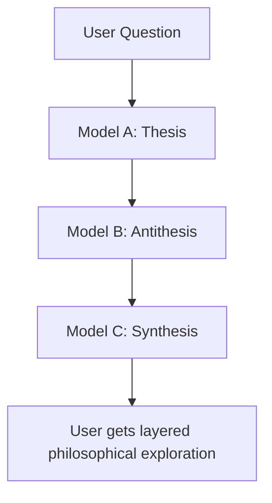
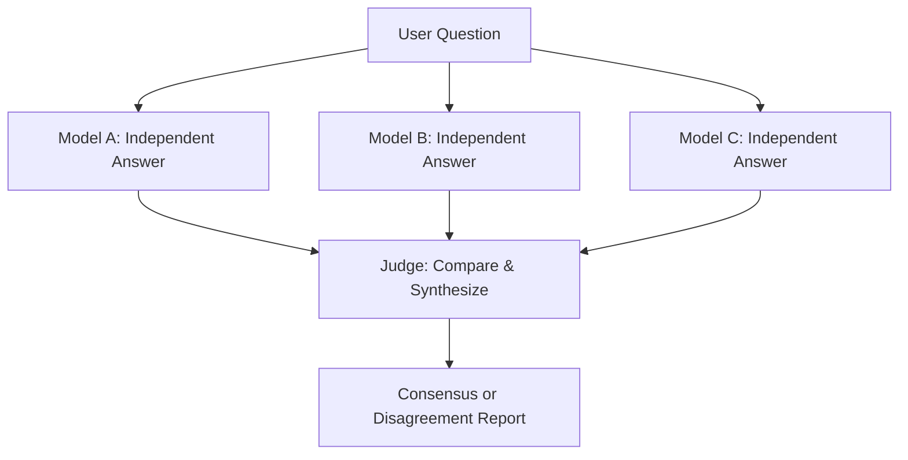
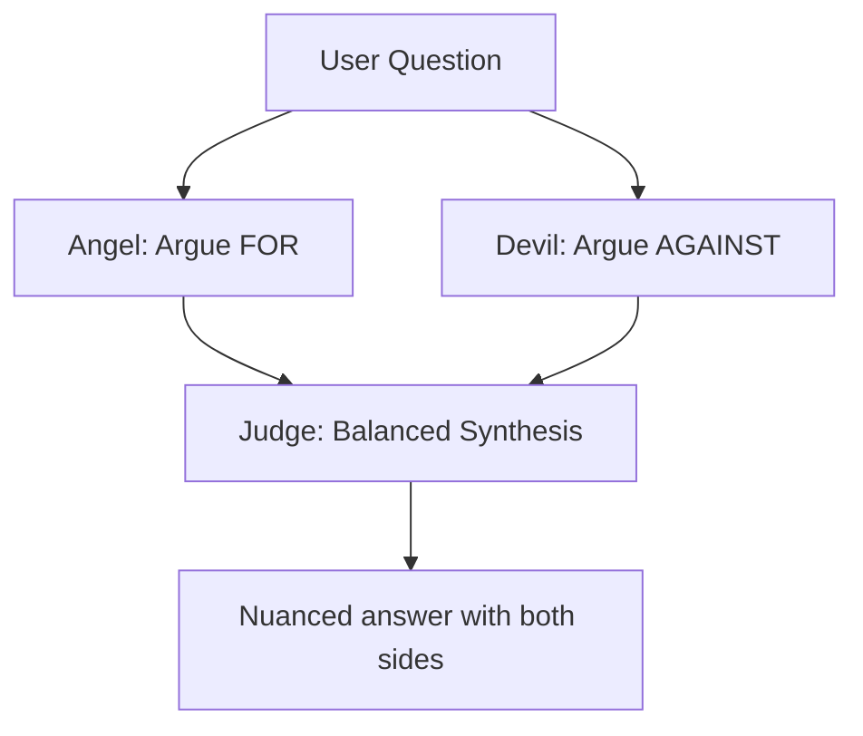

# Multi-Agent Agentic Discord Bot

An autonomous multi-agent Discord bot that can execute complex multi-turn tasks, self-correct, escalate when stuck, and interact with users through reactions and clarifications.

**Key Features:**
- 🤖 Multi-turn agentic execution with **Reflexion** learning pattern
- 🧠 **Sequential Thinking** - Planning model thinks step-by-step before generating plans
- 🗂️ Per-thread S3 artifact storage with automatic file sync
- 🎯 Specialized agent roles (Python coder, DevOps engineer, Architect, etc.)
- 📈 Automatic model escalation (Gemini → Sonnet → Opus)
- 🔄 **Self-reflection** and persistent learning from past attempts
- 🛑 Human-in-the-loop controls (stop, approve, reject via reactions)
- 👍👎 User feedback directly influences confidence scores
- 📊 Full observability (DynamoDB logs, SQS events, Discord progress)
- 🔒 Thread-safe execution with abort flags
- ⚡ Intelligent task classification and routing
- 🏗️ **Architecture Flow** - Design/planning mode without code generation
- ⚖️ **Dialectic Synthesis** - Thesis → Antithesis → Synthesis for philosophical questions
- 🔍 **Multi-Source Consensus** - Factual verification across multiple models
- 😇😈 **Angel/Devil Debate** - Balanced moral/ethical analysis

## Architecture

### Execution Flows

The bot supports 8 execution flows based on task classification:

```
User Message
    ↓
[Opus] Should respond? → YES/NO
    ↓
[Opus] Classify task → TaskType + AgentRole + Complexity
    ↓
    ├─→ SIMPLE (social, general chat)
    │   └─→ Single turn, no tools, no planning
    │
    ├─→ ARCHITECTURE (design/planning WITHOUT code)
    │   └─→ Generates clear, succinct architectural plans
    │   └─→ NO code generation - theoretical/design only
    │   └─→ Confidence: completeness, conflicting info, holes identified
    │   └─→ Can transition to SEQUENTIAL-THINKING on "implement this"
    │
    ├─→ BRANCH (multi-solution brainstorming)
    │   └─→ Multiple models explore different architectural approaches
    │   └─→ Theoretical only, no code generation
    │
    ├─→ SEQUENTIAL-THINKING (complex multi-turn with code generation)
    │   └─→ Chain-of-Thought execution with self-reflection
    │   └─→ CODE GENERATION with MCP tools
    │   └─→ Per-thread artifact storage in S3
    │   └─→ Evaluator scores trajectory → Opus reflects
    │
    ├─→ SHELL (command suggestions)
    │   └─→ Suggests ready-to-run shell commands
    │   └─→ NO scripts - one-liners only
    │
    ├─→ DIALECTIC (philosophical synthesis)
    │   └─→ Thesis → Antithesis → Synthesis
    │   └─→ For abstract "what is the meaning of..." questions
    │
    ├─→ CONSENSUS (multi-source factual verification)
    │   └─→ 3 models answer independently → Judge synthesizes
    │   └─→ For "is it true that..." factual questions
    │
    ├─→ ANGEL_DEVIL (moral/ethical debate)
    │   └─→ Angel argues FOR → Devil argues AGAINST → Judge balances
    │   └─→ For "should I..." ethical dilemmas
    │
    └─→ BREAKGLASS (emergency override)
        └─→ Direct Opus access, bypasses all checks
```

### Flow Selection Guide

| Flow | Use Case | Code? | Tools? | Example Triggers |
|------|----------|-------|--------|------------------|
| **SIMPLE** | Quick Q&A, social | ❌ No | ❌ No | "What is...", "How do I..." |
| **ARCHITECTURE** | Design, planning | ❌ No | ❌ No | "Design a system...", "What's the best approach..." |
| **BRANCH** | Explore alternatives | ❌ No | ❌ No | "Compare approaches...", "Pros and cons..." |
| **SEQUENTIAL** | Implementation | ✅ Yes | ✅ Yes | "Implement...", "Refactor...", "Create..." |
| **SHELL** | Command help | ❌ No | ❌ No | "How to grep...", "kubectl command..." |
| **DIALECTIC** | Philosophical synthesis | ❌ No | ❌ No | "What is the meaning of...", "Philosophically speaking..." |
| **CONSENSUS** | Factual verification | ❌ No | ❌ No | "Is it true that...", "Fact check...", "Verify..." |
| **ANGEL_DEVIL** | Moral/ethical debate | ❌ No | ❌ No | "Should I...", "Is it ethical...", "Moral dilemma" |
| **BREAKGLASS** | Emergency | ✅ Yes | ✅ Yes | `!breakglass` prefix |

### Reflexion Learning Pattern

The sequential-thinking flow implements the **Reflexion** pattern for continuous improvement:

```
1. Load Session (reflections + key insights from DynamoDB)
   ↓
2. Opus Plans (informed by previous trajectory + evaluation)
   ↓
3. Actor Executes (Chain-of-Thought prompting)
   ↓
4. Evaluator Scores Trajectory (task completion, code quality, efficiency)
   ↓
5. Opus Self-Reflects (what worked, what failed, strategy change)
   ↓
6. Save to Memory (sliding window: last 5 reflections, top 20 insights)
   ↓
7. Next execution benefits from learnings
```

**Memory Components:**
- **Reflections**: Last 5 execution reflections (sliding window in DynamoDB)
- **Key Insights**: Top 20 persistent learnings across all executions
- **Trajectory Summary**: Compressed history of previous attempt
- **Evaluation Scores**: Task completion, code quality, efficiency metrics

### Agentic Execution Loop

```
1. Create execution lock (prevents concurrent runs)
2. Post "Starting work..." message (users can react 🛑 to abort)
3. FOR each turn (up to maxTurns):
   a. Check abort flag
   b. Execute turn with LLM + MCP tools
   c. Stream progress to Discord
   d. Update confidence score
   e. Check escalation triggers
   f. Checkpoint every 5 turns
   g. If complete → finalize
   h. If stuck → escalate or ask user
4. Release lock
5. Post commit message with 👍/👎 reactions
```

### Control Mechanisms

| Mechanism | Trigger | Action |
|-----------|---------|--------|
| 🛑 Reaction | On "Starting work..." message | Set abort flag, halt at next turn |
| 👍 Reaction | On commit message | Merge branch to main |
| 👎 Reaction | On commit message | Delete branch, reject changes |
| Low confidence | Confidence < 30% for 2 turns | Escalate model |
| Repeated errors | Same error 3 times | Escalate model |
| No progress | No file changes for 5 turns | Escalate model |
| Max escalation | Already at Opus, still stuck | Ask user for clarification |

### Model Tiers (Tag-Based Routing)

Models are selected dynamically via LiteLLM tags instead of hardcoded lists. Each request uses `model: "auto"` with `metadata.tags`, and the router selects a random model that matches **all** tags.

| Tag | Purpose | Notes |
|-----|---------|-------|
| tier1 | Cheapest/fastest | Social, proofreading, lightweight chat |
| tier2 | Standard technical | Q&A, basic coding, shell help |
| tier3 | Complex reasoning | Multi-file changes, reviews |
| tier4 | Critical decisions | Architecture, highest quality |
| general | General-purpose | Default for non-specialized tasks |
| tools | MCP/tool calling | Required for file/command execution |
| programming | Code-focused | Higher code quality |
| thinking | Deep reasoning | Synthesis/reflection steps |
| websearch | Real-time info | Current events, time-sensitive data |
| classifier | Flow/tier selector | Used for request classification |

**Escalation Path:**
```
tier1 → tier2 → tier3 → tier4
```

### Agent Roles (Tag Routing)

| Role | Tags | Template | Use Case |
|------|------|----------|----------|
| Command Executor | tier2 + tools + general | command-executor | Fast commands |
| Python Coder | tier2 + tools + programming | python-coder | Python development |
| JS/TS Coder | tier2 + tools + programming | js-ts-coder | TypeScript/JavaScript |
| DevOps Engineer | tier3 + tools + general | devops-engineer | Infrastructure, K8s |
| Architect | tier4 + tools + thinking | architect | System design |
| Code Reviewer | tier3 + tools + programming | code-reviewer | Code quality |
| Documentation Writer | tier3 + tools + general | documentation-writer | Docs, README |
| DBA | tier3 + tools + general | dba | Database operations |
| Researcher | tier2 + tools + general | researcher | Code search |

## Advanced Features

### 1. Reflexion Learning Pattern

The bot implements the **Reflexion** pattern, enabling it to learn from past attempts:

**Components:**
- **Actor**: Execution model with Chain-of-Thought prompting
- **Evaluator**: Heuristic-based trajectory scoring (task completion, code quality, efficiency)
- **Self-Reflection**: Opus analyzes what worked/failed and generates strategy changes
- **Memory**: DynamoDB stores reflections, key insights, and trajectory summaries

**How It Works:**
1. Before execution, Opus reviews previous reflections and evaluation scores
2. During execution, the Actor implements with step-by-step reasoning
3. After execution, the Evaluator scores the trajectory (0-100)
4. Opus generates a reflection: what worked, what failed, root cause, strategy change, key insight
5. Reflection is saved with sliding window (last 5) and key insights (top 20)
6. Next execution benefits from these learnings

### 2. Chain-of-Thought Prompting

All execution models are prompted to think step-by-step:

**Structure:**
```
1. Understand the Problem
2. Break Down into Steps
3. Consider Edge Cases
4. Explain Approach
5. Implement Step-by-Step
6. Verify Solution
```

This reduces errors and improves logic by forcing models to articulate their reasoning before acting.

### 3. Per-Thread S3 Artifact Storage

Each Discord thread gets its own isolated workspace:

**Architecture:**
- **Workspace**: `/workspace/<thread-id>/` in Kubernetes pod
- **S3 Sync**: `s3://discord-bot-artifacts/threads/<thread-id>/`
- **Discord Attachments**: Auto-synced to workspace before execution
- **Model Outputs**: Use `<<filename>>` markers to send files back to Discord

**Workflow:**
1. User uploads attachment → Auto-synced to workspace
2. Model reads/writes files in workspace
3. Model includes `<<src/index.ts>>` in response
4. System reads file from workspace → Sends as Discord attachment
5. After execution → Workspace synced to S3
6. Thread deleted → Workspace + S3 prefix cleaned up

### 4. User Feedback Integration

Users directly influence the bot's confidence through reactions:

- **👍 on bot message**: +15 confidence (encourages similar approach)
- **👎 on bot message**: -20 confidence (triggers reflection/escalation)
- Confidence clamped 10-100 and persisted across messages

This creates a feedback loop where user satisfaction directly impacts the bot's decision-making.

### 5. Architecture Flow (Design & Planning)

For theoretical/design tasks that require planning WITHOUT code generation.

**Process:**
1. Opus analyzes the request using Sequential Thinking
2. Generates a clear, succinct architectural plan
3. NO code is generated - only design and recommendations
4. Confidence based on: completeness, conflicting info, facts captured, holes identified

**Key Differences from Sequential-Thinking:**
| Aspect | Architecture Flow | Sequential-Thinking Flow |
|--------|-------------------|-------------------------|
| Output | Design/Plan only | Code + Implementation |
| Tools | None | MCP tools for file ops |
| Confidence | Completeness, clarity | Code quality, progress |
| Reflection | Design gaps, conflicts | Code issues, efficiency |

**Triggers:**
- "Design a system for..."
- "What's the best approach for..."
- "How should I architect..."
- "Plan out the implementation of..."

**Flow Transition:**
When user says "implement this" or "execute the plan", the bot switches to SEQUENTIAL-THINKING flow for actual code generation.

### 6. Branch Flow (Multi-Solution Brainstorming)

Trigger with phrases like "different approaches", "pros and cons", "explore options":

**Process:**
1. Two models brainstorm in parallel
2. Consolidator merges unique approaches
3. Presents 2-3 architectural options with pros/cons
4. **No code generation** - purely theoretical/architectural

**Triggers:**
- "multiple solutions", "brainstorm", "different ways"
- "compare approaches", "tradeoffs", "which approach"

### 7. Dialectic Synthesis Flow (Philosophical)

For abstract philosophical questions seeking understanding through dialectical exploration.

**Process:**
1. Random Tier 2 Model A generates a **Thesis** (strongest position)
2. Random Tier 2 Model B generates an **Antithesis** (counter-position, aware of thesis)
3. Random Tier 4 Synthesizer creates a **Synthesis** (higher-order resolution)



**Best for:** "What is the meaning of life?", "What is consciousness?", "What is justice?"

**Triggers:**
- "meaning of", "nature of", "philosophically", "existential"
- "what is the purpose", "what is reality", "what is truth"

### 8. Multi-Source Consensus Flow (Factual)

For factual questions requiring verification across multiple independent sources.

**Process:**
1. Three random Tier 2 models answer the question **independently**
2. Random Tier 4 Judge compares answers, identifies consensus/disagreement
3. Returns synthesis with confidence indicator



**Best for:** "Is it true that...", "How many...", "When did...", "Fact check..."

**Triggers:**
- "is it true that", "fact check", "verify", "actually true"
- "how many", "when did", "where is", "who was"

### 9. Angel/Devil Debate Flow (Moral/Ethical)

For moral dilemmas and ethical questions requiring balanced consideration of both sides.

**Process:**
1. Random Tier 2 Model A (Angel) argues **FOR** the position
2. Random Tier 2 Model B (Devil) argues **AGAINST** the position
3. Random Tier 4 Judge synthesizes a **balanced, nuanced response**



**Best for:** "Should I...", "Is it ethical...", "Moral dilemma", "Right or wrong"

**Triggers:**
- "should I", "is it right to", "ethical", "moral", "dilemma"
- "right or wrong", "good or bad"

## Project Structure

```
app/
├── src/
│   ├── modules/
│   │   ├── agentic/          # Multi-turn execution system
│   │   │   ├── loop.ts       # Main execution loop with CoT
│   │   │   ├── lock.ts       # Thread-safe locks
│   │   │   ├── escalation.ts # Model escalation
│   │   │   ├── progress.ts   # Discord progress streaming
│   │   │   ├── commits.ts    # Git operations
│   │   │   ├── logging.ts    # DynamoDB logging
│   │   │   ├── events.ts     # SQS event emission
│   │   │   └── README.md     # Module documentation
│   │   ├── reflexion/        # Reflexion learning pattern
│   │   │   ├── evaluator.ts  # Trajectory evaluation (code + architecture)
│   │   │   ├── memory.ts     # Reflection management
│   │   │   └── types.ts      # Reflexion interfaces
│   │   ├── workspace/        # Per-thread S3 artifact storage
│   │   │   ├── manager.ts    # Workspace operations
│   │   │   ├── s3-sync.ts    # S3 synchronization
│   │   │   └── file-sync.ts  # Discord attachment sync
│   │   ├── discord/          # Discord client with partials
│   │   ├── litellm/          # LLM integration
│   │   └── dynamodb/         # Database operations
│   ├── handlers/
│   │   ├── reactions.ts      # Emoji reaction handler
│   │   ├── feedback.ts       # User feedback (👍👎)
│   │   ├── debounce.ts       # Message debouncing
│   │   └── README.md         # Handler documentation
│   ├── pipeline/             # Message processing pipeline
│   │   └── flows/
│   │       ├── sequential-thinking.ts  # Code generation flow
│   │       ├── architecture.ts         # Design/planning flow
│   │       ├── branch.ts               # Multi-solution brainstorming
│   │       ├── dialectic.ts            # Thesis → Antithesis → Synthesis
│   │       ├── consensus.ts            # Multi-source factual verification
│   │       ├── angel-devil.ts          # Moral debate (FOR vs AGAINST)
│   │       ├── simple.ts               # Quick responses
│   │       ├── shell.ts                # Command suggestions
│   │       └── breakglass.ts           # Emergency override
│   │       └── social.ts               # Social interactions (tier 1)
│   │       └── proofreader.ts          # Grammar/spellcheck (tier 1)
│   ├── templates/            # Prompt templates with Sequential Thinking
│   │   ├── planning.txt      # Opus planning with step-by-step reasoning
│   │   └── prompts/
│   │       ├── coding.txt    # CoT for implementation
│   │       ├── devops.txt
│   │       ├── architect.txt
│   │       └── ...
│   └── index.ts              # Application entry point
└── package.json

terraform/
├── dynamodb.tf               # Sessions + Executions tables (with Reflexion fields)
├── s3.tf                     # Artifact storage bucket
├── sqs.tf                    # Message + Event queues
├── kubernetes.tf             # K8s deployments
├── main.tf                   # Provider config
└── README.md                 # Infrastructure docs

docs/
└── ADDING-MODELS.md         # Guide for adding new models
```

## Quick Start

### Prerequisites

- Node.js 20+
- Discord bot token
- LiteLLM proxy running
- AWS account (for DynamoDB + SQS)
- Kubernetes cluster (optional, for deployment)

### Local Development

1. **Install dependencies:**
```bash
cd app
npm install
```

2. **Configure environment:**
```bash
cp .env.example .env
```

Required environment variables:
```bash
DISCORD_TOKEN=your_discord_bot_token
LITELLM_API_KEY=your_litellm_key
LITELLM_BASE_URL=http://localhost:4000
AWS_REGION=ca-central-1
DYNAMODB_SESSIONS_TABLE=discord_sessions
DYNAMODB_EXECUTIONS_TABLE=discord_executions
AGNETIC_EVENTS_QUEUE_URL=https://sqs.region.amazonaws.com/account/queue
S3_ARTIFACT_BUCKET=discord-bot-artifacts  # Per-thread artifact storage
PLANNER_MODEL_ID=kimi-k2.5                # Model for planning phase
```

3. **Run locally:**
```bash
npm run dev
```

### Deploy Infrastructure

1. **Create DynamoDB tables:**
```bash
cd terraform
terraform init
terraform apply -target=aws_dynamodb_table.discord_sessions
terraform apply -target=aws_dynamodb_table.discord_executions
terraform apply -target=aws_dynamodb_table.discord_messages
```

2. **Create SQS queues:**
```bash
terraform apply -target=aws_sqs_queue.agentic_events
terraform apply -target=aws_sqs_queue.discord_messages
```

3. **Deploy to Kubernetes:**
```bash
terraform apply
```

## Usage Examples

### Simple Q&A

```
User: @bot what is async/await in JavaScript?
Bot: [Responds with explanation, no code generation]
```

### Tool Execution

```
User: @bot run kubectl get pods
Bot: [Executes command, shows output]
```

### Code Implementation (Agentic)

```
User: @bot refactor the authentication module to use JWT
Bot: 🚀 Starting work... (react 🛑 to stop)
     🤔 Turn 1/20 | Confidence: 85% | Model: gemini
     📁 Reading: src/auth/index.ts
     ✏️ Writing: src/auth/jwt.ts
     ✅ Turn 1 complete | Confidence: 90% | Files: 2 modified
     
     [... more turns ...]
     
     📝 Commit: Refactor auth to use JWT
     Branch: `auth-jwt-refactor`
     Files: auth/index.ts, auth/jwt.ts, auth/middleware.ts
     👍 to merge | 👎 to reject
```

User reacts 👍 → Branch merged automatically

### Stopping Execution

```
Bot: 🚀 Starting work...
User: [Reacts with 🛑]
Bot: ⏹️ Execution stop requested. Will halt at next turn.
     [Stops at next turn, saves checkpoint]
```

## Debugging

### View Execution Logs

**DynamoDB:**
```bash
aws dynamodb query \
  --table-name discord-messages \
  --key-condition-expression "pk = :channelid" \
  --expression-attribute-values '{":channelid":{"S":"1234567890"}}'
```

**Application Logs:**
```bash
kubectl logs -f deployment/discord-bot -n discord-bot
```

### Consume Events

```bash
aws sqs receive-message \
  --queue-url $(terraform output -raw agentic_events_queue_url) \
  --max-number-of-messages 10
```

### Check Execution State

```typescript
import { getLock } from './modules/agentic/lock';

const lock = getLock(channelid);
console.log(lock);
```

### Monitor Progress

All progress updates are streamed to Discord in real-time:
- Turn start/complete
- Tool execution
- Checkpoints
- Escalations
- Clarification requests

## Configuration

### Model Selection

**By Agent Role:**
```typescript
// app/src/templates/registry.ts
export const AGENT_MODEL_TIER_MAP = {
  [AgentRole.PYTHON_CODER]: 'tier2',
};

export const AGENT_MODEL_INDEX_MAP = {
  [AgentRole.PYTHON_CODER]: 1,  // Use 2nd model in tier2
};
```

**By Task Type:**
```typescript
export const TASK_TYPE_TO_TIER_INDEX = {
  [TaskType.SOCIAL]: { tier: 'tier1', index: 0 },
  [TaskType.WRITING]: { tier: 'tier3', index: 1 },
};
```

### Escalation Thresholds

Triggers in `app/src/modules/agentic/escalation.ts`:
- Confidence < 30% for 2 consecutive turns
- Same error repeats 3 times
- No file changes for 5 turns
- Model reports 'stuck' status

### Max Turns

```typescript
// app/src/templates/registry.ts
export const MAX_TURNS_BY_COMPLEXITY = {
  [TaskComplexity.SIMPLE]: 10,
  [TaskComplexity.MEDIUM]: 20,
  [TaskComplexity.COMPLEX]: 35,
};
```

## Adding New Models

See [docs/ADDING-MODELS.md](docs/ADDING-MODELS.md) for detailed guide.

**Quick example:**
```typescript
// 1. Add to tier
export const MODEL_TIERS = {
  tier2: ['gemini-3-pro', 'gpt-4o-mini', 'claude-haiku'],
};

// 2. Assign to agent (optional)
export const AGENT_MODEL_INDEX_MAP = {
  [AgentRole.RESEARCHER]: 2,  // Use claude-haiku
};
```

## Safety Features

1. **Max turn limits** - Prevents infinite loops (10-35 turns)
2. **Abort flags** - User can stop anytime with 🛑
3. **Confidence monitoring** - Detects when stuck (< 30%)
4. **Model escalation** - Automatically upgrades when struggling
5. **Checkpointing** - Saves progress every 5 turns
6. **Error tracking** - Detects repeated failures (3x same error)
7. **User clarification** - Asks for help when truly stuck
8. **Thread isolation** - Each thread has independent lock
9. **Event logging** - Full audit trail in DynamoDB
10. **Progress streaming** - Real-time visibility in Discord

## Module Documentation

- [Agentic Module](app/src/modules/agentic/README.md) - Multi-turn execution
- [Handlers Module](app/src/handlers/README.md) - Reaction & debounce handlers
- [Reflexion Module](app/src/modules/reflexion/README.md) - Learning from past attempts
- [Infrastructure](terraform/README.md) - Terraform configuration
- [Adding Models Guide](docs/ADDING-MODELS.md) - How to add new LLM models

## Changelog

### Latest Changes

#### Architecture Flow (NEW)
- Added `ARCHITECTURE` flow type for design/planning tasks without code generation
- Flow routes `architecture-analysis` and design questions to planning-only mode
- Confidence evaluation focuses on: completeness, conflicting info, holes identified
- Can transition to `SEQUENTIAL_THINKING` when user requests implementation

#### Planning Prompt Improvements
- Added **Sequential Thinking Process** to planning prompt
- Planning model (Opus) now thinks step-by-step before generating output
- Steps: Analyze → Identify Domain → Assess Complexity → Determine Continuity → Plan → Draft → Review

#### Architecture-Specific Evaluation
- Added `evaluateArchitectureTrajectory()` method to evaluator
- Metrics: Task completion, Design quality, Efficiency
- NO code quality metrics (since no code is generated)
- Focus on design clarity and completeness

## Contributing

1. Fork the repository
2. Create a feature branch
3. Make changes with tests
4. Submit pull request

## License

MIT
