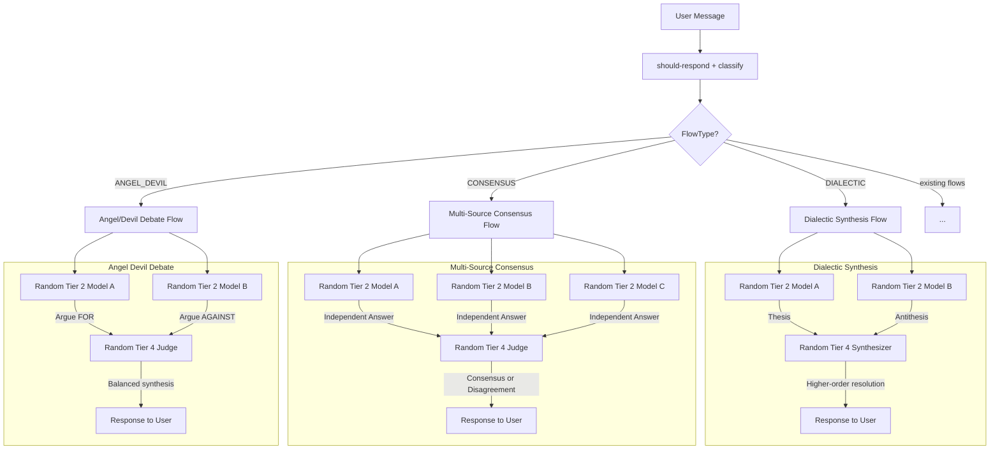

# Thinking Flows Implementation Plan

## Overview

Implement three new multi-model thinking flows from `thinkin-flow.md`:

1. **Dialectic Synthesis** — Thesis → Antithesis → Synthesis (philosophical/abstract questions)
2. **Multi-Source Consensus** — Independent answers from multiple models, then judge synthesizes (factual/trivia)
3. **Angel/Devil Debate** — Argue FOR vs AGAINST, then judge synthesizes (moral/ethical dilemmas)

All three follow the same architectural pattern already established by [`executeBranchFlow()`](app/src/pipeline/flows/branch.ts:72): parallel/sequential `chatCompletion()` calls to random models from appropriate tiers, followed by a synthesizer/judge model from a higher tier.

**Key design decision:** Random model selection from tiers (no fixed provider requirement). Each flow selects random models from the appropriate tier, following the existing [`getRandomTier3Models()`](app/src/pipeline/flows/branch.ts:19) pattern.

---

## Architecture



### Model Tier Strategy

Per `thinkin-flow.md` cost tier mapping:
- **Debaters/Arguers/Independent answerers**: Tier 1-2 models (cheap, diverse perspectives)
- **Synthesizer/Judge**: Tier 4 model (strongest reasoning for coherent synthesis)

The debater models are selected randomly from their tier to maximize provider diversity. The synthesizer is always a random Tier 4 model.

---

## Files to Modify/Create

### New Files

| File | Purpose |
|------|---------|
| `app/src/pipeline/flows/dialectic.ts` | Dialectic Synthesis flow implementation |
| `app/src/pipeline/flows/consensus.ts` | Multi-Source Consensus flow implementation |
| `app/src/pipeline/flows/angel-devil.ts` | Angel/Devil Debate flow implementation |
| `app/templates/prompts/dialectic-thesis.txt` | Prompt for thesis generation |
| `app/templates/prompts/dialectic-antithesis.txt` | Prompt for antithesis generation |
| `app/templates/prompts/dialectic-synthesizer.txt` | Prompt for dialectic synthesis |
| `app/templates/prompts/consensus-independent.txt` | Prompt for independent factual answer |
| `app/templates/prompts/consensus-judge.txt` | Prompt for consensus judging |
| `app/templates/prompts/angel-devil-angel.txt` | Prompt for arguing FOR |
| `app/templates/prompts/angel-devil-devil.txt` | Prompt for arguing AGAINST |
| `app/templates/prompts/angel-devil-judge.txt` | Prompt for balanced synthesis |

### Modified Files

| File | Change |
|------|--------|
| [`app/src/modules/litellm/types.ts`](app/src/modules/litellm/types.ts:99) | Add `DIALECTIC`, `CONSENSUS`, `ANGEL_DEVIL` to `FlowType` enum; add `MORAL_ETHICAL`, `PHILOSOPHICAL`, `FACTUAL_TRIVIA` to `TaskType` enum |
| [`app/src/pipeline/flows/index.ts`](app/src/pipeline/flows/index.ts:1) | Export the 3 new flow functions |
| [`app/src/pipeline/classify.ts`](app/src/pipeline/classify.ts:85) | Add classification logic for the 3 new flow types + `flowNeedsWorkspace` entries |
| [`app/src/pipeline/index.ts`](app/src/pipeline/index.ts:220) | Add `case` branches in the flow dispatch switch statement |
| [`app/src/modules/agentic/progress.ts`](app/src/modules/agentic/progress.ts:10) | Add new progress update types for the thinking flows |

---

## Detailed Implementation Steps

### Step 1: Add New Enums to Types

In [`app/src/modules/litellm/types.ts`](app/src/modules/litellm/types.ts):

Add to `FlowType` enum:
```typescript
DIALECTIC = 'dialectic',
CONSENSUS = 'consensus',
ANGEL_DEVIL = 'angel-devil',
```

Add to `TaskType` enum:
```typescript
MORAL_ETHICAL = 'moral-ethical',
PHILOSOPHICAL = 'philosophical',
FACTUAL_TRIVIA = 'factual-trivia',
```

### Step 2: Create Shared Helper — Random Model Selection

All three flows need the same random model selection pattern. Extract a shared utility into a helper that can be imported by each flow (or reuse the pattern inline like `branch.ts` does).

Each flow file will include local helpers:
- `getRandomModelsFromTier(tier, count)` — picks N random models from a tier
- `getRandomModelFromTier(tier)` — picks 1 random model from a tier

These mirror the existing [`getRandomTier3Models()`](app/src/pipeline/flows/branch.ts:19) and [`getRandomTier4Model()`](app/src/pipeline/flows/branch.ts:33) but are parameterized by tier.

### Step 3: Implement Dialectic Synthesis Flow

**File:** `app/src/pipeline/flows/dialectic.ts`

**Pattern:** Sequential (Thesis → Antithesis → Synthesis)

```
User Question
    ↓
[Random Tier 2 Model A] Present Thesis
    ↓
[Random Tier 2 Model B] Present Antithesis (receives thesis for context)
    ↓
[Random Tier 4 Model C] Synthesize both into higher-order resolution
    ↓
User gets layered philosophical exploration
```

**Flow:**
1. Select 2 random Tier 2 models (Model A, Model B — must be different)
2. Select 1 random Tier 4 model (Synthesizer)
3. Stream progress: `dialectic` phase `thesis`
4. Call Model A with thesis prompt + user question → get thesis
5. Stream progress: `dialectic` phase `antithesis`
6. Call Model B with antithesis prompt + user question + thesis → get antithesis
7. Stream progress: `dialectic` phase `synthesis`
8. Call Synthesizer with both thesis + antithesis + user question → get synthesis
9. Return synthesis as response

**Why sequential, not parallel:** The antithesis should be aware of the thesis to provide a genuine counter-position, not just an independent opposing view. This creates a true dialectic.

### Step 4: Implement Multi-Source Consensus Flow

**File:** `app/src/pipeline/flows/consensus.ts`

**Pattern:** Parallel independent answers → Judge

```
User Question
    ↓ (parallel, different models)
[Random Tier 2 Model A] Independent answer
[Random Tier 2 Model B] Independent answer
[Random Tier 2 Model C] Independent answer
    ↓
[Random Tier 4 Judge] Compare → Flag disagreements → Synthesize
    ↓
If consensus → High confidence answer
If disagreement → Present with "models disagree on X"
```

**Flow:**
1. Select 3 random Tier 2 models (all different)
2. Select 1 random Tier 4 model (Judge)
3. Stream progress for all 3 models
4. Call all 3 models in parallel with the same independent-answer prompt
5. Stream progress: `consensus` phase `judging`
6. Call Judge with all 3 answers + instructions to identify consensus/disagreement
7. Return judge's synthesis, including confidence indicator based on agreement level

### Step 5: Implement Angel/Devil Debate Flow

**File:** `app/src/pipeline/flows/angel-devil.ts`

**Pattern:** Parallel adversarial → Judge

```
User Question
    ↓ (parallel)
[Random Tier 2 Model A] Argue FOR (strongest case)
[Random Tier 2 Model B] Argue AGAINST (strongest case)
    ↓
[Random Tier 4 Judge] Synthesize balanced response
    ↓
User gets nuanced answer with both sides
```

**Flow:**
1. Select 2 random Tier 2 models (must be different)
2. Select 1 random Tier 4 model (Judge)
3. Stream progress for both debaters
4. Call both models in parallel — one with angel prompt, one with devil prompt
5. Stream progress: `angel_devil` phase `judging`
6. Call Judge with both arguments + user question → balanced synthesis
7. Return judge's balanced response

### Step 6: Create Prompt Templates

Each flow needs dedicated prompt templates. These are `.txt` files in `app/templates/prompts/`.

**Dialectic Synthesis prompts:**
- `dialectic-thesis.txt` — Instructs model to present the strongest thesis position on the topic
- `dialectic-antithesis.txt` — Instructs model to present the strongest counter-position, given the thesis
- `dialectic-synthesizer.txt` — Instructs model to find higher-order resolution between thesis and antithesis

**Multi-Source Consensus prompts:**
- `consensus-independent.txt` — Instructs model to answer the factual question independently and thoroughly
- `consensus-judge.txt` — Instructs model to compare answers, identify consensus/disagreement, and synthesize

**Angel/Devil Debate prompts:**
- `angel-devil-angel.txt` — Instructs model to argue the strongest case FOR
- `angel-devil-devil.txt` — Instructs model to argue the strongest case AGAINST
- `angel-devil-judge.txt` — Instructs model to synthesize a balanced, nuanced response from both sides

### Step 7: Update Classification Logic

In [`app/src/pipeline/classify.ts`](app/src/pipeline/classify.ts:85):

Add detection functions:
- `isDialecticRequest(message)` — triggers on philosophical/abstract keywords: "meaning of", "what is the nature of", "philosophically", "existential", "in theory"
- `isConsensusRequest(message)` — triggers on factual/trivia keywords: "is it true that", "fact check", "verify", "actually true", "how many", "when did"
- `isAngelDevilRequest(message)` — triggers on moral/ethical keywords: "should I", "is it right to", "ethical", "moral", "dilemma", "wrong to"

Update `classifyFlow()` to check these before the existing switch statement, similar to how [`isBranchRequest()`](app/src/pipeline/classify.ts:24) works.

Add the new flow types to [`flowNeedsWorkspace()`](app/src/pipeline/classify.ts:69) — all three return `false` (no workspace needed).

### Step 8: Update Pipeline Dispatch

In [`app/src/pipeline/index.ts`](app/src/pipeline/index.ts:220):

Add imports for the 3 new flow functions and add `case` branches:
```typescript
case FlowType.DIALECTIC:
  flowResult = await executeDialecticFlow(flowContext);
  break;
case FlowType.CONSENSUS:
  flowResult = await executeConsensusFlow(flowContext);
  break;
case FlowType.ANGEL_DEVIL:
  flowResult = await executeAngelDevilFlow(flowContext);
  break;
```

### Step 9: Update Flow Exports

In [`app/src/pipeline/flows/index.ts`](app/src/pipeline/flows/index.ts:1):

Add exports:
```typescript
export { executeDialecticFlow } from './dialectic';
export { executeConsensusFlow } from './consensus';
export { executeAngelDevilFlow } from './angel-devil';
```

### Step 10: Update Progress Types

In [`app/src/modules/agentic/progress.ts`](app/src/modules/agentic/progress.ts:10):

Add to the `ProgressUpdate.type` union:
```typescript
'dialectic' | 'consensus' | 'angel_devil'
```

Add optional fields:
```typescript
dialecticPhase?: 'thesis' | 'antithesis' | 'synthesis';
consensusPhase?: 'independent' | 'judging';
angelDevilPhase?: 'debating' | 'judging';
```

---

## Classification Priority Order

The updated classification in `classifyFlow()` should check in this order:

1. Breakglass (existing)
2. Branch request (existing)
3. Angel/Devil — binary moral/ethical dilemmas
4. Dialectic — philosophical/abstract understanding
5. Consensus — factual verification
6. Existing task-type-based routing (social, proofreader, shell, architecture, sequential-thinking, simple)

This ensures the new thinking flows are checked before falling through to the generic simple/technical flows.

---

## Summary of Changes

| Area | Files | Type |
|------|-------|------|
| Types | 1 file modified | Add enums |
| Flow implementations | 3 new files | Core logic |
| Prompt templates | 8 new files | Prompt engineering |
| Classification | 1 file modified | Routing logic |
| Pipeline dispatch | 1 file modified | Switch cases |
| Flow exports | 1 file modified | Re-exports |
| Progress types | 1 file modified | Type additions |
| **Total** | **4 modified + 11 new** | |
